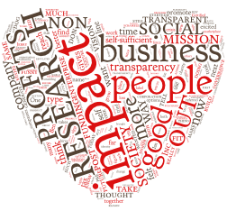
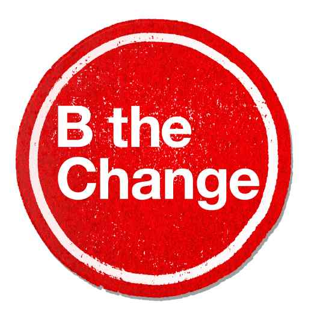

{: .static .retina }
{: .aside .img }

We have gone through an identity crisis recently as we have tried to figure out
who we really are as a company. Since the beginning of this whole venture, we
have felt like we have been straddling the fence between a profit and
non-profit organization in our desires to promote research and grow in the way
we envision yet have the community support that is so critical for the future
of research. We wanted a business structure that took the best parts from
both!

<!--MORE-->

We have a <a href="/company/#sec:mission">mission</a> that is the most
important reason that we are doing all this to begin with---and we believe in
it. We are so excited about it. But at the same time we have some great
business ideas to promote this new paradigm of research. We don't want to have
to deal with the funding limitations and red tape of the 501(c)(3). We just want
to focus on our mission.

On the other hand, we don't want the fact that we are a for-profit company to
deter people from supporting what we are doing. As a for-profit company, how
_do_ we rally researchers, scholars, academics, and others behind us? Isn't
this the domain of the not-for-profits?

Martin Weller, Professor of Educational Technology at [The Open
University](http://www.open.ac.uk/), stated:

<figure class="bq grab">
  <blockquote cite="http://blog.okfn.org/2012/10/22/the-great-open-access-swindle">
    

      I’ve heard Stephen Downes say that as soon as any form of commercial
      enterprise touches education it ruins it (or words to that effect). I
      wouldn’t go that far, I think for instance that commercial companies
      often make a better job of software and technology than universities, but
      academic publishing is such an odd business that maybe it doesn’t make
      sense as a commercial enterprise. As David Wiley so nicely parodies in
      his <a href="http://chronicle.com/blogs/wiredcampus/david-wiley-the-parable-of-the-inventorthe-trucker/7244">trucker's parable</a>,
      there isn’t really another industry like it. Academics (paid by the
      taxpayer or students) provide free content, and then the same academics
      provide free services (editorship and peer-review) and then hand over
      rights and ownership to a commercial company, who provide a separate set
      of services, and then sell back the content to the same group of
      academics.

    

    

      I know a few people who work in commercial publishing, and they are
      smart, good people who genuinely care about promoting knowledge and
      publishing as a practice. This is not a cry for such people to be out on
      the streets, but rather for their skills and experience to be employed by
      and for universities, the research communities and the taxpayer rather
      than for shareholders. In this business Downes’ contamination theory
      seems to hold, there is simply no space in the ecosystem for profit to
      exist, and when it does it corrupts the whole purpose of the enterprise,
      which is to share and disseminate knowledge.

    

  </blockquote>
  <figcaption>

    --- from the blog post
    <a href="http://blog.okfn.org/2012/10/22/the-great-open-access-swindle/"><cite>The great Open Access swindle</cite></a>,
      a guest post on the Open Knowledge Foundation's blog.

  </figcaption>
</figure>

Past indiscretions of commercial companies have tainted the provenient pool of
scholarly publishing. How can we avoid these pitfalls?

Within the current publishing paradigm we agree with Weller---there is no space
for profit to exist without imposing tariffs on either the inputs or the
outputs of knowledge dissemination. Those with narrow, profit-centric views
have embezzled the scholarly community, in the process setting themselves up as
the gatekeepers of knowledge dissemination.

Our vision of <a href="/research/#sec:future">the future of research</a> is so
different from the modus operandi of scholarly publishing, that I think we have
a fighting chance of making a difference without falling into the traps of the
current commercial publishers. Our business model does not restrict the
dissemination of knowledge, but is based on providing tools and services that
help with the actual process of research.

Originally, we felt strongly about doing this as a for-profit company so we
could have the flexibility to do whatever it took to promote our mission and
generate sufficient profits to extend our reach for good as far as possible. We
also wanted to be self-sufficient and not have to worry about the success of
the next fundraising campaign. We don't think that a taxpayer-funded company is
the best way to go either. Relying on grants has its own perils in these days
of uncertain politics. I don't like the idea staking our company's revenue or
future completely upon them.

After thinking about it some more, I remembered some companies that I have come
to admire. All of them are run by people who have a higher vision of what
business can be. They are good companies started by good people that think
businesses can be more than heartless profit machines. They have what is
sometimes referred to as a double or triple bottom line (people, planet, and
profit). One such business, Ben & Jerry's Homemade, Inc. (you know, the yummy
ice cream), gives 7.5 percent of their before-tax
profits to charity and purchases brownies from a bakery that hires people from
prison.  Newman's Own Inc. contributes all profits to charity. How can we be
more like them?

In a way, it's funny to think about this right now. We are still pre-revenue.
Yet, I think _now_ is the time to make these decisions. Funding choices made
early in a company's existence can limit options later on. In general, tech
startups are not known for their philanthropy and humanitarian generosities.
In too many instances, they are characterized more by a high-velocity scramble
to reach the next round of funding, at the same time giving little thought to
what it actually takes to build a self-sufficient, lasting enterprise. Burnout
hits too soon for too many. Much of this problem stems from the dog-eat-dog
world of venture capital investing.[^shareholders] Does it have to be this way?

# Social What?

I must admit, they didn't teach us much about this in business school. Being a
researcher at heart, I decided to try to find an answer to my question. I found
some really cool things. When I stumbled across the term [social
enterprise](http://en.wikipedia.org/wiki/Social_enterprise), I thought it was
referring to an organization that is really good at using Facebook. Nope. In
this context, social refers to society---as in _for the good of society_. It
turns out this is a label for the type of business that we are trying to build!
I cannot tell you how thrilled I was when I found out that [a social enterprise
can be structured as a for-profit
company](http://en.wikipedia.org/wiki/Social_business).

According to Wikipedia,

> a <dfn id="socialbusiness">social business</dfn> is a non-loss, non-dividend
> company designed to address a social objective within the highly regulated
> marketplace of today.  It is distinct from a non-profit because the business
> should seek to generate a modest profit but this will be used to expand the
> company’s reach, improve the product or service or in other ways to subsidize
> the social mission.
{: .bq .grab cite="http://en.wikipedia.org/wiki/Social_business" }

YES!!! We finally found out who we are! The pieces are starting to fit together
now. We _can_ use the power of business to help solve the problems with
research! It is funny, since this doesn't drastically change our plans or
approach, but, hey, I'll take validation wherever I can find it! It is nice to
know what type of company we are and to be able to tell someone else now, too.
This definition is very much in line with what we hope this company will be.
And I think it gives us some stuff to work on and a much more focused direction
to take.

We are not alone in this---other companies are seeing the benefit of
structuring this way.
[Google.org](http://news.blogs.nytimes.com/2006/09/14/philanthropy-googles-way-not-the-usual/),
was structured as a for-profit charity. It was an experiment by Google to
change the way philanthropies are administered. While some problems arose in
Google.org's implementation, their structure is not limited in the ways that
traditional non-profit organizations are limited. For example, it can create or
invest in businesses, lobby Congress, and seek funding from venture
capitalists. It also pays income taxes.

We differ the most from Google.org in that we need to make a profit to survive
and to promote our mission, and maybe this is where Google.org went wrong. It
acted like a non-profit when [it was really a for-profit
organization](http://www.nytimes.com/2011/01/30/business/30charity.html?pagewanted=all).
We want to keep our options open, and have the best parts of both worlds. Yet
when times get tight, how can we maintain this status and not fall into the
greedy trap of commercialism?

{: .static }
{: .aside .img }

A non-profit by the name of [B
Lab](http://www.bcorporation.net/what-are-b-corps/the-non-profit-behind-b-corps)
has created a certification (and an actual business entity by legislation in
some states) called a <abbr>B Corporation</abbr>, or benefit corporation.  They
say, "By voluntarily meeting higher standards of transparency, accountability,
and performance, Certified <abbr>B Corps</abbr> are distinguishing themselves
in a cluttered marketplace by offering a positive vision of a better way to do
business." They have put together a governance model to help businesses
maintain this high level of transparency, accountability, and performance. This
governance model can be _baked_ into corporate bylaws and even state laws.  We
are excited at the prospect of becoming a <abbr>B Corp</abbr> in the future, so
stay tuned!

You may argue, "But is research good for society?" If you're reading this post,
I probably don't have to convince you of that.[^goodforsociety]
{: .conclusion }

[^goodforsociety]: It is thanks to research that the Internet and this post
    have been brought to you today. A better question might be, "Is this _post_
    good for society?"

[^shareholders]: This is one reason we have been so careful in the selection of
    our shareholders.
