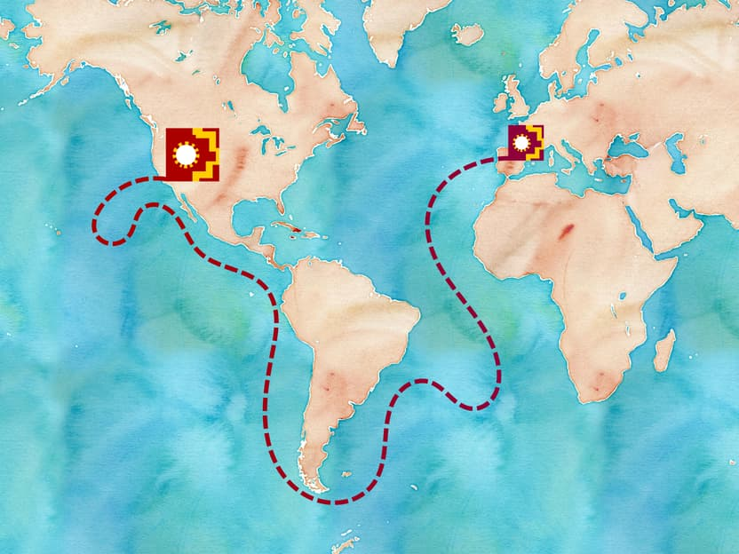
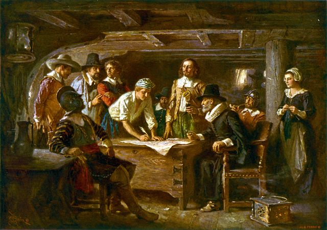

<figure id="fig:journey-of-defining" property="schema:sharedContent" class="img" resource="#journey_of_defining" typeof="schema:ImageObject">
  <link property="schema:representativeOfPage" resource="schema:True" />
  <link property="rdfa:copy" resource="pentandra-website:license" />
  <meta property="schema:width" content="832 px" datatype="schema:Distance" />
  <meta property="schema:height" content="624 px" datatype="schema:Distance" />
  <meta property="schema:contentSize" content="63KB" />
  
  <figcaption property="schema:caption" class="small">A map of our journey so far of defining the Scholarly Commons, from Madrid, Spain, to San Diego, California. <a property="schema:url" href="watercolor_world.jpeg">Map tiles</a> by <a property="cc:attributionName" rel="cc:attributionURL" href="http://stamen.com/">Stamen Design</a>, licensed under a <a rel="license" href="https://creativecommons.org/licenses/by/3.0/"><abbr title="Creative Commons Attribution 3.0 Unported">CC-BY</abbr></a> license.  Sailboat based on <a property="schema:isBasedOn" href="https://openclipart.org/detail/259072/sailboat-refixed">work</a> by <a property="schema:creator" href="https://openclipart.org/user-detail/Lazur%20URH">Lazur URH</a>.</figcaption>
</figure>

Last week I had the opportunity to participate in the second workshop of the
Defining the Scholarly Commons project (I covered the first workshop in [an
earlier blog posting][reimagining]). As you can tell from the squiggly line
above, our course has not been linear, neither has it been smooth sailing. We
have learned a lot, however, and even made some progress in the meantime.

<!--MORE-->

For our steering committee, this workshop was one we have been truly
anticipating, the culmination of a lot of thought and discussion of some very
fundamental matters. As can be expected, many of us embarked upon this project
from different places and with different expectations, and it seems that all of
our diverse streams of thought converged on the inputs and outputs of this one
workshop. It was good that the workshop was held on the top floor of a
fifteen-story building, with many windows, plenty of fresh air, and a nice
balcony upon which to exercise [the law of two feet].

During this workshop there was a main track that was needed to fulfill some of
the original Helmsley grant requirements, which Jeroen Bosman and Bianca Kramer
expertly designed to fit the theme of _putting the pieces together_. At many
points in the program, participants also had the opportunity to propose or join
an unworkshop session to discuss any related topic or perspective that they
desired. Despite a somewhat rocky beginning, I am happy that people were able
to share and participate in what mattered to them. I tried to bounce around
these unworkshops and the main track, learning as much as I could. Good
conversations were taking place at all of them! But there were a few themes
that I have been mulling, and questions for which I have been trying to find
answers, that I want to explore further and discuss a bit in this post.

For your reference, here's a quick breakdown of where I go from here:

1. Table of Contents
{:toc}

# A _global_ commons?

One unworkshop that especially stood out to me, and apparently to [many other
workshop attendees][april], was a workshop led by [Ravi Murugesan][ravi] about
_incorporating scholarly attitudes from the Global South to develop the
commons_. Since I have never lived in the Global South and I've never worked as
an institutional researcher, I have a lot to learn about the challenges that
professional researchers face day-by-day around the world. It was an
wonderfully mind-opening experience for me. I found out that there is a lot of
leftover cruft from the colonialization of the world over the past couple
hundred years by various cultures (mostly by the more developed countries of
the [Global North]), and the effects of these experiences still linger and
extend deeply into the researcher's life at the academy. Many are resentful and
feel like the North/West is trying to push their own ways of doing things upon
others, without them having a say in what is going on. For many researchers in
the South, institutional funding is given predominantly to solve local
problems, yet the ultimate prize is to have an article published in a northern
journal. All this imbalance and inequity has lead to serious pressures and real
problems for researchers of all kinds.

Several of us on the steering committee thought it was a cool coincidence that
these first two workshops has been Spanish themed. We started in Madrid, and
now we're in San Diego, and were able to use the colors of each city flag in
designing the workshop logos, and it just worked. But looking at [the map
above](#fig:journey-of-defining) from more of an _evil_ point of view, our
journey from Madrid to San Diego could be thought of as a journey of
_conquest_. Isn't this the same path that [Juan Rodríguez Cabrillo][cabrillo]
and [others][vizcaino] took as they claimed land for Spain? The difference is
that we are not conquistadores and we are not trying to create an [encomienda]
system[^citizen_science] here! In fact what we want is just the opposite. I
think there is stuff here from history from which we should learn, and not
repeat, and opportunities exist to try to do things a different way. We have a
groundbreaking opportunity here, and it is critical that we do it right.

I want to put forward here an alternative
approach to explaining where I think we are right now by comparing our
situation with the situation of several early groups that encountered
challenges somewhat parallel to what we're facing at this time. Maybe it's that
Cameron Neylon has me [thinking about groups][groups] lately, but these
particular groups stick out in history to me[^disclaimer] because of their
unique accomplishments and the effects of their shared culture despite the fact
that they came together from such distinctly divergent backgrounds and points
of view.

What we're trying to accomplish with the Scholarly Commons has some striking
similarities to what we know of the circumstances surrounding the venture of
the [Plymouth Colony] and specifically the signing of the [Mayflower Compact].
As I contemplate where we are with the Scholarly Commons, I see this early
venture with new eyes. I see groups of people with significant differences (in
the colonists' case significant religious differences, in our case the
differences are more diverse) coming together for a common purpose. They had
the opportunity to leave it all---to run away from their differences, but they
chose not to.

First for some background. Two groups were on board the Mayflower: those who
commissioned the ship, and those who were commissioned to manage the ship and
help setup a colony (the crew). According to language of the former (who kept
the only records we have of this experience), these two groups were referred to
respectively as the Saints and the Strangers. (These labels may give some
insight into the obvious tensions between the two groups.) Unlike most of their
contemporaries headed to the New World, these colonists were not entrepreneurs
or conquistadores determined to conquer indigenous peoples, but came seeking
freedom to practice religion the way they believed. This difference obviously
changed how they approached problems, and with much patience and determination
they were able to develop relationships of trust and mutual respect with each
other as well as with the indigenous tribes of the New World.[^massasoit] They
learned from each other. They helped each other. Their circumstances were not
perfect, nor was every choice that was made. People goofed up on both sides.
But they kept trying, got some things right, and they did something that had
never been done before. They showed the world that what they set out to achieve
was possible. Their achievements changed the perception of many, and led to
their eventual success as a colony. Together they created a new kind of
society---a shared culture---that had such an impact on the early culture of
the United States that we still celebrate this time of our history during our
[Thanksgiving holiday][thanksgiving].

{::comment}
Now what we're doing here is not religious in nature, but I do see similarities
in the motivations and desires between the two experiences. Many are stuck in a
system where they don't have freedom to practice they way they would like to.
In saying this, I'm not trying to say that being able to publish something open
access is as important as the free practice of religion, or that professional
researchers have suffered as much as those early Christians, or that I'm trying
to cast people into stereotypes, which I'm not.
{:/comment}

## An agreement to unite

After setting off for the New World, this group encountered difficulties that
pushed their arrival later than anticipated and with not enough supplies to
finish the voyage to Virginia. They decided it would be prudent to stop
earlier, off the coast of Cape Cod, Massachusetts. Because they would not be
headed to their previously agreed-upon destination, Virginia, several of the
passengers and crew said that the original charter was null and void, and that
they "would use their own liberty; for none had power to command
them."[^bradford] They were wanting to go at it in the new place on their own,
every man for himself. Others, in what I see as a moment of inspiration,
thought it would be better to cooperate and help each other, especially as they
arrived in this cold place in late November. They drafted a compact that they
hoped everyone would agree to and sign before they left the ship. Thankfully,
and after some persuasion, they all consented to sign for the sake of order and
survival. I like to think that they also may have signed to take advantage of
an opportunity to do something that very few of their Old World predecessors
had ever had the opportunity to do: deliberately coming together and _creating
their own government_.

<figure id="fig:the-mayflower-compact" class="img" property="schema:sharedContent" typeof="schema:ImageObject">
  
  <figcaption class="small">The depiction in <i property="schema:title">Signing the Mayflower Compact 1620</i>, by <a href="https://en.wikipedia.org/wiki/Jean_Leon_Gerome_Ferris">Jean Leon Gerome Ferris</a>, resembles the journey we have undertaken to converge upon the principles of the Scholarly Commons.</figcaption>
</figure>

The compact was simple enough. They covenanted to "combine \[them\]selves
together into a civil body politic; for better ordering, and preservation and
furtherance of the ends aforesaid". These ends aforesaid, or the goals
previously mentioned, were to undertake a voyage and to plant a new colony.
They then made provision for the creation of laws "from time to time, as shall
be thought most meet and convenient for the general good of the colony", and
agreed to abide by the laws that would be created. A brilliant example of
self-organization to meet a critical need.[^gardiner]

The agreement to come together and unite instead of doing it all separately and
individually was such as simple thing, yet so far-reaching in its consequences.
And it was good they did this, because they needed everyone that was able to
help make it through that first winter. They needed that unity to survive.

## Our great decision

We also face a critical decision at this point in time. Our choice is not about
winter survival in a cold bay in New England, but the Scholarly Commons _could
be thought of_ as a new land or frontier, a place that we don't fully
understand yet, but full of promise and potential. There is certainly a need
for _better ordering_ and _preservation_, and plenty of _ends aforesaid_. We
may ask ourselves, what's wrong with just going at this on our own? There is so
much potential out there, and people and organizations are already staking out
their ground! Why not just let things go as they have done up to this point in
time, and hope that it all works out? Isn't the laissez-faire approach good
enough? It has gotten us here, hasn't it!? _Why is it so important that we do
this together?_

Quite frankly, I don't think any of our current approaches have had the power
to transform the current systems of scholarship. We need something more,
something that is so amazing that it would transform the world, something that
others will see and say, "That's awesome! Why don't we work like that?" I think
of the words of Alexander Hamilton in discussing the need for a new
constitution for the same region, more than 160
years after the initial compact was signed on board the Mayflower, describing a
situation eerily similar to that earlier time, just on a much bigger scale.

<figure id="fig:hamilton" class="bq grab">
  <blockquote>
    

      It has been frequently remarked that it seems to have been reserved to
      the people of this country, to decide by their conduct and example, the
      important question, whether societies of men are really capable or not of
      establishing good government from reflection and choice, or whether they
      are forever destined to depend for their political constitutions on
      accident and force. If there be any truth in the remark, the crisis at
      which we are arrived may with propriety be regarded as the period when
      that decision is to be made; and a wrong election of the part we shall
      act may, in this view, deserve to be considered as the general misfortune
      of mankind.

    

  </blockquote>
  <figcaption>--- Alexander Hamilton, <cite>The Federalist Papers</cite>, No. 1</figcaption>
</figure>

Now the Scholarly Commons is not a civil body, it's a commons---a middle ground
somewhere between the grassroots level of people and the institutions of
state.[^commons] A commons has no prescribed structure; it is whatever the
people decide for it to be. It is a coming together of people for some greater
purpose. In our case, the greater purpose is _the
contributions_[^contributions] that further our understanding of who we are,
the world, and everything else associated. The great decision we collectively
face is whether to come together and establish a commons for scholarly and
scientific research, or to continue doing things the way they have been done
for so long, having some vague hope for positive change. We need to decide by
our conduct and example whether societies of researchers are really capable or
not of establishing good governance from reflection and choice, or whether we
are forever destined to depend for their scholarly communications on accident
and market forces. Without that choice, there is no Scholarly Commons nor
indeed can there be, or at least not anything that will bring together and
unite the researchers of the world in such a way.

I see here an opportunity to do something that
never has been done before, something that would improve the lives of everyone,
and to do it for the right reasons. The Scholarly Commons will not only give
more freedom to the professional researchers, but will open up opportunities
for many more people to become involved in knowledge work, and make knowledge
itself more free and abundant.

<figure id="fig:jefferson" class="bq grab">
  <blockquote>
    

      
      That ideas should freely spread from one to another over the globe, for
      the moral and mutual instruction of man, and improvement of his
      condition, seems to have been peculiarly and benevolently designed by
      nature, when she made them, like fire, expansible over all space, without
      lessening their density at any point, and like the air in which we
      breathe, move, and have our physical being, incapable of confinement or
      exclusive appropriation.

    

  </blockquote>
  <figcaption>--- Thomas Jefferson</figcaption>
</figure>

I see the Scholarly Commons as one of the most wonderful opportunities that has
ever presented itself to mankind. So much of what happens in our world is based
upon the knowledge that is available, and if we can remove barriers to that
knowledge, and open up the ability for people to interact with it more freely,
it would disrupt the world and further _so many other important initiatives_.
For all the good intentions of those of earlier times, they never had the
technology to pull off something like a global commons of researchers, sharing
as they go, almost instantaneously, the collective research of the world, ever
expanding.

In making this argument, I'm making a few assumptions. The first is that more
knowledge and understanding is a good thing. The second is that sharing is
better than not sharing. Sharing is good because it creates new knowledge
(which is good according to my first assumption). I see the Scholarly Commons
as something that happens within each commoner. If it feels the same, then we
haven't changed anything, have we?

# How can it be done?

I'm going to step forward through time and back down to reality for a minute,
and face this question of diversity. Our diversity is an opportunity but it is
also a challenge. We are all spread around the globe and don't have the luxury
of being stuck together in the cabin of a ship with the exigency of making a
decision and the determination to not set foot on shore before doing so. And,
tomorrow, when it comes down to it, most of us have to do whatever our
higher-ups tell us to do! How do we develop the capacity and urgency to make
this choice in some sort of collective, unified way?

Now, as April Hathcock has [so nicely articulated][april], we need _real
conversation_ to take place to take advantage of this opportunity. We need to
learn from each other, the North from the South, the West from the East, and
vice versa. This can't be a colonialization of the world by the Global North.
This would be an epic failure. The Scholarly Commons needs to be rather a
[_colonization_][colonization] of _a new land of shared practice_ by people
from all parts of the world, nations, cultures, and languages, that are willing
to say that we can do better, and we will do it together. It is a space where
we can bring together the best of our cultures. We need the widespread open
culture of the South (which is exemplified in efforts such as [SciELO]). We
don't need the ego or prestige culture of the North. It may be that the North
has further to travel, and that the South may not have as far to go. Whichever
way you see it, we need to continue these conversations. The fact that these
conversations are happening at all is a good thing. We're all coming at this
from where we are. But is there any other place from which we _could_ come? I
see these conversations, however uncomfortable, candid, or mind-blowing as the
beginning of the commons! They have to happen, and the important thing is that
we create a culture of learning: that we're willing to learn and grow and
change as we go. This new land that we have embarked upon is full of ripe
possibility. What is important is that we agree to come together and unite to
do something greater than any of us, and that we involve as many voices as
would like to be heard so we can create something well-rounded and balanced. We
need something that everyone can touch.

Even after making that decision, I have a hundred more questions, including:

* What is scholarship?
* What does it mean to common through research?
* What is the role of principles in the commons?
* How do we make our processes of sharing more effective?
* Who else needs to be involved?

Since we can't stop the world while we answer these questions, we need leaders
who have made the initial decision to come together and move forward, and have
the vision, patience, and determination to find answers and make the needed
changes a little bit at a time. Danny Kingsley brought up [the theory of the
diffusion of innovations][diffusion], or how innovations permeate society, and
in this I think we can find some clues as to how we move forward. There are
communities that are ready to work in new ways. We need to find these early
adopters and experiment with new ways of working together.

Going forward, there needs to be an emphasis on practice. We have gathered all
of these great ideas, and spent a lot of time distilling principles, but we
need to show what scholarly commoning looks like. We need mechanisms for
participating commoners to govern themselves, and principles flexible enough
for anyone to repurpose or modify to fit a particular need, so that commoning
is co-created from practice, rather than being a set of principles that we try
to _fit_ into an existing situation.

I think that we need a broader strategy, and a more holistic and inclusive
approach to building a commons. We've focused institutionally so far, and
rightly so. This is where it needs to start. But I think going forward we need
to think more broadly, and reconsider the academy in a bigger context, with the
end goals and needs of a much more diverse population in mind. We need a
commons for the people, not for the institutions.

# TL;DR

So I had an assignment to write my thoughts in less than 400 words as to what the Scholarly Commons _is_ and the
direction that we go next for the principles. If you've made it this far in
this post, you have realized how far I have failed. But if I was to sum up my
thoughts into a very high-level statement of what the Scholarly Commons is,
here's what I would say:

{:.big}

The Scholarly Commons is _a commitment_ to come together and create a commons
for the good of anyone involved in scholarly or scientific knowledge. The
Scholarly Commons is also _an opportunity_ to make the world a better place by
drastically improving our practices and widening our networks for the
production and flow of knowledge.

{:.conclusion}

As for the direction to go next with the principles, I think we need to create
ways to preserve and continue these conversations. We need to find ways to
broaden the conversations, and to invite more diverse groups to take part in
them. Then we need to take what we discover and put it into practice, thereby
creating a commons for science and scholarship for the good of all mankind.

# Notes
{:.no_toc}

[reimagining]: </blog/reimagining-research-communications/> "Pentandra Blog → Reimagining Research Communications"
[the law of two feet]: <https://en.wikipedia.org/w/index.php?title=Open_Space_Technology&oldid=737741556#Law_of_two_feet> "The Law of Two Feet on Wikipedia"
[vizcaino]: <https://en.wikipedia.org/wiki/Sebasti%C3%A1n_Vizca%C3%ADno> "Sebastián Vizcaíno on Wikipedia"
[Plymouth Colony]: <https://en.wikipedia.org/wiki/Plymouth_Colony> "Plymouth Colony on Wikipedia"
[Mayflower Compact]: <https://en.wikipedia.org/wiki/Mayflower_Compact>
[thanksgiving]: <https://en.wikipedia.org/wiki/Thanksgiving> "Thanksgiving on Wikipedia"
[encomienda]: <https://en.wikipedia.org/wiki/Encomienda> "a labor system, rewarding conquerors with the labor of particular groups of people"
{:lang="es"}
[cabrillo]: <https://en.wikipedia.org/wiki/Juan_Rodr%C3%ADguez_Cabrillo> "Juan Rodríguez Cabrillo on Wikipedia"
{:lang="es"}
[new-video]: <http://bollier.org/blog/new-video-%E2%80%9Cre-imagine-future%E2%80%9D> "View more info on David Bollier's site"
[april]: <https://aprilhathcock.wordpress.com/2016/09/27/making-the-local-global-the-colonialism-of-scholarly-communication/> "Making the Local Global: The Colonialism of Scholarly Communication"
[colonization]: <http://wikidiff.com/colonialization/colonization> "Colonization vs colonialization"
[ravi]: <https://twitter.com/ravimurugesan> "Ravi on Twitter"
[scielo]: <http://scielo.org/php/index.php> "Scientific Electronic Library Online"
[Global North]: <https://en.wikipedia.org/wiki/North%E2%80%93South_divide> "North-South Divide on Wikipedia"
[diffusion]: <https://en.wikipedia.org/wiki/Diffusion_of_innovations> "Diffusion of Innovations on Wikipedia"
[Massasoit]: <https://en.wikipedia.org/wiki/Massasoit> "Massasoit on Wikipedia"
[groups]: <http://cameronneylon.net/blog/whos-in-the-club-new-frames-for-understanding-knowledge-sharing/> "Who’s in the Club? New frames for understanding knowledge sharing by Cameron Neylon"

*[SciELO]: Scientific Electronic Library Online
*[TL;DR]: Too Long; Didn't Read
*[US]: United States

[^citizen_science]:

    Actually I've been thinking more and more that the term _citizen science_
    doesn't go far enough, and sometimes I worry that the practice ends up
    resembling an [encomienda] system more than I would like.

[^bradford]:

    These quotations from the Mayflower Compact and other circumstances
    relating to these early colonists can be found on [the Wikipedia
    page][Mayflower Compact] (with spelling modernized), or in [Bradford's
    History "Of Plimoth
    Plantation"](http://archive.org/stream/historyplymouth01socigoog#page/n246/mode/2up),
    Book 2 Anno 1620, written by William Bradford in the years from
    1630 to 1651,
    and printed in entirety for the first time in 1854.

[^gardiner]:

    In a footnote of a later edition of Bradford's history,[^bradford] a
    quotation from Gardiner's <cite>History of England</cite>, 1603--1642, IV. 163 is
    particularly relevant to the analogy I am making here with the Scholarly
    Commons:

    > In all this there was nothing new. The election of administrative
    > functionaries took place in every borough town in England. What was
    > really new was that whilst in England each corporation was exposed to the
    > action of the other forces of the social system, in America the new
    > corporation was practically left to itself. It was as if Exeter or York
    > had drifted away from the rest of England, and had been left to its own
    > resources on the other side of the Atlantic. The accident which had
    > deprived the colony for a time of all legal connexion with the Home
    > Government, was only a foreshadowing of its future fortunes. Sooner or
    > later the colonies would have a social and political history of their
    > own, which would not be a repetition of the social and political history
    > of England.
    {:.bq.grab lang="en-GB"}

    This echoes my own thoughts, that the New World and the Scholarly Commons
    are less about _land_, but about the _affordance_ of the new culture and
    sociality of that new land, or that the positioning of that land provided.

[^commons]:

    Here's a recent video [from David Bollier and Anna Grear][new-video] that
    explains why commons are so important, especially for the global problems
    that we now face:

    <video class="simple" poster="Re-Imagine2.jpg" width="100%" height="100%" style="width: 100%; height: 100%;" id="reimagine-the-future" preload="none" controls="controls">
      <source type="video/youtube" src="https://www.youtube.com/watch?v=uA1Ri3LvIRs" />
    </video>

[^contributions]:

    I'm thinking of contributions here in a broader sense: the social and
    cultural processes of creating knowledge and sharing it with others, not
    just technical resources.

[^massasoit]: 

    Before preparing this essay, I did not realize how fortunate these people
    were in landing where they did, when they did.

    The Plymouth colonists show this determination to bridge differences with
    courage and their great fortune later on in their treaty with [Massasoit],
    the great chief of the Wampanoag Indians, on March 22 the next year.

[^disclaimer]:

    I would not be surprised to learn that similar stories of disparate groups
    coming together are found in the histories of many cultures around the
    world, though I am biased and love the stories of the founding of the
    United States. I picked these specific examples from history because they
    are familiar to me (I knew about them), and they seemed to fit my
    conception of the Scholarly Commons as a break from the old ways: something
    completely new, not an incremental redesign of our current system of
    scholarly communication.

<% content_for :javascripts do %>

<% end %>
