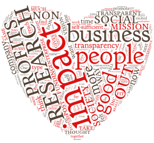
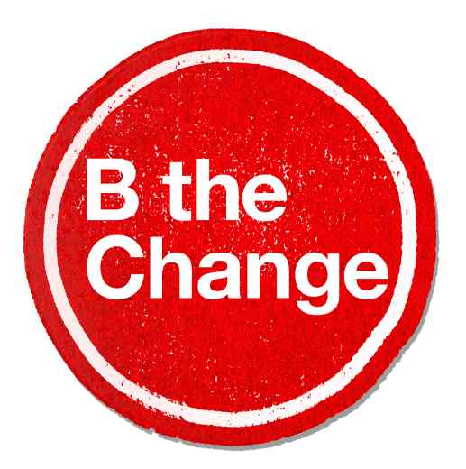

{.static .retina}\

We have gone through an identity crisis recently as we have tried to figure out
who we really are as a company. Since the beginning of this whole venture, we
have felt like we have been straddling the fence between a profit and
non-profit organization in our desires to promote research and grow in the way
we envision yet have the community support that is so critical for the future
of research. We wanted a business structure that took the best parts from
both!

<!--MORE-->

We have a [mission] that is the most important reason that we are doing all
this to begin with---and we believe in it. We are so excited about it. But at
the same time we have some great business ideas to promote this new paradigm of
research. We don't want to have to deal with the funding limitations and red
tape of the [501]{.oldstyle}(c)[(3)]{.oldstyle}. We just want to focus on our
mission.

On the other hand, we don't want the fact that we are a for-profit company to
deter people from supporting what we are doing. As a for-profit company, how
_do_ we rally researchers, scholars, academics, and others behind us? Isn't
this the domain of the not-for-profits?

Martin Weller, Professor of Educational Technology at [The Open University],
stated:

<figure class="bq grab">

> I’ve heard Stephen Downes say that as soon as any form of commercial
> enterprise touches education it ruins it (or words to that effect). I
> wouldn’t go that far, I think for instance that commercial companies often
> make a better job of software and technology than universities, but academic
> publishing is such an odd business that maybe it doesn’t make sense as a
> commercial enterprise. As David Wiley so nicely parodies in his [trucker's
> parable][parable], there isn’t really another industry like it. Academics
> (paid by the taxpayer or students) provide free content, and then the same
> academics provide free services (editorship and peer-review) and then hand
> over rights and ownership to a commercial company, who provide a separate set
> of services, and then sell back the content to the same group of academics.

> I know a few people who work in commercial publishing, and they are smart,
> good people who genuinely care about promoting knowledge and publishing as a
> practice. This is not a cry for such people to be out on the streets, but
> rather for their skills and experience to be employed by and for
> universities, the research communities and the taxpayer rather than for
> shareholders. In this business Downes’ contamination theory seems to hold,
> there is simply no space in the ecosystem for profit to exist, and when it
> does it corrupts the whole purpose of the enterprise, which is to share and
> disseminate knowledge.

<figcaption>--- from the blog post [<cite>The great Open Access swindle</cite>][swindle], a guest post on the Open Knowledge Foundation's blog.</figcaption>
</figure>

Past indiscretions of commercial companies have tainted the provenient pool of
scholarly publishing. How can we avoid these pitfalls?

Within the current publishing paradigm we agree with Weller---there is no space
for profit to exist without imposing tariffs on either the inputs or the
outputs of knowledge dissemination. Those with narrow, profit-centric views
have embezzled the scholarly community, in the process setting themselves up as
the gatekeepers of knowledge dissemination.

Our vision of [the future of research][future] is so different from the modus
operandi of scholarly publishing, that I think we have a fighting chance of
making a difference without falling into the traps of the current commercial
publishers. Our business model does not restrict the dissemination of
knowledge, but is based on providing tools and services that help with the
actual process of research.

Originally, we felt strongly about doing this as a for-profit company so we
could have the flexibility to do whatever it took to promote our mission and
generate sufficient profits to extend our reach for good as far as possible. We
also wanted to be self-sufficient and not have to worry about the success of
the next fundraising campaign. We don't think that a taxpayer-funded company is
the best way to go either. Relying on grants has its own perils in these days
of uncertain politics. I don't like the idea staking our company's revenue or
future completely upon them.

After thinking about it some more, I remembered some companies that I have come
to admire. All of them are run by people who have a higher vision of what
business can be. They are good companies started by good people that think
businesses can be more than heartless profit machines. They have what is
sometimes referred to as a double or triple bottom line (people, planet, and
profit). One such business, Ben & Jerry's Homemade, Inc. (you know, the yummy
ice cream), gives [7.5]{.oldstyle} percent of their before-tax profits to
charity and purchases brownies from a bakery that hires people from prison.
Newman's Own Inc. contributes all profits to charity. How can we be more like
them?

In a way, it's funny to think about this right now. We are still
[pre-revenue]{.sic}. Yet, I think _now_ is the time to make these decisions.
Funding choices made early in a company's existence can limit options later on.
In general, tech startups are not known for their philanthropy and humanitarian
generosities. In too many instances, they are characterized more by a
high-velocity scramble to reach the next round of funding, at the same time
giving little thought to what it actually takes to build a self-sufficient,
lasting enterprise. Burnout hits too soon for too many. Much of this problem
stems from the dog-eat-dog world of venture capital investing.[^shareholders]
Does it have to be this way?

# Social What?

I must admit, they didn't teach us much about this in business school. Being a
researcher at heart, I decided to try to find an answer to my question. I found
some really cool things. When I stumbled across the term [social enterprise], I
thought it was referring to an organization that is really good at using
Facebook. Nope. In this context, social refers to society---as in _for the good
of society_. It turns out this is a label for the type of business that we are
trying to build! I cannot tell you how thrilled I was when I found out that [a
social enterprise can be structured as a for-profit company][social business].

According to this Wikipedia article,

> a <dfn id="socialbusiness">social business</dfn> is a non-loss, non-dividend
> company designed to address a social objective within the highly regulated
> marketplace of today.  It is distinct from a non-profit because the business
> should seek to generate a modest profit but this will be used to expand the
> company’s reach, improve the product or service or in other ways to subsidize
> the social mission.

YES!!! We finally found out who we are! The pieces are starting to fit together
now. We _can_ use the power of business to help solve the problems with
research! It is funny, since this doesn't drastically change our plans or
approach, but, hey, I'll take validation wherever I can find it! It is nice to
know what type of company we are and to be able to tell someone else now, too.
This definition is very much in line with what we hope this company will be.
And I think it gives us some stuff to work on and a much more focused direction
to take.

We are not alone in this---other companies are seeing the benefit of
structuring this way. [[Google.org]{.domainname}][nytimes article on
Google.org], was structured as a for-profit charity. It was an experiment by
Google to change the way philanthropies are administered. While some problems
arose in [Google.org]{.domainname}'s implementation, their structure is not
limited in the ways that traditional non-profit organizations are limited. For
example, it can create or invest in businesses, lobby Congress, and seek
funding from venture capitalists. It also pays income taxes.

We differ the most from [Google.org]{.domainname} in that we need to make a
profit to survive and to promote our mission, and maybe this is where
[Google.org]{.domainname} went wrong. It acted like a non-profit when [it was
really a for-profit organization][nytimes followup]. We want to keep our
options open, and have the best parts of both worlds. Yet when times get tight,
how can we maintain this status and not fall into the greedy trap of
commercialism?

{.static}\

A non-profit by the name of [B Lab][blab intro] has created a certification
called a <dfn id="def:b-corp-certification">B Corp Certification</dfn>, and is
spearheading legislation in some states to create a related business entity
called a benefit corporation. They say, "By voluntarily meeting higher
standards of transparency, accountability, and performance, Certified B Corps
are distinguishing themselves in a cluttered marketplace by offering a positive
vision of a better way to do business." They have put together a governance
model to help businesses maintain this high level of transparency,
accountability, and performance. This governance model can be _baked_ into
corporate bylaws and even state laws in some states. We are excited at the
prospect of becoming a benefit corporation in the future, so stay tuned!

You may argue, "But is research good for society?" If you're reading this post,
I probably don't have to convince you of that.[^goodforsociety]

[mission]: </company/#sec:mission> "Pentandra's mission"
[The Open University]: <http://www.open.ac.uk/>
[parable]: <http://chronicle.com/blogs/wiredcampus/david-wiley-the-parable-of-the-inventorthe-trucker/7244>
[swindle]: <http://blog.okfn.org/2012/10/22/the-great-open-access-swindle/>
[future]: </research/#sec:future> "Pentandra → The Future of Research: A Manifesto"
[social enterprise]: <http://en.wikipedia.org/wiki/Social_enterprise> "Social Enterprise on Wikipedia"
[social business]: <http://en.wikipedia.org/wiki/Social_business> "Social Business on Wikipedia"
[nytimes article on Google.org]: <http://news.blogs.nytimes.com/2006/09/14/philanthropy-googles-way-not-the-usual/>
[nytimes followup]: <http://www.nytimes.com/2011/01/30/business/30charity.html?pagewanted=all>
[BLab intro]: <http://www.bcorporation.net/what-are-b-corps/the-non-profit-behind-b-corps>

[^goodforsociety]:

    It is thanks to research that the Internet and this post have been brought
    to you today. A better question might be: is this _post_ good for
    society? :satisfied:\ 

[^shareholders]:

    This is one reason we have been so careful in the selection of our
    shareholders.
