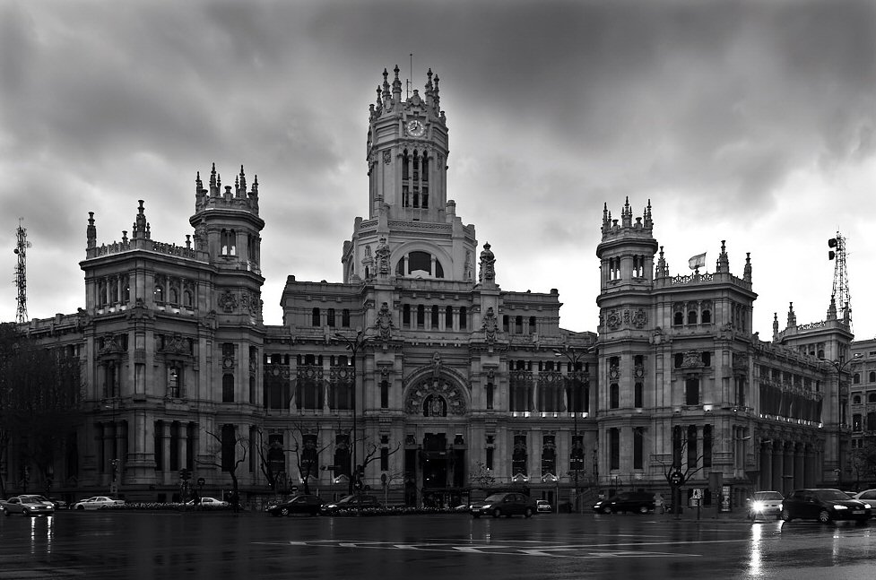

Early on in our preparations for the [Madrid workshop], we needed some ideas
for a logo for the Scholarly Commons. I've studied design, art, music, and
typography, all of which are rooted in culture and history (and all of which
are connected in very interesting ways), so I was intrigued with the idea of
creating something that would express the essence of the Scholarly Commons from
various perspectives. I also thought it going through such a design process
would help me wrap my brain around the potentialities of a scholarly commons,
so I volunteered for the job. Little did I know where all this would lead...

<!--MORE-->

It was not very long into the design process before I realized that I couldn't
effectively design branding for something that had not yet been defined. Either
my design would influence what the Scholarly Commons turned out to be, or as we
eventually converged on what the Scholarly Commons _should_ be, we would find
that my premeditated design was just plain wrong. I needed to have a better
feel and understanding of what the Scholarly Commons was supposed to be. There
was just so much that I didn't understand about commons and scholarship
(especially as the definition of scholarship seems to be unbounded when I'm
left to think about it for too long). I knew enough to know that a commons is
grown out of shared understanding, and wasn't something that I could just go
out and define on my own. Just as the _definition_ of the Scholarly Commons has
to grow out of collective effort, the _branding_ of the Scholarly Commons must
be the fruit of the same collaborative process if it is to accurately represent
it.

So I ended up bagging some of my early approaches at branding the Scholarly
Commons, and focused on designing something for the much more limited scope of
the first workshop in this program, held Madrid, Spain last February. This
would give us something to start with, and maybe some elements could grow out
of this more limited design process and feed back into the branding for the
Scholarly Commons down the road.

# A More Doable Approach

As I started thinking about the much more limited scope of creating some
branding for the workshop in Madrid, I found I could finally wrap my brain
around it, and thoughts started flowing. Yay! We needed something that would
show the significance and modernity of the workshop's theme: _reimagining
research communications_, but at the same time, something rooted in culture
that would connect us to the past. We look to the future when trying to
discover new things, but our corpus of scholarly knowledge is rooted deeply in
the past. Of course, since we were doing this in Madrid, I also wanted
something that would bring in some of the Spanish flair.

Spain is known well for its architecture, so I thought that there may be some
architectural edifice or feature that could serve as the basis for a design. It
didn't take long to find it.

Intro to [Palacio de Comunicaciones]{lang=es}.

<figure property="schema:sharedContent" resource="#palacio_de_comunicaciones" id="photo:palacio-de-comunicaciones" class="img" typeof="schema:ImageObject">
  <link property="schema:representativeOfPage" resource="schema:False" />
  <meta property="schema:width" content="977" />
  <meta property="schema:height" content="647" />
  <meta property="schema:contentSize" content="113KB" />
  
  <figcaption property="schema:caption"><b property="schema:name" lang="es">El Palacio de Comunicaciones</b> (Palace of Communications), located in Madrid, Spain, not too far away from our workshop. <a href="https://ssl.panoramio.com/photo/9301215">Photo</a> by <a href="https://ssl.panoramio.com/user/82662?with_photo_id=9301215" property="cc:attributionURL">Sven Goelles</a>, licensed under a <a href="https://creativecommons.org/licenses/by-nc-nd/4.0/" rel="license"><abbr title="Creative Commons Attribution-NonCommercial-NoDerivatives 4.0 International">CC BY-NC-ND</abbr></a> license. </figcaption>
</figure>

It was not some grand generic building into which the mail delivery process was
fit, but the other way around. The whole building was designed, from the ground
up, to fit the function for which it was to serve: enabling communications.
From several points of view, you could say that the building was _embedded
within_ the city's communications structure. The designers looked at the mail
delivery process, looked at the needs of the public,[^for-the-public] and then
designed the building to _fit_ that context. They looked at the mail process
and then built a building around it.

Not [functionalism].

Eclecticism

Open, big lower floor and drop boxes along the exterior wall, set back.

[Madrid workshop]: </blog/reimagining-research-communications/> "Pentandra Blog → Reimagining Research Communications"
[palacio-photo]: <https://ssl.panoramio.com/photo/9301215> "Photo of the Palacio de Comunicaciones in Madrid, by Sven Goelles"
[Palacio de Comunicaciones]: <https://es.wikipedia.org/wiki/Palacio_de_Comunicaciones> "Palacio de Comunicaciones on Wikipedia"
[Cybele Palace]: <https://en.wikipedia.org/wiki/Cybele_Palace> "Cybele Palace on Wikipedia"
[functionalism]: <https://en.wikipedia.org/wiki/Functionalism_(architecture)> "Functionalism on Wikipedia"

[^for-the-public]: Actually, one of it's design goals was to build "a building for the public."
