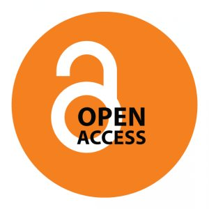
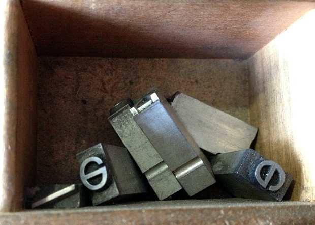
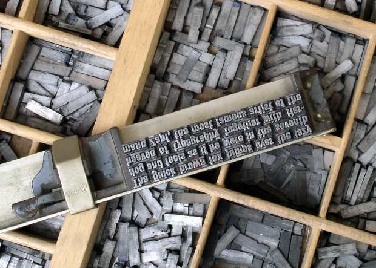

This post is the result of the last two years of searching, trying to
understand how we need to move forward as a company and as a society. The
majority of the section of this post about [the modern open access
movement](#sec:the-modern-open-access-movement) was written in October
*2012*{:.oldstyle}, when open access was probably at its peak of political
popularity. Even though this a jump back in time as far as the open access
movement goes, and was originally written, I think, from an overly academic
viewpoint, it has some value in describing some of the foundations upon which
we are building our ideas and company.
{: .intro }

---

  <link property="schema:representativeOfPage" resource="schema:True" />
  

I have been thinking a lot about open access[^oa-overview] lately and how it
relates to what we are trying to accomplish at Pentandra. I want to discuss
what open access means to us and how that influences our approach to business
and software design.

This post is somewhat of a reaction to the open access movement, and some of
the frustrations I've felt. It is as if open access is this bolt-on attachment
to the paper-publication paradigm that is touted as solving all our problems
with research---that it will open up research to the world. Yet the problem of
open access lies deeper, and we will not reach those promised blessings of
universal access and understanding unless we delve down and solve the problems
that have been holding back our entire research infrastructure.

During the course of writing what has turned into a treatise, I've had to bring
together a broad spectrum of ideas in order to render a complete picture of
where we've come from and where we're going as a society. I've needed to reach
back two thousand years, pull threads out of the centuries, and weave them
together in our present time. I could have shared this picture using more of a
piecemeal approach, separating all of this into a series of posts, but decided
to keep the complete image intact. I think it's important to do it this way so
you can see more clearly where we're coming from as a company.

<!--MORE-->

# Contents
{:.no_toc}

1. Table of Contents
{:toc}

# A Brief History of Open Access

As I [briefly discussed earlier][economics], economics is oftentimes the
underlying motivator for change. To really understand how we've come to where
we are regarding access to knowledge, we need to look at the economics of each
era to understand the motivations for publication. To start with, I'm looking
from the perspective of the publication of knowledge in Europe during [the
middle ages](#sec:the-middle-ages) and [the early modern
period](#sec:the-early-modern-period), two transitionary times that have led us
to where we are today. My goal is not to provide a comprehensive history of
open access or research publication, but only to provide context for
understanding our business and design approach as we work to solve the problem
of [access to knowledge][mission].

## The Middle Ages

The Middle Ages (5th to 15th centuries) was a period of great intellectual
activity.

People were generally more stuck in on place. Feudal law often required that
occupations be hereditary. Did they research? I imagine so. I think that it has
always been man's passion to figure things out. But there was no good mechanism
to share knowledge between fiefdoms. Most communication was oral. Few books
existed, and those that did were cloistered away in monasteries---closed to the
public.

Illiteracy was widespread, but even beyond that, books were normally written in
[Latin], a language that the common people did not even know. 

Barriers to the spread of knowledge included:

1. Language
1. Location
1. Access to books (formal knowledge presented in an accessible-for-learning
   way) ($$$ and due to the below 2 problems)
1. Formal education (was handled by the church)
1. Scale

### The Work of Many for the One

Only the wealthy could afford books during this time. The one that was
commissioning a book would employ a [clerk], or scholar, would manage the
copying process of the book. Normally, the clerk employed scribes or copyists
to do the actual work of writing the book.

Each page was a work of art, and required careful planning. The text and images
were not separate things, but were designed as one and flowed together into a unified
whole.

<figure id="fig:illuminated-scientific-manuscript" class="img" property="schema:image" resource="#illuminated_scientific_manuscript" typeof="schema:ImageObject">
  
  <figcaption><b property="dc:title schema:name">An illuminated scientific manuscript</b>, or better known at the time as <dfn><a href="https://en.wikipedia.org/wiki/Natural_philosophy" title="Philosophia Naturalis on Wikipedia">natural philosophy</a></dfn>, written in <a href="https://en.wikipedia.org/wiki/Latin" title="Latin on Wikipedia">Latin</a> upon <a href="https://en.wikipedia.org/wiki/Parchment" title="Parchment on Wikipedia">parchment</a> circa 1292, showing a contemporary depiction of the Arabic <a href="http://en.wikipedia.org/wiki/Toledan_Tables">Toledan tables</a>, which used geometric chords and sines to predict the movements of the Sun, Moon, and planets relative to the fixed stars. At this time, the prevailing belief was that the Earth was stationary at the center of the universe. Licensed under a <a property="cc:license" href="http://creativecommons.org/publicdomain/zero/1.0/" ><abbr title="Creative Commons Zero (Public Domain Dedication)">CC0</abbr> license</a> by the <a property="cc:attributionName" rel="cc:attributionURL" href="http://www.bl.uk">British Library</a>. </figcaption>
</figure>

### Access to Knowledge

<figure id="fig:galileo" class="bq grab">
  <blockquote>
    

      The <em>leitmotif</em> that I recognize in Galileo's work is the
      passionate fight against any kind of dogma based on authority. Only
      experience and careful reflection are accepted by him as criteria of
      truth. Nowadays it is hard for us to grasp how sinister and revolutionary
      such an attitude appeared at Galileo's time, when merely to doubt the
      truth of opinions which had no basis but authority was considered a
      capital crime and punished accordingly.

    

  </blockquote>
  <figcaption>--- Albert Einstein, forward to Galileo's <cite>Dialogue Concerning the Two Chief World Systems, Ptolemaic and Copernican</cite>, reprinted in 1953.</figcaption>
</figure>

Transition and the supposed immortality of copyists

## The Early Modern Period

1. Latency

### The Republic of Letters

The availability of postal services lowered the barrier of location, though it
introduced another problem: latency.

The Invisible College

Rosicrucianism and the Royal Society

Duplicating machines

### The Printing Press: The Work of One (or a few) for the Many

Printing press lowered the barrier of scale. It didn't eliminate it by any
stretch of the imagination, but it was a whole lot more economical than hiring
a cadre of copyists.

The printer and later the publisher became the one in charge of what got
published thanks to economics.

Journal des Sçavans and Philosophical Transactions

<cite lang="en-GB">Philosophical Transactions, Giving some Accompt to the of the present Undertakings, Studies, and
Labours of the Ingenious in many considerable parts of the World</cite>

<figure id="fig:printing-press" class="img" property="schema:image" resource="#printing_press" typeof="schema:ImageObject">
  
  <figcaption><b property="schema:name dc:title">A Gutenberg-style printing press</b>, inside the Book Workshop of La Maison Fusier, located in the town of Ferney-Voltaire, France. Printing presses like these made the mass dissemination of knowledge possible.</figcaption>
  <link property="rdfa:copy" resource="pentandra-website:license" />
</figure>

## The Modern Open Access Movement

This is when open access became a thing. Before that, it existed, but not as a
thing.

In the lingua franca of the current open access movement, <dfn
id="def:openaccess">open access</dfn> means allowing unrestricted access to the
results of publicly funded research (journal articles and sometimes the
underlying data as well) to the public over the Internet for free.

---

In general, scholarly research is being published the same way it has been
published since the beginning of scholarly publishing (with the <a
href="http://en.wikipedia.org/wiki/Journal_des_s%C3%A7avans"><cite
lang="fr">Journal des sçavans</cite></a> and the <a
href="http://en.wikipedia.org/wiki/Philosophical_Transactions_of_the_Royal_Society"><cite>Philosophical
Transactions of the Royal Society</cite></a> in 1665). With the passing of almost 350 years and the advancements of the digital age, the
venerable research paper has evolved from a paper-only publication to a digital
publication as well, usually taking the form of a PDF. While the research paper
is being published increasingly in this modern-day medium, it still closely
resembles its thin, fibrous counterpart. However, the digital medium has made
research papers much cheaper to distribute, making ideas like open access
financially feasible.

---

We support the principles behind the open access movement. As I quoted Martin
Weller in [a previous post][truckers_parable], it just makes sense for the
public to be able to have open access to the research it paid for in the first
place. Researchers like open access because it enables their research to have a
broader dissemination and a subsequently larger impact.

Pretty much, the only people that don't like open access are the journal
publishers.[^anti-OA] Open access effectively flips their business model upside
down.  The problem is that publishers don't want these research papers
distributed freely. They want them behind a paywall so they can continue to
profit from their business model, which is based primarily on journal
subscriptions. This approach has been working great for them for the last 100+ years. Making a profit is not bad---but they are
in a position to charge whatever they want for journals and get away with it.
And they do. They get all the profits, but they do not add much
value[^pubvalue] to the research that is donated to them. Journal subscription
costs continue to rise 5--7 percent each year as
library budgets are shrinking. Yet these publishers have consistently netted
over 35 percent each year, while all the
refereeing, writing, and editing is done for them for free by researchers.
Large academic libraries in the UK (and I'm sure it is a similar cost here in
the states) end up paying over £1,000,000 a year for research that was donated to
these insatiable institutions, quite possibly by members of their own faculty!

The fact that this practice has persisted for so long is kind of mind-boggling.
I guess there really was no other option until the Internet came along with a
better way to publish.

C'mon, publishers, are you so comfortable with your
modus operandi that you require legislation to perpetuate your antiquated
business model? There are [so many other options][velvet_rope] for monetizing
the research and publication industry in more valuable ways!  Come down from
your this-is-how-it-has-always-been-done ivory towers, stop digging in your
heels, and get with the 21st century.

Putting their business practices aside, as a researcher, I don't want to shell
out $8--30 per paper
when I don't even know beforehand whether the paper will significantly help my
research project. If I was not a student or faculty member of an academic
institution, where I had access to some of the more popular journals, I
probably would not risk the expense unless the paper's abstract was
particularly convincing.

### Public Policy

So where does all this publicly-funded research come from? Well, the government
collects taxes from the public. These public funds are distributed by the
government to researchers in the form of grants. Because the government is
distributing the money, it sets the rules. Ideally, those rules would be in the
public interest. To give some context to our thoughts, let me summarize what is
being done about open access right now by governments around the world.

The UK and the European Union seem to be the most progressive in the promotion
of open access. The UK has pioneered efforts to legislate open access, having
mandated that all publicly-funded research will be offered openly by
2014. Following their footsteps, the European
Commission has mandated open access dissemination of all research paid for by
its latest research initiative, named
<a href="http://ec.europa.eu/research/horizon2020/index_en.cfm?pg=home&video=none">Horizon 2020</a>.
It is hoped that other EU member states will follow suit.[^EU-OA]

Australia and New Zealand also have a lot of support going for open access and
even [open research](https://sites.google.com/site/nzauopenresearch/). In
Australia, two main agencies give out research funds: the National Health and
Medical Research Council and the Australian Research Council. Earlier this year
the NHMRC mandated a policy to put research papers in an open access repository
12 months after publication. The ARC is now
[following their lead][arc].

In the US the situation is a little different. Several attempts have been made
to legislate open access, but there has been a lot of opposition and not all
have been successful. In 2008, a bill was
successfully passed[^NIH] that required all NIH-funded research be submitted to
[PubMed Central][PubMed], an open access repository for the
biomedical and life sciences. Hoping to keep the momentum going, the [Federal
Research Public Access Act][FRPAA] was introduced to Congress,
which extended the similar requirements across all the big governmental funding
agencies. Publishers lobbied[^AAP] and the bill never made it out of committee.
Up to this point in time, FRPAA has been introduced to US Congress three times,
but has not made it out of committee.  The [White House was
petitioned][white_house] in May of this year to require open access
to taxpayer-funded research, effectually proposing the same thing as FRPAA. As
of today, the White House has yet to respond.

More recently, attempts have been made to promote *closed* access to
publicly-funded research.  The most caddish proposal was made right before the
holidays at the end of last year: the Research Works Act.[^RWA] This act would
prohibit any federal agency from mandating open access without the consent of
the publishers, in effect, giving publishers complete control to restrict
public access to all publicly-funded research. Oh---and taking away from the
government the right to have a say in it. This is complete troll-like behavior.
The public has paid for this bridge and the publishers want to make a profit
off of anyone who crosses, and they act as if they are entitled to do it. 

Recently, the governor of the state of Georgia
announced that the Georgia State Archives would be closed to the public
due to budget cuts. They couldn't afford to pay the staff. This isn't the first
time that Georgia has cut funding for the archives. Over the last 10 years, Georgia has cut staff at the archives from
53 employees down to three.[^GSA]

What has the Georgia State Archives to do with open access? Everything. While a
lot of discussion on open access centers around research papers, a big part of
the equation is the [research data]. Without the data, there would be no
conclusions and no papers! If the data is locked up in an inaccessible archive,
it sure makes it hard to access. Why does access to the data matter? Because
without the access, we can't use it. All the research that has used that data
cannot be verified anymore, and future research cannot be built reliably on top
of it.

Closing the archives also sets a dangerous precedent for thoughtless
legislators to follow when looking for quick and easy budget cuts.

Other well-intentioned, but shallow-thinking legislators are trying to limit or
completely deny public access to United States Social Security Death Records
for the sake of discouraging identity theft, yet their efforts only exacerbate
the problem, effectually [removing the only way to detect it][ssd].
Some say that we are entering the [beginning of the Dark Ages][public_access]
for public records.

### Beyond Fairness

While the self-serving actions of the publishers may be reason enough to
support open access, there is another, more meaningful reason besides
*fairness*. Open access opens up a huge potential for collaboration and moving
scientific research forward.

When research is disseminated openly, the entry barrier to build upon that
research is [lowered significantly](/research/#p[TuaIam],h[TuaIam,2]).  Anyone
can access the research, with or without an academic affiliation.  Further
research and innovation can then accelerate more quickly and with less expense.
Having access to research across domains will give more depth and [context] to
future research output. Text mining can accelerate contextual understanding,
leading to surprising cross-discipline breakthroughs and collaboration.

From an economics perspective, open access creates value. Nobody really knows
how that value will be [captured][clothesline] in the future. The
research is just sitting there, on the Ether, ready to be used in some novel,
unforeseen way to make our world a better place.  Open-source software has
created enormous value as developers have taken chunks of software
functionality and put them together in new and innovative ways.  Open-access
research, or even better, [open research](/open/#research), can work the same
way.

# Designing True Open Access to Knowledge

Since 2012, the conversation has drifted from
open access to research papers to open access to research data. Since the time,
we have achieved some limited success. In 2013,
the Obama Administration issued [a directive][obama_directive] to the big US
agencies <q
cite="http://www.whitehouse.gov/blog/2013/02/22/expanding-public-access-results-federally-funded-research">to
make the published results of federally funded research freely available to the
public within one year of publication and requiring researchers to better
account for and manage the digital data resulting from federally funded
scientific research.</q> It's a step in the right direction, at least for the
US. Canada's [three major funding agencies have just recently
adopted][canada-tri-agency] a unified open-access policy. The European
Commission has similarly encouraged open access to research outputs.

But all of this is still not enough. Overcoming the barriers of the past has
uncovered smaller problems and inconsistencies, making invisible things visible
and giving us the opportunity to make previously impossible things possible.

Research must [clearly show] not only *what* data was used, but *how* that data
was used. While open access to research papers and research data is a great
step, it does not solve the fundamental problem of open access to knowledge. In
a way, it's a hack on top of the paper publication paradigm. The same goes for
[altmetrics] as it stands right now. The scholarly paper is just a *format* for
the dissemination[^dissemination] of knowledge. Even if we have access to the
papers *and* the data, we still have a problem. We still have to manually and
mentally extract that knowledge from each paper. Our brains become the
bottleneck and we spend a lot of time trying to crack open nuts. True open
access means more than just open access to these research papers or even to the
underlying research data---it means open access to raw, unadulterated
knowledge, which must include access to the *knowledge-creation process*. To
really understand a piece of knowledge, you need to understand where it came
from---its history. You need to understand *how and why* that nugget of
knowledge came into existence in our culture.

So what would true open access to knowledge look like? I have listed five
general principles below that would really [open up our access to the knowledge
of the world][mission].

## Creating Open Knowledge

Before we can *open up* knowledge, we need to know what *knowledge* is. In our
[mission], we allude to the process of *knowledge creation*, yet can knowledge
really be created? Christopher Columbus did not *create* the [New World]---he
only discovered it[^Vespucci] to the Old World. It had been waiting there all
along. Likewise, knowledge, or truth, is already there, waiting for us to
discover it! The knowledge that this completely new land mass existed was new
to the Europeans. It is in this sense that we talk about knowledge creation.
<dfn id="def:knowledge_creation">Knowledge creation</dfn> is the process of
discovering something that we, as a society, did not know about before, the
acceptance of which has now reached critical mass, meaning that it has been
tested sufficiently and is now generally accepted as truth.[^knowledge_creation]

<figure id="fig:jefferson" class="bq grab">
  <blockquote>
    

      
      That ideas should freely spread from one to another over the globe, for
      the moral and mutual instruction of man, and improvement of his
      condition, seems to have been peculiarly and benevolently designed by
      nature, when she made them, like fire, expansible over all space, without
      lessening their density at any point, and like the air in which we
      breathe, move, and have our physical being, incapable of confinement or
      exclusive appropriation.

    

  </blockquote>
  <figcaption>--- Thomas Jefferson</figcaption>
</figure>

True open access to knowledge requires that this knowledge-creation process be
open and transparent---visible for all to see and build upon.

For thousands of years, we've taken knowledge at face value. That was all that
the medium of paper, parchment, or tablet could do! To explain how a new piece
of knowledge came about, we've had to do it with expository text, located
somewhere around the statement itself. The World Wide Web is largely a transfer
of this textual paradigm to digital form. Has this been valuable? Of course!
But the Web can do far more than paper can. Publishing knowledge as plain text
has worked up to this point, but it's easy for the research context to get lost
or never get published in the first place. The Web can let us look _into_ or
_behind_ a bit of knowledge to see where it came from, where it is now, and
will allow us to take knowledge new places in the future. This is what we call
[<dfn id="def:opening-knowledge">opening up knowledge</dfn>][mission].

### Knowledge on the World Wide Web

With the Web such a large place, why are we worried about access to knowledge?
Yes, there is a lot of knowledge on the World Wide Web, but the creation of
knowledge is disconnected and not on the Web. There is no path for knowledge to
become part of the Web in context. The transition is broken and leads to
research rot. Knowledge integrity.

The World Wide Web has spurred a world-wide collaboration of knowledge. Spirit
of egalitarianism. Yet knowledge is put on the Web, but loses its context---its
past and its future. We can't keep taking knowledge at face value.

<figure id="fig:johnson" class="bq grab">
  <blockquote>
Integrity without knowledge is weak and useless, and knowledge without integrity is dangerous and dreadful.
</blockquote>
  <figcaption>--- Samuel Johnson, <a href="http://www.gutenberg.org/ebooks/652"><em>The History of Rasselas, Prince of Abissinia</em></a></figcaption>
</figure>

Some of the paper-bound artifacts of traditional knowledge creation, namely
citations and peer review, are not first-class citizens on the Web. In fact,
citations have been carted over in situ to the documents of the World Wide Web.
Imposing footnotes on documents on the web is fairly awkward, and feels like a
hack. Footnotes don't really make sense in a web document. For that matter,
footnotes are awkward on paper as well! All of that switching back and forth
nonsense. Footnotes and citations are a remnant of the print paradigm. It seems
they were put at the end of papers as that was the least bad place to put them.
Likewise, they don't fit the Web architecture or take advantage of the power of
the Web. Not only that, but once they are there, it is all too easy to lose
them.

<figure id="quote:web_models_society" resource="#web_models_society" class="bq grab">
  <blockquote cite="http://lists.w3.org/Archives/Public/www-tag/2002Jul/0090.html">
    

      I don't want the Web to constrain what people do: the Web is not there to
      constrain society. It's there to model society in its completeness, in
      its entirety.

    

  </blockquote>
  <figcaption>--- Tim Berners-Lee, in a <a href="https://en.wikipedia.org/wiki/Global_Network_Navigator"><abbr title="Global Network Navigator">GNN</abbr></a> interview, 1994</figcaption>
</figure>

A big part of society is involved in the creation of knowledge. Yet knowledge
creation takes place outside of the Web today. Since the [W3C's vision for the
Web][w3c_vision] involves 'participation, sharing knowledge, and thereby
building trust on a global scale,' doesn't it seem weird that there is no
inherent mechanism to track knowledge *creation?*

What would it look like if the process of knowledge creation was modeled on the
Web? What if you could look *inside* a given fact, and see how it came into
existence? And then support it with additional arguments or challenge it? Maybe
the best way to describe open knowledge is to start with why current
technologies are not open knowledge.

### Publications as Silos

A paper represents a lot of research that was not published.

Due to constraints of the paper publication paradigm, research papers must be
limited in length and must be complete before they are published. Anything else
just would not make sense economically for the publisher. Negative results do
not get published for the same reason.

<figure class="bq grab">
  <blockquote cite="http://www.wf4ever-project.org/wiki/download/attachments/2064544/ISMB2013KeynotecleanGOBLE.pdf">
    

      An article about computational science in a scientific publication is
      <em>not</em> the scholarship itself, it is merely <em>advertising</em> of
      the scholarship. The actual scholarship is the complete software
      development environment, and the complete set of instructions which
      generated the figures.

    

  </blockquote>
  <figcaption>--- Jonathan B. Buckheit and David Donoho, <a href="http://statweb.stanford.edu/~donoho/Reports/1995/wavelab.pdf"><cite>Wavelab and Reproducible Research</cite></a>, 1995.</figcaption>
</figure>

I would add to that the questions and thoughts that were in the researchers
mind as the research was designed in the first place. 

The writing process is wonderful. Writing forces you to think, to formulate
plans and to analyze results. There is a lot of value in it! But there is no
reason the publication process should cost money in our time. There is no
scarcity of resources whose costs are incrementally incurred. It costs no money
to produce a PDF or to [copy it]. There is no value for anyone in it!  People
don't like paying for things that have no value. Peer review is donated. There
is value in making research easier to do---things that could save time during
the research process. But the inputs and outputs of the research process cannot
be trolled!

The emphasis on matter-of-fact statements instead of questions. Hiding the
research process, or perhaps, simplifying, so that only the essential news was
published? Terseness over expressiveness?

### Researchers as Silos

Even with the invention of the printing press, and the technological advances
of the press over the years, research itself has remained, in large part, a
black-box, manual process.

Traditionally, the research process itself has been a very manual, low-tech
process, even in high-technology domains. Progress is tracked in research
notebooks and Post-it notes, or is just kept in the researcher's head. In this
way, researchers themselves are silos! This culture has been promoted by a
focus on [scientific priority] coupled with [over-discriminating journal
publishers](#sec:the-modern-open-access-movement).

In the end, the researchers must distill all of their notes
into a four- or eight-page paper. Yet, what happens to all those notes? What
happens to all the knowledge locked up in the researcher's head? Currently, it
stays there and doesn't get shared.

Look at collaboration and openness as a positive thing, a way to do more good,
more quickly. Trickle down economics.

## Emphasizing Attribution, not Authorship

We need to focus more on attribution, not authorship. We're researchers first,
not authors, aren't we? We want to know who did the *research!* Authorship in
research is a remnant of [the early modern
period](#sec:the-early-modern-period), and stems from the limitations of the
paper publication paradigm. When all you have is a monolithic paper at the end,
*is there any other way to attach your name to your research?* Authorship has
been the source of countless scientific squabbles. All to often, it's the
researcher with the most power in an organization who ends up higher up in the
list of authors of a research paper, not the one that actually did the most
work! In fact, David Colquhoun has mentioned that he has 'come across cases
where authors had not even read papers on which their name
appears.'[^colquhoun]

True open access to knowledge needs to be very fine-grained, so you know exactly
who did what. Transparency is the important factor here, not so much for
personal aggrandizement or [scientific priority], but for accountability and
traceability. In general, I don't believe in the *[lone genius]*. Great
breakthroughs in knowledge are almost always very incremental, and are built
upon the thoughts of many predecessors. To teach anything else disregards the
context in which a discovery was made. I subscribe more to the theory of
*[multiple discovery]*---<q
cite="http://en.wikipedia.org/wiki/Multiple_discovery">that most scientific
discoveries and inventions are made independently and more or less
simultaneously by multiple scientists and inventors</q>.

<figure class="bq grab">
  <blockquote cite="http://en.wikipedia.org/wiki/Multiple_discovery">
    

      When the time is ripe for certain things, they appear at different places
      in the manner of violets coming to light in early spring.

    

  </blockquote>
  <figcaption>--- <a href="http://en.wikipedia.org/wiki/Farkas_Bolyai">Farkas Bolyai</a>, to his son <a href="http://en.wikipedia.org/wiki/J%C3%A1nos_Bolyai">János</a>, urging him to publish his theory of non-Euclidian geometry without delay.</figcaption>
</figure>

The point is that attribution, or credit, should take care of itself if the
process of knowledge creation is transparent. Like minds should to be able to
work together, focusing on what they are trying to achieve without worrying
unduly about credit management.

### A Highly Heterogeneous Composition

Research is messy. Sometimes it just doesn't fit very well in a four- or
eight-page research paper. While there are some excellent examples of the use
of [wikis][wiki] in research, such as
[Scholarpedia](http://www.scholarpedia.org/) or
[Wikiversity](http://en.wikiversity.org/), wikis are still based on
the research paper model. Transparent collaboration occurs only during the
writing of the paper, and not throughout the entire research process. For most
fields this is not enough. Wikis are built on textual revisions and do not
provide the structure to follow a research conclusion back through the research
process to the underlying data and analyses the conclusion is based upon.
Research semantics get lost, and [citations are just not
enough](/research/#p[RsbOsr],h[RsbOsr,3]).

Open access to the knowledge-creation process needs to be built around the
[unit of research](/research/process/#sec:unit-of-research). This gives
research outputs a natural structure that can be developed in a simple and
understandable way.  These research outputs can then be shared or composed
together in various collaborative ways. This is an important distinction
between [true research software](/research/#p[WtrHwt],h[WtrHwt,2,3]) and wikis.
While it is possible to provide open access to a research paper and even to the
underlying research data, if we fail to show _how_ they are connected, then we
are failing to give people access to the research and thought processes behind
those research outputs. We need the whole [research context][context] to really
understand those research outputs.

## Iterating Research

For some research questions, that is a
good way to go, but for most, 

Over the last decade software development processes have evolved from a
monolithic [waterfall model] to more [iterative]
methodologies. It just didn't work to go through one giant iteration when
designing a complicated software system. It is much more efficient to go
through many small iterations through the development process, getting feedback
from the project owners along the way.

Research is, by nature, iterative. It is very uncommon to come to a correct
conclusion to any sophisticated research question in one fell swoop. Yet the
research paper model promotes the idea that the research needs to be completely
finished before it can be published. It doesn't have to be this way. For many
fields, the research paper is not a good fit for the publication of research.
It's just the way it has been done for hundreds of years. Research is an
iterative process, so a realtime, iterative model for research publication
would be a much better solution to the problem. Research outputs need to be
published little by little, instead of as one perfected, monolithic publication
at the end. It's is better to get the research out there to invite
collaboration and peer review during earlier phases of the research process.
As research progresses, the research outputs are presented in an incremental,
natural way.

As is practiced in traditional research, the prepublication peer review makes
more sense in a print paradigm, where a paper is printed once and can't be
changed after publication. While we are familiar with this paradigm, and much
of academia uses it, paper publications are just not a very good fit for the
research process. It was just all that was available at the time.

If you are not convinced, take a look at the open-source software movement.
Software is not research, but the underlying development processes are very
similar. A software developer's research output is, if you will, the source
code. Using some sort of iterative methodology, the developer will piece little
bits of functionality together until, eventually, he will arrive at a
sophisticated product. The researcher "develops" conclusions in a similar
manner. That product may include a nicely written paper, but all the underlying
research needs to be openly accessible as well.

### The Work of Many for the Many

Asynchronous research.

We don't just need an acceleration of science---we need a completely different
paradigm.

The questions don't change but the answers do
--- Dan Reed

## Determining Research Quality

Why do we care about quality?

1. We want the research conclusions to be correct and trustworthy.
2. We nee to be able to judge how good a researcher is, for hiring or
   promotion.

Because of the nature of research, oftentimes it is hard to find an expert that
can judge no. 2, so an appeal is made to authority. Does anyone else like what
this researcher is saying? Has he or she published in quality journals?
Oftentimes it is hard to know how good their research is by looking at the
research outputs. However, this is true for other experts as well, sometimes
something is published in a high-profile journal, and it has the appearance of
quality research, but only later when others try to reproduce, or check the
results, things don't add up. An anomaly is found in the data.

I am not of the opinion that amateurs should be given only academic drudgework,
but that everyone should have the opportunity to meaningfully participate at
every level of the knowledge creation process.

Yet we all vary in knowledge and skill levels. How can we ensure the quality of
research outputs? We don't have any commonly accepted Authorities of
Omniscience to ask to verify the accuracy of our research. Over the centuries,
we have had to resort to our peers.

What is the purpose of vetting or peer review? Simply to have an established
authority whose output we can depend on with some semblance of trust. Review is
mainly a filtering mechanism! The goal was to exclude as many papers as
possible so as to reduce the incremental costs of printing. This had the added
benefit of reducing [information overload] for the consumer reader. On the
other hand, peer review also helped good papers become better by giving
criticism and editorial feedback to the authors.

Also, researchers didn't publish because they had to for their grant, so they
could continue surviving. They published when they had something valuable to
say. Imagine how much the publication volume of research papers would reduce if
that principle was followed today!

Peer review Separating [impact] from technical validity.

Yet the answers to peer review lie in the foundations of the Web.

We should be able not only to see the research methodology used in a research
project, but we need to be able to peer into the researchers brain to see how
the researcher thinks.

### Forecasting Research Impact

Publishers are notoriously bad at predicting research impact. 

### Judging Technical Validity

Peer review is as [domain-specific] as research itself. In fact, isn't peer
review a form of research? The reviewer has a different motivation---to play
the part of devil's advocate, hypercritically looking for logical fallacies or
other misrepresentations.

Reviews include the vocabulary of the domain. Not only does the criteria, but
the importance of review varies by domain. While we need a general,
domain-agnostic way to share and build on each others' research, the peer
review of the future cannot be one-size-fits all. Researchers are
domain-specific as well, so this should work.

Peer review is a process too, and should be transparent. Questions that are
raised during research should be modeled in the same way as research is. If the
questions are answered during the course of the review by the research under
review, that is good. If questions remain open, that is a sign of either a
problem with the technical correctness of the research, or a future research
direction.

Value in the anonymity of the review may necessitate review attributions to
remain hidden, locked away in individual silos. 

## Democratizing Research

It wasn't too long ago that science was dominated by amateurs. Research was an
avocation enjoyed by teachers, philosophers, and other learned people.

'\[N\]ever before has science become so alienated from the common man, and he, in
turn, so suspicious of science,' said Erwin Chargaff, the biochemist who
discovered <a href="https://en.wikipedia.org/wiki/Chargaff%27s_rules"
>two rules</a> that helped lead to the discovery of the double
helix structure of <abbr title="Deoxyribonucleic acid">DNA</abbr>.

### The Rise of the Professional Researcher

During the first half of the 20th century,
corporations and universities realized that research could form part of their
competitive advantage. Governments also began to employ researchers for
competitive advantage in warfare.[^manhattan-project] After World War II, the National Science Foundation was established in the
US to unify the nation's efforts in scientific progress. In Europe, research
began to be supported at the national level, and since 1984 at the EU level with the [Framework
Programmes]{:lang="en-GB"}.

Isn't this progress? I'm not so sure. It's all too easy for political
priorities to become the prominent driver for governmental funding. [In his
farewell address][eisenhower], Dwight D. Eisenhower warned of the '<q
cite="https://en.wikipedia.org/wiki/Eisenhower%27s_farewell_address">prospect
of domination of the nation's scholars by Federal employment, project
allocation, and the power of money</q>.' When the prevailing culture is *publish
or perish*, the temptation is great to cater to the fashionable, rather than to
follow dreams to explore uncharted territories. The chance of discovering
spectacular vistas have to be balanced with the risk of not winning that grant.
The natural instinct to survive is strong and focuses achievements inward,
instead of what the true motivation of scientific research should be: an
outward expression of love for mankind and the world in which we live, or at
least a passionate desire to *know* how our world works. Instead, researchers
are forced to push research forward relentlessly, all the time pushing other
researchers down in a selfish scramble to survive.

<figure id="quote:institutionalization_chargaff" resource="#institutionalization_of_science" class="bq grab">
  <blockquote>
    

      
      The institutionalization of science as a mass occupation, which began
      during my lifetime, has brought with it the necessity of its continual
      growth---similar in that respect to such mythical entities as the "gross
      national product"---not because there is so much more to discover, but
      because there are so many who want to be paid to do it. Any attempt to
      reform is, therefore, met by insincere cries about the "freedom of
      scientific inquiry"; and this will be followed by the immediate
      constitution of all sorts of pressure groups, marching under the banner
      of Galilei. Entrepreneurs disguised as freedom-fighters may look
      ludicrous, but they are usually effective, for there is little as
      irresistible as the momentum of the pocketbook.

    

    
...

    

      Our kind of science has become so dependent on public support that nobody
      seems to be able to do any research without a handout. If their
      applications are turned down, even the youngest and most vigorous
      assistant professors stop all work and spend the rest of their miserable
      days writing more applications. This continual turning off and on of the
      financial faucets produces Pavlovian effects and a general neurasthenia
      that are bound to damage science irreversibly.

    

  </blockquote>
  <figcaption>--- Erwin Chargaff, <cite>Heraclitean Fire: Sketches from a Life Before Nature</cite>, 1978</figcaption>
</figure>

Some researchers write highfalutin mumbo-jumbo in an effort to sound clever.
Such are attempts to widen the gap between ivory-tower researchers and the
common man---as if the incomprehensible paper makes a researcher intellectually
unapproachable or the grant money justifiable. I think this is an artifact from
[the middle ages](#sec:the-middle-ages), when the prevailing approach was to
keep the masses in the dark. We should be beyond that now. Knowledge is not
exclusively squirrelled away in monastic libraries anymore. It's at our
fingertips. Even government censoring cannot stop the flow of it. There is no
excuse to try to keep people from learning so as only to prove your own
intellectual superiority. The dynamics of the knowledge industry are changing,
and we need to start working together as a team. Any concept can be explained
simply if enough thought is put into it. I think it actually requires *more*
skill to explain complicated things in a simple way, relating in such a way
that a broad audience can understand. Truth is simple. Knowledge is not the
exclusive property of the professional intellectualist. The *real* power comes
in teaching and sharing---in collaboration---where, like a good choir or
orchestra, the whole is greater than the sum of the parts.

In saying this, I don't want to diminish the importance of domain vocabularies.
Domain-specific vocabularies are justified and needed to explain complicated
technical concepts in a given domain or discipline. Yet, as we learned from
[Jack Andraka](#sec:some-good-examples), anyone can understand complicated
vocabularies and concepts if they're willing to put forth the effort.
[Wikipedia] anyone?

### A Hope for Little Research

Just like the World Wide Web lets people of all skill levels participate in the
[Web of Documents][web], true open access to knowledge needs to allow
people---of all skill levels---to participate in the process of knowledge
creation.

We live in a time of widespread intellectual affluence. Knowledge is available
for free at your nearest Internet connection. We need researchers that are
motivated by a [passion for discovery][passion]---that want to serve humanity
without hidden agendas or selfish motivations.

<figure class="section" resource="#you_are_amateurs" typeof="schema:VideoObject">
  <meta property="schema:bitrate" content="649k" />
  <meta property="schema:height" content="384" />
  <meta property="schema:width" content="512" />
  <meta property="schema:duration" content="PT5M22S" typeof="schema:Duration" />
  <meta property="schema:thumbnail" content="you_are_amateurs.jpg" />
  <video id="video:you_are_amateurs" style="width:100%;height:100%;" poster="you_are_amateurs.jpg" controls="controls" preload="none">
    <source property="schema:contentUrl" type="video/mp4" src="you_are_amateurs.mp4" />
    <source property="schema:contentUrl" type="video/webm" src="you_are_amateurs.webm" />
    <source property="schema:contentUrl" type="video/ogg" src="you_are_amateurs.ogv" />
    <track kind="subtitles" src="you_are_amateurs.en.srt" srclang="en" />
  </video>
  <figcaption><b property="schema:title">You Are Amateurs</b> from <cite>A Christmas Without Snow</cite>, via the <a href="https://archive.org/details/AChristmasWithoutSnow" property="prov:wasDerivedFrom">Internet Archive</a>, produced by Korty Films in 1980. Licensed under a <a property="cc:license" href="http://creativecommons.org/publicdomain/zero/1.0/" ><abbr title="Creative Commons Zero (Public Domain Dedication)">CC0</abbr> license</a>. </figcaption>
</figure>

It was in 1905, while Albert Einstein worked
full-time as an examiner at a patent office, that he published [four
papers][miracle year], including his papers on [special relativity] and
[mass-energy equivalence], that would change our understanding of space, time,
and matter. A few years passed. According to his wife Elsa, '<q
cite="https://en.wikipedia.org/wiki/Albert_Einstein" class="sic">\[d\]uring
breakfast on morning, \[Einstein\] seemed lost in thought and ignored his food.
\[I\] asked him if something was bothering him. He sat down at the piano and
started playing. He continued playing and writing notes for half an hour, then
went upstairs to his study, where he remained for two weeks, with \[me\]
bringing up his food. At the end of the two weeks he came downstairs with two
sheets of paper bearing his theory \[of general relativity\].</q>'[^chaplin]

What if Einstein had waited for a federal grant before starting on this work?
The chances of a grant proposal being accepted would have been very small,
since his ideas seemed insane at the time. What then? If a grant had been
denied, would he have decided to just forget about it? Instead, he pursued his
passion in simplicity. This was the era of [small science], when science was
pursued for the love of it. 'Love is a better teacher than a sense of
duty,'[^violin_practicing] Einstein said, and 'imagination is more important
than knowledge.' 

I'm not suggesting that the world is full of thousands of untapped Einsteins,
but that we need to check our motivations for pursuing science and research as
a society in general. We need to do more of, what I would call, <dfn
id="def:little_research">little research</dfn>. We need to create a world
where, as Chargaff put it, science and research are dominated by '<q
id="q:amateurship"
cite="https://en.wikipedia.org/wiki/Citizen_science#History">amateurship
instead of money-biased technical bureaucrats</q>.'

The change that I would like to see is for everyone to be a part of this
intellectual revolution---that we get rid of the ivory tower and play this game
together, on an even playing field, respecting and valuing each others vastly
disparate contributions to this great work. In many ways this would parallel
the web developer revolution that has occurred over the last two decades. At
the beginning of the Web, the scientists were the web developers. There's a
reason the Web looked like it did in the 90's,
and it was not all a technical problem. The Web was created at CERN to navigate
between scientific documents. Designers at some point realized the vast
potential of design on the Web, and pushed for the ability to express more.
Business people flocked to the Web when they saw the potential to disseminate
more information [for low or zero costs][copy it]. Slowly, the Web grew up and
we have HTML5, CSS3, JavaScript, browsers that can handle great complexity
without breaking a sweat, and an audience that wants it. Web developers come up
with extremely creative solutions, learn from and share ideas freely with each
other. It doesn't matter which school they attended, only how good their ideas
are. They are playing on an even playing field. Anyone can be a web developer!
The same can happen with research and researchers.

# Technological Foundations of Research Publication

We live in a different time now than when Sir Isaac Newton was around---a time
in which we can take advantage of [multiple discovery] and push forward
knowledge in an unprecedented way.

[Clayton Christensen] of Harvard Business
School [predicts][technological core] that '<q
cite="http://techcrunch.com/2013/04/06/clayton-christensen-talks-venture-capital-crowd-funding-and-how-to-measure-your-life/">in
15 years from now, more than half of the
universities will be in bankruptcy.</q>' The reason? '<q>For 300 years, higher education was not disruptable because
there was no technological core.</q>' Well, education is getting disrupted
right now, thanks to the technology core of [Udemy], [Coursera], [General
Assembly] and the like.

Research is getting a technology core as well. It's coming slower than
education, but it is coming. *Research will be disrupted.*

So what is truly required for research to be published? What is research made
of, that when you took it away it would cease being research?

## A Closer Look at 17th Century Tech

To understand how to move forward, we must look back to the past. Let's take a look
at the technology that was available for scientific publications during the
17th century. It can serve as sort of a loose
metaphor for how to proceed in the future.

<figure id="fig:movable-type" class="img" property="schema:image" resource="#movable_type" typeof="schema:ImageObject">
  <link property="rdfa:copy" resource="pentandra-website:license" />
  
  <figcaption><b property="schema:name dc:title">Movable type</b>, or <em>sorts</em>, in a type case. Licensed under a <a href="http://creativecommons.org/licenses/by/4.0/"><abbr title="Creative Commons Attribution 4.0 International">CC-BY</abbr> license</a>. </figcaption>
</figure>

Movable type worked really well for alphabets that had relatively few
characters in them.

<figure id="fig:composing-stick" class="img" property="schema:image" resource="#composing_stick" typeof="schema:ImageObject">
  
  <figcaption><b property="schema:name dc:title">Movable type in a composing stick</b>, by Willi Heidelbach, licensed under a <a href="http://creativecommons.org/licenses/by-sa/3.0/" rel="license" property="cc:license"><abbr title="Creative Commons Attribution-Share Alike 3.0 Unported">CC-BY-SA</abbr> license</a>.  </figcaption>
</figure>

## Research Cases: A Proposal for the Future

Research begets knowledge. Just as Gutenberg found a way to break down a page
of text into movable type, we need to break research itself down into little
pieces.

Having the open access to the research data is not enough---you also need to
know [how that data was used][clarity].

Research cases are more a social construct than technical. Research objects
seem more technical.

Research Objects are great for aggregating professional scholarly deliverables,
but their strength is also their weakness. They have no semantic meaning. They
are a glorified zipfile inexorably tied to the project-based grant funding
model. They don't address the conceptual foundations of what research actually
*is*. An that may be fine for the professional researchers. But is that really
what the world needs? How do research objects make the pursuit of knowledge
more understandable to the public? Do research objects lower barriers for
citizen involvement? I don't see it yet. Kettering is also quoted as saying,
"People are very open-minded about new things---as long as they're exactly like
the old ones." Research objects are definitely better than the venerable
research paper, but they are still as closed-minded.

# Freedom

Do I think that these ideas will be widely accepted by professional research
community? Probably about as much as telling a community of professional
pastors of religion that the world needs more lay ministers. This may be
especially true for those researchers that are at the top of their professional
ladders. Yet, I may be writing more to the those of the world that are
researchers at heart, not by profession, or to those researchers that are
starting out, trying to make sense of a paradoxical profession.

In that past (as in before the Internet), high-profile, prestigious journals
were the best way to get access to the latest research. Nowadays there are
faster and better ways to communicate and disseminate scholarly research, and
the big journal publishers are actually getting in the way and bottlenecking 
research dissemination. When it comes down to it, this is all about freedom.
There is just no good reason anymore why a third party should stand at the gate
of publicly-funded research, giving or denying access to whomsoever it wishes.
Any time there is someone arbitrarily regulating the free flow of information
(or research, in this case), we, as researchers, entrepreneurs, and citizens
will not have access to the information we need to make the best decisions in
our jobs, lives, and nations.

We, at Pentandra, are committed to designing research software from the ground
up with open access in mind. While there are some exciting advancements in
current research software,[^utopia] we think that these improvements are
transitional, and that the future of research lies in open, [domain-specific]
research systems.
{: .conclusion }

# End Notes
{:.no_toc}

1. Footnotes
{:footnotes}

# Additional Resources
{:.no_toc}

* [The Coming of the Book: The Impact of Printing 1450--1800][febvre], by Lucien Febvre and Henri-Jean Martin. 
* [The Printing Press as an Agent of Change][press_agent], by Elizabeth Eisenstein. 
* [Hypertext as an agent of change][hypertext], by Mandy Brown.
* [Manuscripts, Books, and Maps: The Printing Press and a Changing World][booktext], by Bruce Jones.
* [The Funding of Science][funding] on Wikipedia.

[^anti-OA]: Some publishers do support open access, primarily the "gold"
    variant, where the author pays the fee to publish his research. Then the
    publishers feel that they were paid enough to make it worth their while
    and the public does not need to pay anything for access.
    [More information about methods of financing open access](http://en.wikipedia.org/wiki/Open_access#Methods_of_financing_gold_open_access_publishing)
    can be found on Wikipedia.

[^AAP]: The Association of American Publishers was the 
    [primary opponent](http://en.wikipedia.org/wiki/Federal_Research_Public_Access_Act#Opposition)
    of the
    <a href="http://thomas.loc.gov/cgi-bin/query/z?c112:H.R.4004:"><abbr>FRPAA</abbr></a>
    and the
    [proponent](http://en.wikipedia.org/wiki/Research_Works_Act#Reception)
    of the Research Works Act.

[^GSA]:

    As of November 1, 2012,
    [Georgia State Archives was set to lose seven](http://georgiaarchivesmatters.org/2012/09/27/the-staff-what-we-stand-to-lose/)
    of the remaining ten employees. Because of
    [the efforts of many](http://www.change.org/petitions/the-governor-of-ga-leave-our-state-archives-open-to-the-public)
    Governor Nathan Deal
    [restored two of the jobs](http://www.ajc.com/news/news/state-regional-govt-politics/5-georgia-archives-employees-will-still-lose-jobs/nShnm/),
    which will be enough to keep the archives open until the middle of next
    year. At the same time, as is unfortunately all too common with competing
    political priorities, Georgia is spending upwards of $400 million in public funds to
    [build a controversial new football stadium][football]
    instead of retrofitting the Georgia Dome with a retractable roof. 
    Happily, during the latest session of the Georgia General Assembly (2013--2014), a good portion of the archive's lost
    budget was restored. You can track the progress on
    [georgiaarchivesmatters.org](http://georgiaarchivesmatters.org/){:.domainname}.

[^RWA]: The [Research Works Act][RWA]
    (<abbr>HR</abbr> 3699) would in effect repeal
    <abbr title="National Institutes of Health">NIH</abbr>'s 
    <a href="http://publicaccess.nih.gov/policy.htm">open access policy</a>.
    Richard Price, <abbr>CEO</abbr> of [academia.edu](http://academia.edu){:.domainname},
    wrote about [some of the particular arguments](http://blog.academia.edu/post/17986108041/the-dangerous-research-works-act)
    against this bill. As a reaction to this bill and to being fed up with the
    injustices of the current system in general, some researchers set up [a
    website to boycott Elsevier](http://thecostofknowledge.com/), one of the
    primary promoters of the bill.

    In response to many of these reactions,
    [Elsevier eventually withdrew support][elsevier_RWA]
    for the bill. Representatives Darrell Issa and Carolyn B. Maloney issued
    the [following statement](https://plus.google.com/117417705451874519785/posts/7McDJNDrpcR):
    
    > "The introduction of <abbr>HR</abbr> 3699
    > has spurred a robust, expansive debate on the topics of scientific and
    > scholarly publishing, intellectual property protection, and public access
    > to federally funded research.  Since its introduction, we have heard from
    > numerous stakeholders and interested parties on both sides of this
    > important issue.
    >
    > "As the costs of publishing continue to be driven down by new technology,
    > we will continue to see a growth in open access publishers. This new and
    > innovative model appears to be the wave of the future. The transition
    > must be collaborative, and must respect copyright law and the principles
    > of open access. The American people deserve to have access to research
    > for which they have paid. This conversation needs to continue and we have
    > come to the conclusion that the Research Works Act has exhausted the
    > useful role it can play in the debate. As such, we want Americans
    > concerned about access to research and other participants in this debate
    > to know we will not be taking legislative action on <abbr>HR</abbr>  class="oldstyle">3699, the Research Works Act. We do intend to
    > remain involved in efforts to examine and study the protection of
    > intellectual property rights and open access to publicly funded
    > research."
    {: .bq .grab }

[^utopia]: Such as [Utopia Documents](http://utopiadocs.com/).

[^NIH]: This policy was passed as part of the
    <a href="http://thomas.loc.gov/cgi-bin/bdquery/z?d110:H.R.2764:">Consolidated Appropriations Act, 2008</a>.
    The law requires that the paper be submitted to PubMed Central [no later
    than twelve months after publication][nih policy]. While it is great that
    the research will be available eventually, twelve months is too long to
    wait for the latest research for most research organizations, so a
    subscription to the journal is still necessary.

[^pubvalue]: Most of the value added by publishers currently involves
    selecting and typesetting research papers, assigning a
    <a href="http://www.doi.org/">
      <abbr title="Digital Object Identifier">DOI</abbr></a>,
    and organizing the peer-review process. While this is commendable, it is
    hardly worth the money they get paid for it.
    [Listen](http://www.youtube.com/watch?v=v31zpZ4woOI&t=13m35s){:.oa-value}
    to the discussion about the value that publishers currently add to the
    research dissemination process.

[^EU-OA]: The announcement of the mandate from the European Commission came
    only a day after the UK announced their new open access policy. The
    commission [hopes] that open access publishing by member states
    will reach 60% by
    2016.

[^manhattan-project]: One of the first large-scale government research projects
    was the [Manhattan Project], which led to the creation of the
    [US Office of Scientific Research and Development] in 1941, with Vannevar Bush as the director, and the
    creation of a network of national laboratories, including the [Lawrence
    Berkeley National Laboratory], [Los Alamos National Laboratory], [Oak Ridge
    National Laboratory], [Argonne National Laboratory], [Ames Laboratory],
    [Brookhaven National Laboratory], and [Sandia National Laboratory], and was
    the beginning of what we call today [Big Science]. After World War II, Vannevar was instrumental in establishing the
    [National Science Foundation]. Before the war, academic research in science
    and engineering was not considered a federal responsibility.

[^oa-overview]: Open access is a complicated and highly-debated topic right
    now. Many people sit on both sides of the fence. A researcher may publish,
    referee, and even sit on editorial boards, all at the same time! If you
    have a spare half-hour, this is a good round-table discussion on open
    access that gives a deeper look into some of the issues. If you don't have
    much time right now, feel free to pick a question or two below that
    interests you and hear what they have to say:

    * [is open access a good idea?](http://www.youtube.com/watch?v=v31zpZ4woOI&t=1m22s){: .oa-goodidea }

    * [how much does open access cost?](http://www.youtube.com/watch?v=v31zpZ4woOI&t=4m2s){: .oa-cost }

    * [what is the Gold Open Access model?](http://www.youtube.com/watch?v=v31zpZ4woOI&t=11m44s){: .oa-gold }

    * [what can publishers do to add value?](http://www.youtube.com/watch?v=v31zpZ4woOI&t=13m35s){: .oa-value }

    * [how can authors afford Gold Open Access?](http://www.youtube.com/watch?v=v31zpZ4woOI&t=15m31s){: .oa-afford }
    
    * [are publishers really necessary for open access?](http://www.youtube.com/watch?v=v31zpZ4woOI&t=16m33s){: .oa-publishers }

    * [what is the Green Open Access model?](http://www.youtube.com/watch?v=v31zpZ4woOI&t=20m38s){: .oa-green }

    * [are publishers confident in their added value?](http://www.youtube.com/watch?v=v31zpZ4woOI&t=21m24s){: .publisher-value }

    * [will open access put publishers out of business?](http://www.youtube.com/watch?v=v31zpZ4woOI&t=22m43s){: .publisher-death }
 
    * [what countries mandate open access right now?](http://www.youtube.com/watch?v=v31zpZ4woOI&t=26m39s){: .oa-promoters }

    <figure id="ruvr" class="section">
      <video class="simple" width="100%" height="100%" style="width: 100%; height: 100%;" id="player" preload="none" controls="controls">
        <source type="video/youtube" src="http://www.youtube.com/watch?v=v31zpZ4woOI" />
      </video>
      <figcaption>
        
 

          The London Bureau of
          <a href="http://english.ruvr.ru/">The Voice of Russia</a>
          interviews several open access advocates, including Ross Mounce, from the 
          <a href="http://okfn.org">Open Knowledge Foundation</a>, Rita Gardner, the
          director of the Royal Geographic Society, Björn Brembs, Professor at the
          Department of Genetics at the University of Leipzig, and Timothy Gowers,
          Math Professor at Cambridge University.

        

      </figcaption>
    </figure>

    Peter Suber is considered by many to be the expert on open access. He
    understands the philosophy behind it. In a recent interview he said that
    "the focus of the open access movement is on journal articles for which
    scholars are not paid, and therefore for which the have nothing to lose and
    everything to gain by enlarging their audience by putting them online free
    of charge."
    {: .section }

    <figure id="petersuber" class="section">

      <audio id="suberinterview" preload="none" controls="controls">
        <source src="SuberPodcast_mp3.mp3" type="audio/mpeg" />
        <source src="SuberPodcast_ogg.ogg" type="audio/ogg" /> 
      </audio>

      <figcaption>
        

          An interview with Peter Suber on the Harvard University campus at the
          <a href="http://cyber.law.harvard.edu/hoap/Main_Page"
           >Berkman Center for Internet and Society</a>, where
          Suber is a faculty fellow.
          <a href="http://dx.doi.org/10.6084/m9.figshare.96368" class="uri">http://dx.doi.org/10.6084/m9.figshare.96368</a>
          

        

      </figcaption>
    </figure>

    And to finish it off, here is a great video by [PhD Comics]:
    {: .section }

    <figure id="PhD-OA" resource="http://www.youtube.com/watch?v=L5rVH1KGBCY">
      <video class="simple" width="100%" height="100%" style="width: 100%; height: 100%; max-width: 100%;" id="oa-explained" preload="none" controls="controls">
        <source type="video/youtube" src="http://www.youtube.com/watch?v=L5rVH1KGBCY" />
      </video>
      <figcaption>
        

          What is open access? Nick Shockey and Jonathan Eisen take us through
          the world of open access publishing and explain just what it's all
          about.

          <a property="dc:title" rel="cc:attributionURL"
             href="http://www.phdcomics.com/tv/#015">Open Access
             Explained!</a>,
          by <a href="http://www.phdcomics.com"
                property="cc:attributionName"
                rel="dc:creator">PhD Comics</a>,
          is licensed under a
          <a rel="cc:license"
             href="http://creativecommons.org/licenses/by/3.0/">
             <abbr>CC-BY</abbr> license</a>.
          

        

      </figcaption>
    </figure>

[^dissemination]: To me the word *dissemination* evokes the image of a
    researcher on an ivory tower, benevolently throwing out copies of his most
    recent publication to the masses below. I don't like it inasmuch as it
    focuses attention on the altitude of the researcher, rather than on the
    research itself. It also implies a one-way transmission. I prefer more
    down-to-earth terms, such as *collaboration* or *communication*. See
    [Introducing Research Cases][research cases] for a more participative
    approach.

[^Vespucci]: To be completely fair, Columbus only discovered the [West Indies].
    It was [Amerigo Vespucci] who discovered the continents which we know today
    as North and South America.

[^knowledge_creation]: For a more formal definition of knowledge creation, and
    especially for the process that new knowledge takes as it becomes more
    integrated into society, see Ikujiro Nonaka's paper, <a
    href="http://www.jstor.org/stable/2635068"><cite>A Dynamic Theory of
    Organizational Knowledge Creation</cite></a> (behind <abbr>JSTOR</abbr>'s
    paywall, sorry!), and <a
    href="http://www.palgrave-journals.com/kmrp/journal/v1/n1/full/8500001a.html">
    <cite>The knowledge-creating theory revisited: knowledge creation as a
    synthesizing process</cite></a> by Nonaka and Toyama.

[^chaplin]: Charlie Chaplin, in his [autobiography], mentions a dinner at 
    his home in 1926, during which Einstein's
    second wife, Elsa, told him and two other friends about the time Einstein
    conceived of the theory of relativity. She related:

    > The Doctor \[Einstein\] came down in his dressing gown as usual for
    > breakfast but he hardly touched a thing. I thought something was wrong,
    > so I asked him what was troubling him. "Darling," he said, "I have a
    > wonderful idea." And after drinking his coffee, he went to the piano and
    > started playing. Now and again he would stop, making a few notes then
    > report: "I've got a wonderful idea, a marvelous idea." I said: "Then for
    > goodness sake tell me what it is, don't keep me in suspense." He said:
    > "It's difficult, I still have to work it out."
    >
    > Mrs. Einstein told Mr. Chaplin that Einstein continued playing the piano
    > and making notes for about half an hour, then went upstairs to his study,
    > telling her that he did not wish to be disturbed, and he remained there
    > for two weeks. "Each day I sent up his meals," she said, "and in the
    > evening he would walk a little for exercise, then return to his work
    > again."
    >
    > "Eventually," Mrs. Einstein said, "he came down from his study looking
    > very pale." "That's it," he told me, wearily putting two sheets of paper
    > on the table. And that was his theory of relativity.
    {: .bq .grab }

    He later referred to this as the happiest time of his
    life.[^Einsteins_Dream]

[^Einsteins_Dream]: Parker, Barry. [Einstein's Dream: The Search for a Unified Theory of the Universe](http://books.google.com/books?id=GMZyB1bBpssC). Basic Books, 2008. ISBN: 9780465011858.

[^violin_practicing]: While Einstein said this in particular about his love of
    music and violin practice, the same applies to any skill that you are
    pursuing.

[^colquhoun]: <http://www.michaeleisen.org/blog/?p=694#comment-359363>{:.uri}

*[PDF]: Portable Document Format
*[FRPAA]: Federal Research Public Access Act
*[NIH]: National Institutes of Health
*[EU]: European Union
*[US]: United States
*[UK]: United Kingdom
*[HR]: House of Representatives
*[NHMRC]: National Health and Medical Research Council (Australia)
*[ARC]: Australian Research Council
*[OA]: Open Access
*[DOI]: Digital Object Identifier
*[DARPA]: Defence Advanced Research Projects Agency
*[NASA]: National Aeronautics and Space Administration
*[W3C]: World Wide Web Consortium
*[ISBN]: International Standard Book Number
*[HTML5]: HyperText Markup Language, Version 5
*[CSS3]: Cascading Style Sheets Level 3
*[CERN]: European Organization for Nuclear Research (French: Organisation Européenne pour la Recherche Nucléaire)

[clarity]: </research/#sec:clarity> "Pentandra → The Future of Research → Clarity"
[context]: </research/#sec:context> "Pentandra → The Future of Research → Context"
[clearly show]: </research/#p[RsbOsr],h[RsbOsr,3]> "The Future of Research → Clarity (part of)"
[obama_directive]: http://www.whitehouse.gov/blog/2013/02/22/expanding-public-access-results-federally-funded-research
[oa_week]: http://openaccessweek.org/ "A global event promoting Open Access as a new norm in scholarship and research"
[truckers_parable]: /blog/a-social-business/#p[IhSApb],h[IhSApb,4]
[velvet_rope]: http://gigaom.com/2012/03/26/dont-build-a-paywall-create-a-velvet-rope-instead/
[arc]: http://chronicle.com/blogs/wiredcampus/the-australian-research-councils-new-leader-opens-up/40276
[PubMed]: http://www.ncbi.nlm.nih.gov/pmc/ "PubMed Central"
[FRPAA]: http://en.wikipedia.org/wiki/Federal_Research_Public_Access_Act
[white_house]: https://petitions.whitehouse.gov/petition/require-free-access-over-internet-scientific-journal-articles-arising-taxpayer-funded-research/wDX82FLQ
[clothesline]: http://www.edge.org/conversation/-39the-clothesline-paradox-39-
[public_access]: http://www.nytimes.com/2012/09/27/us/budget-cuts-to-limit-public-access-to-georgia-archives.html?_r=0#p[WohFyo],h[WohFyo,1]
[hypertext]: http://aworkinglibrary.com/writing/hypertext-as-an-agent-of-change/
[press_agent]: http://www.amazon.com/Printing-Press-Agent-Change-Volumes/dp/0521299551
[febvre]: http://www.amazon.com/The-Coming-Book-Printing-1450-1800/dp/1859841082
[iterative]: <http://en.wikipedia.org/wiki/Iterative_and_incremental_development>
[waterfall model]: http://en.wikipedia.org/wiki/Waterfall_model
[research data]: </research/process/#p[DirGaf],h[DirGaf,1,2,DciDce,1]>
[ssd]: <http://www.nytimes.com/2012/10/09/us/social-security-death-record-limits-hinder-researchers.html?_r=2#p[MJsMJs],h[MJsMJs]>
[RWA]: <http://thomas.loc.gov/cgi-bin/bdquery/z?d112:HR03699:@@@L&summ2=m&>
[elsevier_RWA]: <http://www.elsevier.com/wps/find/intro.cws_home/newmessagerwa>
[football]: <http://www.bizjournals.com/atlanta/print-edition/2012/05/11/atlantas-proposed-new-football.html?page=all>
[hopes]: <http://www.nature.com/news/europe-joins-uk-open-access-bid-1.11022>
[nih policy]: <http://publicaccess.nih.gov/policy.htm>
[PhD Comics]: <http://www.phdcomics.com/tv/>
[technological core]: <http://techcrunch.com/2013/04/06/clayton-christensen-talks-venture-capital-crowd-funding-and-how-to-measure-your-life/>
[Clayton Christensen]: http://www.claytonchristensen.com/
[illuminated]: <http://en.wikipedia.org/wiki/Illuminated_manuscript> "Illuminated Manuscript on Wikipedia"
[booktext]: http://shikan.org/bjones/Books/booktext.html
[mission]: </company/#sec:mission> "Pentandra → Our Mission"
[scientific priority]: http://en.wikipedia.org/wiki/Scientific_priority
[lone genius]: http://en.wikipedia.org/wiki/Heroic_theory_of_invention_and_scientific_development
[multiple discovery]: http://en.wikipedia.org/wiki/Multiple_discovery
[Udemy]: <http://www.udemy.com> "Our mission is to help anyone learn anything online"
[Coursera]: <https://www.coursera.org/> "Take the world's best courses, online, for free."
[General Assembly]: <https://generalassemb.ly/> "Learn technology, design, and business skills from industry professionals in our global community"
[Latin]: <https://en.wikipedia.org/wiki/Latin> "Latin on Wikipedia"
[parchment]: <https://en.wikipedia.org/wiki/Parchment> "Parchment on Wikipedia"
[clerk]: <https://en.wikipedia.org/wiki/Clerk#History_and_etymology> "The word clerk is derived from the Latin clericus meaning &quot;cleric&quot; or &quot;clergyman&quot;, which is the latinisation of the Greek κληρικός (klērikos), &quot;of the clergy&quot;."
[passion]: </research/#fig:passion> "The sense of mystery that drives a true scientist"
[funding]: <https://en.wikipedia.org/wiki/Funding_of_science> "Funding of Science on Wikipedia"
[Manhattan Project]: <https://en.wikipedia.org/wiki/Manhattan_Project> "Manhattan Project on Wikipedia"
[Big Science]: <https://en.wikipedia.org/wiki/Big_Science> "Big Science on Wikipedia"
[US Office of Scientific Research and Development]: <https://en.wikipedia.org/wiki/Office_of_Scientific_Research_and_Development> "OSRD on Wikipedia"
[National Science Foundation]: <https://en.wikipedia.org/wiki/National_Science_Foundation> "National Science Foundation on Wikipedia"
[Lawrence Berkeley National Laboratory]: <https://en.wikipedia.org/wiki/Lawrence_Berkeley_National_Laboratory> "LBNL on Wikipedia"
[Los Alamos National Laboratory]: <https://en.wikipedia.org/wiki/Los_Alamos_National_Laboratory> "LANL on Wikipedia"
[Oak Ridge National Laboratory]: <https://en.wikipedia.org/wiki/Oak_Ridge_National_Laboratory> "ORNL on Wikipedia"
[Argonne National Laboratory]: <https://en.wikipedia.org/wiki/Argonne_National_Laboratory> "Argonne on Wikipedia"
[Ames Laboratory]: <https://en.wikipedia.org/wiki/Ames_Laboratory> "Ames on Wikipedia"
[Brookhaven National Laboratory]: <https://en.wikipedia.org/wiki/Brookhaven_National_Laboratory> "Brookhaven on Wikipedia"
[Sandia National Laboratory]: <https://en.wikipedia.org/wiki/Sandia_National_Laboratories> "Sandia Laboratory on Wikipedia"
[Framework Programmes]: <https://en.wikipedia.org/wiki/Framework_Programmes_for_Research_and_Technological_Development> "Framework Programmes on Wikipedia"
[Wikipedia]: <http://www.wikipedia.org/> "The Free Encyclopedia"
[web]: <https://en.wikipedia.org/wiki/World_Wide_Web> "World Wide Web on Wikipedia"
[Small Science]: <https://en.wikipedia.org/wiki/Small_Science> "Small Science on Wikipedia"
[eisenhower]: <https://en.wikipedia.org/wiki/Eisenhower%27s_farewell_address> "Eisenhower's farewell address on Wikipedia"
[miracle year]: <https://en.wikipedia.org/wiki/Annus_Mirabilis_papers> "Annus Mirabilis papers on Wikipedia"
[autobiography]: <http://books.google.com/books/about/My_Autobiography.html?id=31UyYJnDhJsC> "My Autobiography by Charlie Chaplin"
[einstein]: <https://en.wikipedia.org/wiki/Albert_Einstein> "Albert Einstein on Wikipedia"
[special relativity]: <https://en.wikipedia.org/wiki/Special_relativity> "Special Relativity on Wikipedia"
[mass-energy equivalence]: <https://en.wikipedia.org/wiki/Mass%E2%80%93energy_equivalence> "Mass-energy equivalence on Wikipedia"
[altmetrics]: <https://en.wikipedia.org/wiki/Altmetrics> "Altmetrics on Wikipedia"
[New World]: <https://en.wikipedia.org/wiki/New_World> "The New World on Wikipedia"
[Amerigo Vespucci]: <https://en.wikipedia.org/wiki/Amerigo_Vespucci> "Amerigo Vespucci on Wikipedia"
[West Indies]: <https://en.wikipedia.org/wiki/West_Indies> "West Indies on Wikipedia"
[w3c_vision]: <http://www.w3.org/Consortium/mission.html#vision>
[wiki]: <http://en.wikipedia.org/wiki/Wiki> "Wiki on Wikipedia"
[domain-specific]: </research/#p[WtrHwt],h[WtrHwt,2]> "Pentandra → The Future of Research → To be most effective, research software must be domain specific"
[copy it]: <http://kk.org/thetechnium/2008/01/better-than-fre/> "Better Than Free, by Kevin Kelly"
[research cases]: </blog/introducing-research-cases/> "Introducing Research Cases"
[economics]: </blog/introducing-research-cases/#sec:publish-or-perish> "Introducing Research Cases → Publish Or Perish"
[canada-tri-agency]: <http://poeticeconomics.blogspot.com/2015/02/canadas-tri-agency-open-access-policy.html> "Canada's tri-agency open access policy, by Heather Morrison"

<% content_for :javascripts do %>

<% end %>
