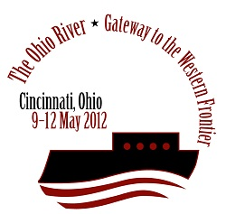
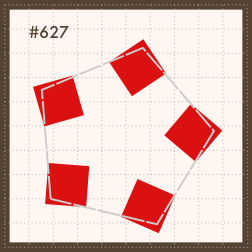
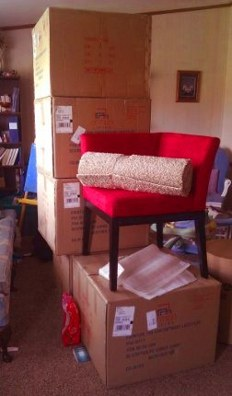

{.static}\

Pentandra is heading to the [National Genealogical Society conference][ngs
conf] this year! I can't believe that the long-awaited day is approaching so
fast. We are so excited. While we have attended the last two years as NGS
members brainstorming our business idea, this will be the first conference of
any kind that we will have attended as a company. We are looking forward to
sharing with everyone what we have been working on and what we're trying to do.

<!--MORE-->

# Booth Approaches

For the last couple of months, we have been designing our booth. During that
process, a question that kept coming up was, "What do we want people to
experience when they see and visit our booth?" People set up booths at trade
shows to sell software, books, hotel stays, computers or mobile devices, etc.
Why are _we_ setting up a booth?

We realized that what mattered to us most was to have a booth that invites
people in for open discussion. There are many booths at trade shows that feel
closed off, giving the feeling of a separation between a company and its
customers. We feel that our customers are part of our company, partners really,
and we want them to feel welcome to come in and make themselves at home. We're
just ordinary people trying to do amazing things. We want others to be a part
of it.

We are also a software company, but we feel that is only *part* of what we are
trying to offer. Community is very important to us. Part of the reason we are
[open](/open/) is so that we can become an active, contributing member of the
genealogy community---we don't want to be labeled merely as a _vendor_. We're
starting small, but we hope that a community of developers, genealogists,
marketers, and enthusiasts will _want_ to join us in an awesome project with
ambitious goals.

{.static}

So we had the idea to set up chairs in the form of a pentagon, an important
shape in our logo and in [our description of the research
process](/research/process/). We found some really fun bright-red corner chairs
that look a bit like the arrow tips of our logo. People can come and talk in
comfort. We will have a bookcase of interesting books about research and other
topics that people can peruse at their pleasure. We want our booth to be a
place where people can come for inspiration, rejuvenation, or to just take a
break from their research labors. We're also planning on hosting some small
group discussions during the conference.

<figure class="aside img">
  
  <figcaption>
Our chairs have arrived!
</figcaption>
</figure>

We hope that people will want to get involved, and that our out-of-the-box
booth ideas won't be a complete flop. Our success depends on people. We can't
do what we hope to accomplish without people willing to come and share their
ideas.

[ngs conf]: <http://www.ngsgenealogy.org/cs/conference_info>
