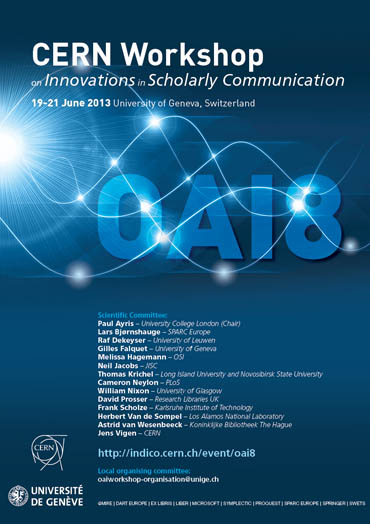

<figure class="aside img">

{.static}\

</figure>

We're excited to announce that in June we're heading to the CERN
Workshop on Innovations in Scholarly Communication in Geneva, Switzerland to
present a poster on our forthcoming open-source research framework, ROC.

CERN is a very appropriate place for us to introduce ROC for two reasons.
First, much of the research that is being done at CERN is to increase our
understanding of what I would call _inner space_, or, the atom. When I think of
outer space, I think of NASA; when I think of inner space, I think of CERN.
Much of our work as a company is to understand and model the [fundamental unit
of research][case]: the _case_.

<!--MORE-->

The second reason is that CERN is the birthplace of the [World Wide Web][www].
In [1990]{.oldstyle}, Tim Berners-Lee and [Robert Cailliau]{lang=fr},
[proposed][proposal] to develop a system that would use hypertext as "a way to
link and access information of various kinds as a web of nodes in which the
user can browse at will."[^first-website] Kind of a cool idea, isn't it?

While their original idea included linking _web pages_ together using hypertext
(which is what we are used to thinking of when we think of the Web, and is
probably how you ended up here reading this post), it was not limited to this.
Their original idea extended to linking pieces of _data_ together. In a way,
what we are doing takes it a step further, linking the various elements of
_research_ together.

Without the contributions of these two men and thousands of others, there is no
way that we could even _imagine_ trying to accomplish what we are working on
now.

Thank you, all!

[case]: </research/process/#sec:unit-of-research> "Pentandra → Research 101 → Unit of Research"
[www]: <http://en.wikipedia.org/wiki/World_Wide_Web> "World Wide Web on Wikipedia"
[proposal]: <http://www.w3.org/Proposal.html> "Proposal for the World Wide Web"

[^first-website]: 

    CERN has been busy trying to preserve [this moment in
    history](http://info.cern.ch/). For a bit of nostalgia, here is a link to
    the first web site _ever_:
    [<http://info.cern.ch/hypertext/WWW/TheProject.html>]{.small}
