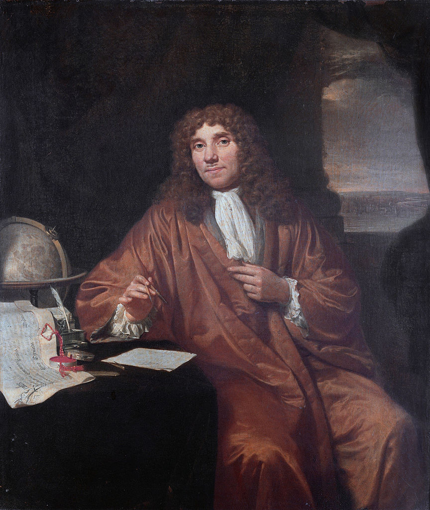

The following is an expanded version of a presentation I prepared for the FORCE2015 conference at the University of Oxford to give an
introduction and background to what we are trying to accomplish with [Research
Cases](https://researchcases.org).
{: .intro }

<!--MORE-->

---

# Motives of Correspondence

The [Republic of Letters] was an international network of collaborators that
existed during the 17th and 18th centuries. In this metaphysical Republic, letters
about natural philosophy (science), religion, politics, or really any
intellectual topic were exchanged in a quasi-public manner between interested
parties. Leisure time, money for postage, and a curious mind were the only
barriers for entry into this network.[^barriers-to-entry]

The Republic of Letters was part of a bigger movement: the [Enlightenment], or
the Age of Reason, an exciting time when old ideas were being overturned,
experimentation was being emphasized, and long-entrenched authority was being
challenged. This was the age of [sapere aude]---dare to know---as discussed by
[Immanuel Kant] in his essay <cite>[Answering the Question: What Is
Enlightenment?]</cite> in 1784.

This was a time before our overspecialization and compartmentalization of
research into our tidy little boxes. Ideas were discussed freely, and flowed
from one domain to another. Openness and a desire to find truth characterized
this age. The sharing of knowledge was more important than feeding the ego.
Citizens of the Republic wrote back and forth to each other, describing in
detail the most recent thoughts, conveying the results of the latest
experiments, and hunches.[^franklin] This correspondence proceeded in a very
piecemeal, informal fashion---thought upon thought.

<figure id="fig:vanLeeuwenhoek" class="img" property="schema:image" resource="#leeuwenhoek" typeof="schema:ImageObject">
  
  <figcaption><b lang="nl">Antonie van Leeuwenhoek</b>, here posing with his favored device of scientific communication: the letter. Portrait by the Dutch <a href="http://en.wikipedia.org/wiki/Jan_Verkolje">Jan Verkolje</a>.</figcaption>
</figure>

This happy-looking gentleman, [Antonie van Leeuwenhoek], is regarded by many as
the father of microbiology. Among other things, he discovered bacteria and a
method to drastically improve the power of a microscope. Yet he published zero
papers or books. He relied on the open and effective method of scientific
communication and collaboration, correspondence by letter, exchanging over
560 letters with the Royal Society during the
course of his life. Leeuwenhoek is widely regarded as an amateur, and I believe
that he would appreciate that designation, because he researched to satisfy his
curiosity---he researched for the love of it.

## Publish or Perish

For the last 350 or so years we have relied on
journals for the dissemination of scholarly news. Yet journals were only a
complement to the communications method already in use at the time:
_correspondence by letter_. The journal was a labor-saving device to distribute
the latest research news en masse to the public. However, as a communications
medium, journals allow only one-way discourse and lack many of the advantages
of interaction and collaboration that correspondence provided.

If those involved in the Republic of Letters had something that worked so well,
namely correspondence by letter, what were the motives for creating the
journal?

In early 1665 Henry Oldenburg obtained a copy of
the newly published [Journal des sçavans], published out of Paris, France. It
prompted a business idea. If he could publish a journal entirely devoted to
natural philosophy, he would be able to more easily promote new scientific
ideas, broaden the reach of the Royal Society, and perhaps even make a little
bit of money on the side. From a systems perspective, Oldenburg wanted to
maximize the scale of dissemination of scientific news by minimizing the
friction that existed in the system.[^neylon] Thus started the Philosophical
Transactions. His plan worked except for the money part, though he generally
made just enough to cover his rent.

As it turns out, many of these early decisions to create the journal and
centralize scientific communications were driven simply by economics. It was
cheaper to disseminate scientific news using the printing press rather than
employing an army of copyists. Eventually, the economics of the machine won.
More efficient was it to disseminate scientific news to a broad audience using
a printing press than it was to keep up this one-to-one, direct style of
interaction.

While journals have been very successful at disseminating research news, they
have also promoted an attitude of fierce competition and the social consequent
of *publish or perish*. The printing process has entrenched the subtle yet
devastating ideas that research must be finished before it is shared and that
peer review is a one-time ordeal. Researchers are incentivized to hold back
until they have everything figured out to increase their chances of getting
published. The commercialization of research and the journal publication
industry have only exacerbated the problem.

<figure id="fig:ivorytowers" class="img" property="schema:image" resource="#ivorytowers" typeof="schema:ImageObject">
  
  <figcaption><b>The formidable Hawksmoor Towers</b> of <a href="https://en.wikipedia.org/wiki/All_Souls_College,_Oxford">All Souls College</a>, University of Oxford, which have become a symbol of the ivory towers of research, or the disconnection between research and the public. Photo by <a property="cc:attributionName" rel="cc:attributionURL" href="https://commons.wikimedia.org/wiki/User:Godot13">Andrew Shiva</a>, licensed under a <a rel="cc:license" href="http://creativecommons.org/licenses/by-sa/3.0/"><abbr title="Creative Commons Attribution-Share Alike 3.0 Unported">CC-BY-SA</abbr> license</a>. </figcaption>
</figure>

The economics of the journal have led to an environment of centralization in
which research outputs funnel through the publisher. Publishers have become the
de facto gatekeepers of knowledge, and the orchestrators of peer review. The
quest for notoriety and personal gain has also played a part in this
transformation, with researchers seeking to become published to make a name for
themselves and to secure opportunities for future funding.

Where has this led us?

* To a funding model for research that is tied to the publishing process, to
  which researchers are slaves.[^codrington]
* To a false sense of scarcity as publishers are forced to select a limited
  number of what they think are *the best* papers to publish to control
  publishing costs. Then we have to live with the overhead and time delays of
  the publishing process.
* Research is now more about dissertation than discourse.
* Researchers have become silos themselves (or in small groups) to protect
  their own interests.
* All the above kinda takes the fun out of research. 

Is this what we want? I don't think so.

# Research Cases

Let's step back a bit. The Republic of Letters was an amazing success. What can
we learn from those early days of scientific correspondence?

Andrea Rusnock said,

<figure class="bq grab">
  <blockquote cite="http://www.jstor.org/stable/4028081" lang="en-GB">
    

      While publication and distribution of the Philosophical Transactions
      certainly contributed to the diffusion of knowledge, it did not provide for
      the flexibility, openness, manoeuvrability and relative rapidity of
      interaction that correspondence did. In short, the Society’s correspondence
      encouraged a more participatory science.

    

  </blockquote>
  <figcaption>--- <a href="http://www.jstor.org/stable/4028081">Correspondence networks and the Royal Society, 1700--1750</a></figcaption>
</figure>

Is there some way we could craft modern technology to reinforce the motives
that drove citizens of the Republic of Letters to collaborate so eagerly?
Couldn't we create something even *more* valuable than the original Republic
because we have technology that they didn't? Technology that excels at
communication? Technology that allows us to collaborate economically in more
direct and differentiated ways?

What would this technology look like? If all we needed was a modern version of
correspondence, it seems that [email and mailing lists would have taken
over][skywriting] that role by now. Blogs and wikis are good at disseminating
content, but they have not successfully replaced the journal either. Why
haven't these technologies replaced the journal already? The subtle, yet
obvious reason is that the dissemination of content is not enough.
Dissemination of content is not valuable enough in its own right to warrant
widespread change in the way we do research. As a research community, we're
missing something important.  Something that we've lost. Something that is
worth changing for, something that would accelerate research like nothing else
would. Never before in the history of our world has knowledge and enlightenment
been so freely available to all.  Never before have so many joined the ranks of
the curious. Yet while they want to participate in the creation of knowledge,
modern-day researchers shouldn't need to jump through the hoops of traditional
journal publishers anymore.  Journals are just not the labor-saving device they
used to be.

Research cases is a vision for a new kind of research---a research that is more
participative, similar in spirit to the networks of correspondence that existed
during the 17th and 18th centuries.

As a social business, one of our goals is to lower the barriers for people of
all disciplines, subjects, and skill levels to be able to contribute to the
world's knowledge in meaningful ways. We envision the future of research being
based upon open Web standards and [open, domain-specific collaborative research
platforms](/research/#sec:future). We see the publishers of the future as the
developers and providers of these platforms.

What would this future look like? Here are some principles that we think should
be part of the future of research:

* Research has a trajectory and a rhythm that drives it forward.
  Quasi-informal, open, flexible, in-process research is composed of many
  smaller pieces brought together over time. These individual pieces need to be
  published in context with fine-grained attribution for all contributions
  made. Research shared this way would lower the administrative risk for
  granters and grantees, and open the door to micro-grants and other
  alternative funding models, which would enable greater maneuverability to
  follow the direction that the research leads.
* We need to get away from the monoculture of the journal article as the only
  community-sanctioned format of publication and value a diversity of
  approaches. Researchers should own their own research and control how it is
  shared, though there *may* be an exception to this if the research was funded
  by a third party.
* Direct, public, and rapid interaction between any and all interested
  researchers removes the need to go through a middleman for scholarly
  discourse. This direct collaboration should include questioning and digging
  deeper into each others' arguments.
* Research is not an elitist activity, and should be open to anyone who desires
  to participate and contribute, whatever the skill level. All contributions
  can be transparently judged based on merit. Above all, *research should be
  fun!* If the fun is not inherent in the research itself, it should at least
  exist as a feeling of camaraderie amongst fellow discoverers.
* Feedback and peer-review need to be introduced much earlier and continue
  throughout the research process. As James Jurin said, '<q lang="en-GB">All
  reasonings should be left to the judgement of the Publick, to whom indeed it properly belongs.</q>'[^jurin]

We invite anyone interested [to participate](https://researchcases.org "Help out with Research Cases").
{: .conclusion }

# Notes

[^codrington]: 

    It may be more than coincidence that the All Souls Library was created
    through the bequest of [Christopher
    Codrington](https://en.wikipedia.org/wiki/Christopher_Codrington), who
    amassed his fortune through the slave trade.

[^jurin]:

    After Henry Oldenburg's prolific tenure as secretary of the Royal Society,
    several subsequent secretaries could not keep up with the volume and
    diversity of correspondence, so correspondence stagnated. James Jurin came
    along in the 1720s, and revived the society's
    correspondence. He was so successful at this revival that he increasingly
    couldn't handle the volume of correspondence. In 1752 the Committee of Papers was established to
    spread the load across the institution. Thus were the beginnings of peer
    review as we know it today.[^rusnock]

[^rusnock]: Rusnock, Andrea. <a href="http://www.jstor.org/stable/4028081">Correspondence Networks and the Royal Society, 1700--1750</a>. <cite>The British Journal for the History of Science</cite> vol. 32, no. 2, Did the Royal Society Matter in the Eighteenth Century? (June 1999), pp. 155--69.

[^neylon]:

    Cameron Neylon wrote [an excellent blog
    post](http://cameronneylon.net/blog/network-enabled-research/) about the
    future of research that parallels Oldenburg's experience
    350 years earlier.

[^franklin]:

    To get a glimpse into the openness and camaraderie that existed at the
    beginning of the [Enlightenment], even to the open sharing of ideas,
    preliminary data, and thoughts that were not completely thought out, here's
    an excerpt from a letter from [Benjamin Franklin] to [Peter Collinson] in
    1753:

    <figure class="bq grab">
      <blockquote lang="en-GB">
        
These Thoughts, my dear Friend, are many of them crude and hasty, and if I were merely ambitious of acquiring some Reputation in Philosophy, I ought to keep them by me, 'till corrected and improved by Time and farther Experience. But since even short Hints, and imperfect Experiments in any new Branch of Science, being communicated, have oftentimes a good Effect, in exciting the attention of the Ingenious to the Subject, and so becoming the Occasion of more exact disquisitions (as I before observed) and more compleat Discoveries, you are at Liberty to communicate this Paper to whom you please; it being of more Importance that Knowledge should increase, than that your Friend should be thought an accurate Philosopher.

      </blockquote>
      <figcaption>
--- Quoted in <a href="http://books.google.com/books/about/The_Invention_of_Air.html">The Invention of Air</a> by Steven Johnson
</figcaption>
    </figure>

[^barriers-to-entry]:

    Due to cultural barriers that existed at the time, the Republic was mostly
    comprised of gentlemen---lady [interlocutors][Interlocutor] were quite
    rare.

[Antonie van Leeuwenhoek]: https://en.wikipedia.org/wiki/Antonie_van_Leeuwenhoek "Leeuwenhoek on Wikipedia"
{:lang="nl"}
[Interlocutor]: http://en.wikipedia.org/wiki/Interlocutor_(linguistics) "Or in other words, the person who takes part in a conversation, the person to whom the letter is being written."
[Enlightenment]: http://en.wikipedia.org/wiki/Age_of_Enlightenment "Age of Enlightment on Wikipedia"
[Peter Collinson]: http://en.wikipedia.org/wiki/Peter_Collinson_%28botanist%29 "Peter Collinson on Wikipedia"
[Benjamin Franklin]: http://en.wikipedia.org/wiki/Benjamin_Franklin "Benjamin Franklin on Wikipedia"
[Journal des sçavans]: http://en.wikipedia.org/wiki/Journal_des_s%C3%A7avans "Journal des sçavans on Wikipedia"
{:lang="fr"}
[Republic of Letters]: https://en.wikipedia.org/wiki/Republic_of_Letters "Republic of Letters on Wikipedia"
[Sapere Aude]: http://en.wikipedia.org/wiki/Sapere_aude "A Latin phrase meaning 'Dare to know'"
[Answering the Question: What is Enlightenment?]: http://en.wikipedia.org/wiki/Answering_the_Question:_What_is_Enlightenment%3F
[Immanuel Kant]: http://en.wikipedia.org/wiki/Immanuel_Kant "Immanuel Kant on Wikipedia"
[not a paper]: http://faculty.education.illinois.edu/burbules/papers/paper.1.html "This is Not a Paper, written in 1995"
[skywriting]: http://cogprints.org/1581/1/harnad90.skywriting.html
