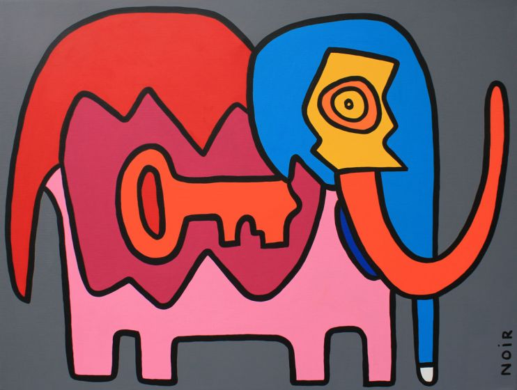

<figure id="the-key-to-success" property="schema:sharedContent" class="img" resource="#the-key-to-success" typeof="schema:ImageObject">
  <link property="schema:representativeOfPage" resource="schema:True" />
  <meta property="schema:width" content="742 px" datatype="schema:Distance" />
  <meta property="schema:height" content="560 px" datatype="schema:Distance" />
  <meta property="schema:contentSize" content="51KB" />
  
  <figcaption property="schema:caption"><b><a href="https://howardgriffinprints.com/print/thierry-noir/elephant-key-dark-grey/">Elephant Key</a></b>, a repainting of one of the first cartoons that Thierry Noir painted in protest of (and on) the Berlin Wall during the 1980s, represents the key to success: hard work every day. Also brings to mind the well-known parable of <a href="https://en.wikipedia.org/wiki/Blind_men_and_an_elephant">the blind monks examining an elephant</a>, in which each monk reaches a different conclusion based upon which part of the elephant he examined. (Image copyright © <a property="pav:retrievedFrom" href="http://howardgriffingallery.com/images/made/uploads/images/1-Thierry-Noir-Howard-Griffin-Gallery_742_560_80_s_c1_smart_scale.jpg">Howard Griffin Gallery</a> and used by the kind permission of Thierry Noir and Howard Griffin.)</figcaption>
</figure>

For more than twenty years, or at least ever since the World Wide Web enabled
new possibilities for sharing knowledge, there has been a discontent among the
research community around how scholarly and scientific knowledge is shared.
Researchers freely give the results of their research (in the form of papers)
to publishers, the publishers enlist other researchers without compensation to
review these papers, and then the publishers turn around and sell these papers
to research libraries and the public for $30--40 apiece. Researchers who
realize what is going on feel trapped, as the current system incentivizes
researchers to keep knowledge to oneself until publication for fear of being
scooped and publish in the most prestigious (and expensive) journals in order
to keep their jobs. Others researchers are either not aware of these problems
or turn a blind eye to them because they think this is just how the system
works and there is nothing that they can do to change it.

Over the years researchers have led resistance movements of various kinds,
including boycotts of certain publishers. Many of these approaches have been
successful at raising awareness and support for the cause, but they have not
led to any real change of the system as a whole. By pointing out these things,
my intention is not to bash publishers in general. Many publishers play a
critical part in the functioning of the current system and feel just as trapped
by their position in it. We all want and need something better. I am not
against capitalism, commerce, or free markets in general. I am not against the
state or government in general. I am against the inequities of the current
systems of scholarship and science that take unfair advantage of the
researchers and the public, and often leave critical information, sometimes
needed in life and death situations, unavailable to those who need it the most.
It doesn't have to be that way.

<!--MORE-->

So a couple years ago [some of us got together][scwg] to define an alternative
system, which we are calling the Scholarly Commons. We are engaged in a battle
to open up the knowledge of the world---to build bridges between society and
the type of knowledge that is currently being held behind paywalls or [trapped
in researchers' minds][opening knowledge]. The walls of the old system are
cracking and there are holes in some places, but we need a viable alternative
before people will feel comfortable enough to venture into new territory. We
are trying to define an alternative system that would allow anyone the ability
to access and participate in science and scholarship.

I am using the [Thierry Noir]{lang=fr}'s [Elephant Key](#the-key-to-success) as
the mascot of this post, even though it is not [his most well-known
work][mutations] and tearing down the wall is not enough. In a sense, the
painting of the Berlin Wall during the 1980s is representative of the
modern-day resistance movement that has led to the situation in which we now
find ourselves. In the minds of the people at that time, the act of painting
the Wall created an alternative way of looking at and thinking about it, an
alternative system so to speak. It changed the Wall from a "killing machine" to
something that could be transcended, if only in thought. It threw out the
assumption that the Wall was unapproachable and proved that it was possible _to
think_ about it. And not just to think about it. The more sublime revelation
was that there might be more than one way to think about it.

And just as with the [reunification of Germany], realizing the Scholarly
Commons is not simply a matter of removing a wall and getting on with life as
usual. It will take new ways of thinking, new approaches, and reconstruction
that will include a whole lot of work. In this sense, the mascot of this post
can serve a dual purpose (and make a higher contribution to the future) if we
are willing to consider [a well-known parable][parable] that involves some
blind monks from Indostan. Like the blind monks in this parable, people bring
their own perspectives to the idea of the Scholarly Commons. It attracts people
for so many different reasons that it is easy to wonder whether the Scholarly
Commons can possibly accommodate such seemingly divergent views. Yet like the
elephant in this parable, the Scholarly Commons is something very specific. It
is not simply a catch-all bag for anything FAIR or Open. It is a complex vision
that cannot be defined by [a few principles][principles] any more than an
elephant can be defined by a small set of superficial features or functions.
And if that were not enough, it is all too easy for us to be blinded by our own
interpretations of the pieces that we think we see. The Scholarly Commons is
the convergence of all of these perspectives _and more_. But this does not mean
it is undefinable or unknowable!

The point is that we need to define it.

_But what does that mean, and how do we do it?_ It is easy to fall into the
trap of thinking of what a system _is not_ than what it _is_. We could
innocently try to avoid this trap by not saying anything at all, but
underspecifying this new system does not eliminate bias or make it more
inclusive---it only makes it more vague, useless, and unattainable. The whole
premise of the Scholarly Commons is that the "chaotic innovation" that is going
on in scholarly communications should eventually lead to convergence on some
level. If we are ever going to reach that convergence, we are going to need to
be explicit about _what exactly this new system is_, and the sooner we can be
open and honest about this the better! Many facets and perspectives need to be
considered and consolidated. Assumptions need to be brought to the surface.
Differences need to be reconciled in a spirit of mutual respect, kindness, and
understanding. This is a design problem and should be approached in an open,
rational way because "a logical picture is easier to criticize than a vague
picture since the assumptions it is based on are brought out into the
open."[^notes] The key to all of this is a willingness to ask the questions
that need to be asked and to accept the answers to those questions, whatever
they may be.

We are not alone in thinking these things. [Bonaventure Mvé-Ondo]{lang=ewo}, in
his book <cite>[Africa: The Scientific Divide][scientific divide]</cite>, calls
for a modern renaissance which encompasses a completely new culture and
approach to science. One statement he makes in particular hints at the
direction of this transformation: "The whole question, then, is how to move
from a Westernization of science to a truly shared science, undergirded by a
'multiplicity of epistemologies'."[^bonaventure] The Scholarly Commons, as a
convergence into "a truly shared science", will likely not result in one
universal or one-size-fits-all technical solution, but should lead to the
condition that we can work together effectively across a "multiplicity of
epistemologies" without it being rigid or confining.

While many things are needed to bring about this convergence, it is with the
hope that we can contribute to that process that I am announcing here a series
of vignettes, to prompt a few of the many fundamental discussions that have yet
to happen around this important topic, and to paint the picture of the
Scholarly Commons from various perspectives. Of course, we are painting here
with the broad stroke of our own opinion, and these vignettes do not reflect
any formal process of consensus, though they might be stepping stones that will
lead in that direction. In many cases, these vignettes are the first foray onto
a topic and they most definitely should _not_ be viewed as the last word on
any. The intent is to raise questions, open the discussion, and broaden our
collective horizons, with the hope that through this exercise, we can come to
some understanding as to which questions we need to be asking, and, not any
less important, how best to find answers to those questions. Maybe the
Scholarly Commons is not something that any one of us can define alone, but is
truth that needs to be discovered---and it is the search for truth that will
hold us together.

[mutations]: <https://www.independent.co.uk/arts-entertainment/art/features/thierry-noir-the-street-artist-who-mutated-the-berlin-wall-in-protest-9316814.html> "Meet Thierry Noir: The street artist who 'mutated' the Berlin Wall in protest, on The Independent"
[reunification of Germany]: <https://en.wikipedia.org/wiki/German_reunification> "German Reunification, on Wikipedia"
[parable]: <https://en.wikipedia.org/wiki/Blind_men_and_an_elephant> "Blind Men and an Elephant, on Wikipedia"
[principles]: <https://www.force11.org/group/scholarly-commons-working-group-wp2principles/principles-scholarly-commons-open-comments> "About the principles of the Scholarly Commons"
[scwg]: <https://www.force11.org/group/scholarly-commons-working-group> "The Scholarly Commons Working Group at FORCE11"
[opening knowledge]: <../opening-knowledge/> "The Pentandra Blog → Opening Knowledge"
[scientific divide]:  <https://www.futuribles.com/en/bibliographie/notice/afrique-la-fracture-scientifique-africa-the-scient/>

[^notes]:

    Alexander, Christopher. <cite>[Notes on the Synthesis of
    Form](https://books.google.com/books?id=Kh3T3XFUfPQC)</cite>, Harvard
    University Press, 1964, p. 8.

[^bonaventure]:

    [Mvé-Ondo, Bonaventure.]{lang=ewo} <cite>[[Afrique : la fracture
    scientifique]{lang=fr} / Africa: The Scientific Divide][scientific
    divide]</cite>, [Futuribles]{lang=fr}, 2005, p. 48.
