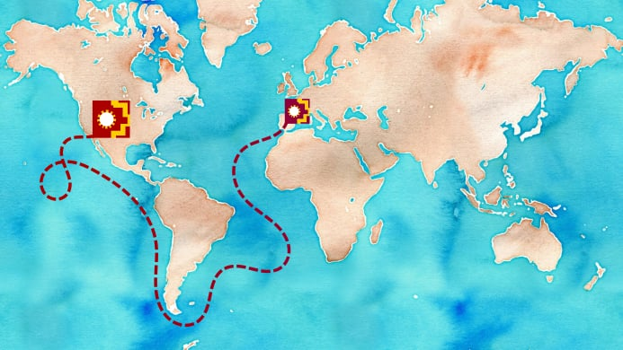
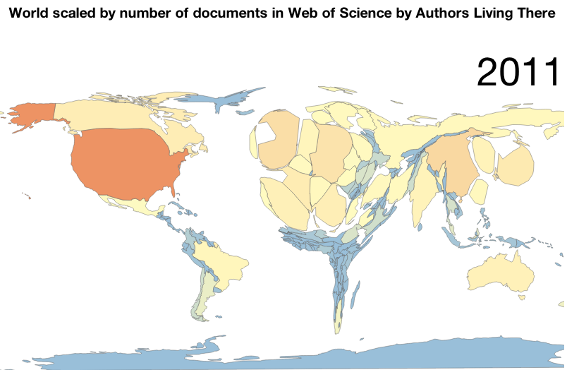

::: intro

This is actually the prequel to some thoughts that were published earlier about
[putting the pieces of technology together][technology]. Many of the ideas
about in that post were much more simple and straightforward for me, and I've
really struggled with knowing how to express some of the complex thoughts about
the culture of the Scholarly Commons in this post.

Several of the comparisons I want to draw are politically charged, or at least
they were in their time. My motivation for sharing them is not to advocate for
or against any specific nation-state or political philosophy, but to illustrate
the diversity and complexity of the issues that we must face and come to
understand on our journey towards a Scholarly Commons, which is something hard
to see, let alone describe to others, and is much, much bigger than any of us.
The Scholarly Commons is a new beginning for scholarship, similar to many new
beginnings when the old systems have become corrupted to the point that it is
easier to create something new than to try to purify the old.

Again, keep in mind that these are my own thoughts, and do not necessarily
represent the views of the [Scholarly Commons Working Group][SCWG] of FORCE11.

:::

<% render('/partials/image.*', id: 'clash-of-cultures', image: @items[@item[:cover_image_id]], representative_of_page: true) do %>
The Scholarly Commons explores the intersection and convergence of many tensions, including: individual and society, human and machine, capitalism and socialism, global and local, east and west, north and south, left and right, top and bottom, love and fear, public and private, past and future, tradition and modernity, amateur and professional, formality and informality, open and closed, anarchy and academy, prestige and participation, exclusivity and inclusivity, priority and openness, knowledge and ignorance. Annotated street art by <a property="cc:attributionName" rel="cc:attributionURL" href="https://en.wikipedia.org/wiki/Dmitri_Vrubel">Dmitri Vrubel</a>, painted circa <time property="schema:dateCreated">1989</time> on the <a rel="schema:sameAs" href="https://en.wikipedia.org/wiki/East_Side_Gallery">East Side Gallery</a> of the Berlin Wall, depicts Erich Honecker of the GDR and Leonid Brezhnev of the USSR in <a href="https://en.wikipedia.org/wiki/Socialist_fraternal_kiss">a fraternal embrace</a>. The Russian caption, which can be translated loosely as <i><a property="schema:name" rel="schema:sameAs" href="https://en.wikipedia.org/wiki/My_God,_Help_Me_to_Survive_This_Deadly_Love">My God, Help Me to Survive This Mortal Love</a></i>, evokes a similar plea for help with the tensions which are at play at this time. <a rel="pav:retrievedFrom" href="https://commons.wikimedia.org/wiki/File:Sanctuary_-_Berlin_Wall.JPG">Photographed</a> in <time property="schema:dateCreated">2005</time> by <a property="cc:attributionName" rel="cc:attributionURL" href="https://en.wikipedia.org/wiki/User:Victorgrigas">Victor Grigas</a>. 
<% end %>

A couple of years ago I had the opportunity to participate in the second
workshop of [the Scholarly Commons project][scholarly commons]. For many of us
in the Scholarly Commons Working Group of FORCE11, this workshop was one we
have been truly anticipating, the culmination of a lot of thought and
discussion of some very fundamental matters. We have each embarked upon this
project from different places and with different expectations, and it seems
that all of our diverse streams of thought converged on the inputs and outputs
of this one workshop. It was good that the workshop was held on the top floor
of a fifteen-story building, with many windows, plenty of fresh air, and a nice
balcony upon which to exercise [the law of two feet]. I am happy to report that
everyone survived. :smile:

<!--MORE-->

The workshop was organized around a main track designed to fulfill [some of the
original Helmsley grant requirements][workshop 2 requirements]. [Jeroen
Bosman]{lang=nl} and [Bianca Kramer]{lang=nl} expertly designed this track to
fit the theme of _putting the pieces together_, which we interpreted at the
time to mean using as the pieces some of the existing tools and workflows
aggregated as part of the [Innovations in Scholarly Communication][101
innovations] project. I have tried to describe this exercise and the
difficulties that arose from it in [the earlier post][main track]. Because this
essay is not a review exclusively of the San Diego workshop but is trying to
put the pieces of the culture of the Scholarly Commons together (at least for
myself), I'm going to bring in a few other thoughts and sources as I work to
get a better understanding of these things.

At its core, the Scholarly Commons is about a new _culture_, and it doesn't
take much imagination to see that the old motivations and logic don't have a
place in this new world. I have come to reject the idea that open access to
scientific and scholarly literature (as we currently understand it) is enough
to bring about the convergence hoped for in the Scholarly Commons. As April
Hathcock has [clearly articulated][april], the Scholarly Commons has to be more
than "paid lip service to plurality and global contexts---indeed, to the heart
of commoning". We need to face some difficult questions and acknowledge the
fact that many are stuck in systems where they don't have freedom to practice
they way they would like. I think there are lessons from history here from
which we should learn---and things we should not repeat. We need to be open to
the possibility that the system of the Global North we're so used to thinking
about may actually be local. If what we're calling "The Scholarly Commons"
looks too much like any existing system, it is probably an indicator that we
have not thought about this enough. _To simply relabel any existing system or
workflow as "The Scholarly Commons" shows either brazen willfulness or a lack
of understanding, either of which will *not* lead us where we desperately need
to go._ In saying this, I'm not suggesting that we're seeking the one holy
grail of scholarly commoning. But I'm also not suggesting that anything open,
FAIR, and citable is the answer either. Even though I'm referring to it as _The
Scholarly Commons_, this is not a singular or monistic system. The Scholarly
Commons will be richly nuanced, pluralistic, and dynamic. At the same time, I
believe it is also important _and possible(!)_ that this system be
_[technically compatible][on gaps and systems]_ to a minimum degree, enough to
allow for a system wherein we can all talk with each other, even if this may
entail some compromises and require a bit of toleration from all of us.

The purpose of this post is not necessarily to describe this new culture or
logic, though I may touch on a few aspects that I think are important. Defining
the Scholarly Commons is a future task for all of us---a task that will never
be finished. My purpose here is to show that _[a different logic]_ at the root
of this new culture changes _everything_ that flows from it. If we can come to
understand this logic and grow it in the right way, the Scholarly Commons will
provide a better direction for scholarship and science. Groundbreaking
opportunities exist to try to do things a different way. We have a chance to do
something good here and it is of critical importance to the future of humanity
that we do it right.

# Scholarly attitudes

At many points in the program, participants also had the opportunity to propose
or join an unworkshop session to discuss any related topic or perspective that
they desired. One unworkshop that especially stood out to me, and apparently to
[many other workshop attendees][april], was a workshop led by [Ravi
Murugesan][ravi] about _incorporating scholarly attitudes from the Global South
to develop the commons_. Since I have never lived in the Global South and I've
never worked as an institutional researcher, I have a lot to learn about the
challenges that professional researchers face day-by-day around the world. It
was an wonderfully mind-opening experience for me. I found out that there is a
lot of leftover cruft from the colonialization of the world over the past
couple hundred years by various cultures (mostly by the more developed
countries of the [Global North]), and the effects of these experiences still
linger and extend deeply into the researcher's institutional life. Many are
resentful and feel like the Global North or Western idealism are trying to push
their own ways of doing things upon others, without them having a say in what
is going on. For many researchers in the South, institutional funding is given
predominantly to solve local problems, yet the ultimate prize is to have an
article published in a northern journal. All this imbalance and inequity has
lead to serious pressures and real problems for researchers of all kinds.

<figure id="journey-of-defining-the-commons" property="schema:sharedContent" class="img" resource="#journey-of-defining-the-commons" typeof="schema:ImageObject">
  <link property="schema:representativeOfPage" resource="schema:True" />
  <link property="rdfa:copy" resource="pentandra-website:license" />
  <meta property="schema:width" content="832 px" datatype="schema:Distance" />
  <meta property="schema:height" content="624 px" datatype="schema:Distance" />
  <meta property="schema:contentSize" content="63KB" />
  
  <figcaption property="schema:caption">It looks almost as if the Scholarly Commons workshops were patterned after the Spanish colonialization of the New World. Is there something we can learn from history here? <a property="schema:url" href="watercolor_HdLwglsB1l0.png">Map tiles</a> by <a property="cc:attributionName" rel="cc:attributionURL" href="http://stamen.com/">Stamen Design</a>, licensed under a <a rel="license" href="https://creativecommons.org/licenses/by/3.0/">CC-BY</a> license. </figcaption>
</figure>

Several of us thought it was a cool coincidence that these first two workshops
has been Spanish themed. We started in Madrid, and now we're in San Diego, and
were able to use the colors of each city flag in designing the workshop logos,
and it just worked. But looking at [the map
above](#journey-of-defining-the-commons) from more of a Machiavellian point of
view, our journey from Madrid to San Diego could be thought of as _a journey of
philosophical conquest_. Isn't this the same path that [Juan Rodríguez
Cabrillo][cabrillo] and [others][vizcaino] took as they claimed land for Spain?
Obviously, this is not what we have in mind. The difference is that we are not
[conquistadores]{lang=es} and we are not trying to create an
[[encomienda]{lang=es}][encomienda] system[^citizen_science] here! In fact, the
struggles and inequities of the current system are the very things from which
we are trying to get away.

During the first half of the 20th century, corporations and universities
realized that research could form part of their competitive advantage.
Governments also began to employ researchers for competitive advantage in
warfare.[^manhattan-project] After World War [II]{.roman}, the National Science
Foundation was established in the US to unify the nation's efforts in
scientific progress. In Europe, research began to be supported at the national
level, and since 1984 at the EU level with the [Framework
Programmes]{lang=en-GB}.

_Isn't this progress?_ I'm not so sure. It's all too easy for political
priorities to become the prominent driver for governmental funding. [In his
farewell address][eisenhower], US President Dwight D. Eisenhower warned of the
"<q
cite="https://en.wikipedia.org/wiki/Eisenhower%27s_farewell_address">prospect
of domination of the nation's scholars by Federal employment, project
allocation, and the power of money</q>." When the prevailing culture is
_publish or perish_, the temptation is great to cater to the fashionable,
rather than to follow dreams to explore uncharted territories. The chance of
discovering spectacular vistas have to be balanced with the risk of not winning
that grant. The natural instinct to survive is strong and focuses achievements
inward, instead of what the true motivation of scientific research should be:
an outward expression of love for mankind and the world in which we live, or at
least a passionate desire to *know* how our world works. Instead, researchers
are forced to push research forward relentlessly, all the time pushing other
researchers down in a selfish scramble to survive.

As part of the diversity panel at OpenCon
this year, [Thomas Hervé]{lang=fr} [Mboa Nkoudou]{lang=ewo}

As I see it, the Scholarly Commons needs to disrupt these centers of power and
displace existing value structures, or we will never get to the point that
things are fair and equitable. If it doesn't, we will be forever trying to play
catch-up with an incumbent system which has a 350 year head start. We will get
nowhere trying to fight it. We need an alternative system that is 'driven by a
different logic.'

different trading unit. If we can create "a constellation of working
alternatives driven by a different logic," we may have an opportunity to

![A slide from [Thomas Hervé]{lang=fr} [Mboa Nkoudou's]{lang=ewo} presentation at OpenCon 2017 depicting how current practices around Open Access are entrenching incumbent centers of power and enabling a culture of cognitive injustice and epistemic alienation.](centers_of_power.svg){.simple #centers-of-power}

## Plurality and bias

Each of us comes with bias. It is useful to acknowledge it for what it is, but
it is nothing to be ashamed of! If we took away our bias, what would be left?
With it would go our conscience and our ability to act.

During {} session she had invited several
I do not remember having a choice in being born where I was.

None of us like to be labelled. Any label is an oversimplification and
objectification of who we are. We are complex beings.

Even though the Madrid workshop quickly did away with in the old system, in the
real world, however, we can't just start from scratch. Once we collectively
know where it is that we need to go together, each of us will have to
_transition smoothly_ from where we are to where to where we want to be.
Nobody---I don't care whether you are located in the North, South, East, West,
the Moon, or on Mars---will be there already.

I have already talked about the reaction to the main track of the workshop. In
saying what I'm about to say here, I do not discount the motivations for doing
What I have not talked about was the intent of the exercise, and I think that
was lost on those that left the exercise. I also left the exercise to join the
Southern discussion, because I felt like there was something for me to learn
there. But I was involved in some of the pre-workshop discussions. We talked
about focusing on more abstract practices instead, but felt like using more
concrete tools would help facilitate the discussion. But I think we
underestimated either how local some of these tools were, or perhaps how much
of the world had rejected these practices.

April called the main track of the workshop a colonialization of the world from
the Global North. I would agree that that is how it was presented. However, I
think it is more complicated than that. People from the North are also not
satisfied with the current system. It is an aging system that even 70 years ago
was [totally inadequate for its purpose][manifesto]. It is inequitable in many
dimensions, not just from North to South. So if there was one thing I could say
to April (or to any others that are struggling with what we're trying to do
here) it would be: don't give up. We're all learning. I think any of us would
readily admit that we don't understand every aspect of what this will be or
look like. I don't even think that we yet know all of what needs to be known or
considered. I don't think really anyone can or will, or even whether it is
necessary that any one person does need to know and understand this from every
possible perspective. I'm not even sure any one person can. None of us are
there yet. We can only do the best that we know how to do. The important thing
for each of us to know is that there is something here worth pursuing. And we
shouldn't give up on this until we get there. And we can only get there
together. We can't get there alone.

Science and scholarship must move beyond this esoteric culture and become an
integrated part of societies.

For the last year I have had very limited access to the Internet. I am not
affiliated with a university. All any of us can do is to act in the position in
which we have been placed. Is there anything else any of us could do?

We also need to acknowledge that all of the diversity discussion is not an end
in itself. There is a purpose for it! Plurality helps us develop better
understandings of problems and better solutions. People not only want to
belong, but want to feel needed. They want to feel valued. They want to feel
understood. They want to feel connected to community, but at the same time,
they want to feel that they have something special that sets them apart from
everyone else---that only they can offer. This [seeming paradox][paradoxical
power] is actually a very needed thing in our understanding of the world. This
is the heart of commoning. But many people do not feel this right now.

As as a colonialization of the world by the Global North, the Scholarly Commons
would be an epic failure. Not just in terms of quantitative participation, but
in the quality of the discussion. It would be so much less than it could be.
The only ones that would be happy with that arrangement would be those who are
currently at the center of Wallerstein's [world-systems theory]. [Juan Pablo
Alperin]{lang=es} has depicted what that world would look like for scholarship:

<figure id="world-according-to-the-web-of-science">

<figcaption>Our World according to the [Web of Science]. Compare this [distorted world] with [the Mercator-projected][mercator] [map above](#journey-of-defining-the-commons).</figcaption>
</figure>

[I want to put forward here an alternative approach]{.newthought} to explaining
where I think we are right now by comparing our situation with a few
experiences of several early groups that encountered challenges similar in
principle to what we're facing at this time.

Perhaps exploring some of these ideas in a few historical settings can help us
see things as they are more clearly. Maybe it's that Cameron Neylon has me
[thinking about groups][groups] lately, but these particular groups stick out
in history to me because of their unique accomplishments, the manner in which
their shared culture came about, and the lasting effects their culture had on a
developing society, despite the fact that they came together from such
distinctly divergent backgrounds and points of view. Each of these groups began
with a different logic, and things turned out very differently because of it. I
am not suggesting that the logic involved in any of these cultures is the logic
of the Scholarly Commons, but they are generally oriented toward good things,
and there may be something that we can pull out of them as we work on this new
logic. As I share these stories with you, I ask that you try to not look at
them through your lens of [presentism]. We cannot fully understand or
appreciate what it was like during this time for these people. Several of these
are far distant not only temporally but culturally from our present experience.
This difficultly is compounded by the fact that very few records exist from
this time period, and those that do exist carry their own biases. That said,
I'm trying to dig a little deeper here.

### Bradford in America

 I'm using Nathaniel Philbrick's book [<cite>Mayflower: A Story of Courage,
 Community, and War</cite>][Mayflower] as inspiration, and I have taken a few
 brief forays into Bradford's [<cite>History Of [Plimmoth]{.sic}
 Plantation</cite>][Bradford's History]. What I've discovered is that things
 were a lot more complicated than the stories I heard growing up reveal. I
 would not be surprised to learn that similar stories of disparate groups
 coming together are found in the histories of many cultures around the world,
 though I am biased and love the stories of the founding of the United States.
 I picked these specific examples from history because they are familiar to me
 (I knew about them), and they seemed to fit my conception of the Scholarly
 Commons as a break from the old ways: something completely new, not an
 incremental redesign of our current system of scholarly communication.

I'm not using this story to bring up how fairly or not fairly these people were
being treated. I'm also not bringing it up to extoll the virtues of democracy
or my own political position. It is hard to imagine what the situation was like
for these people at this time. So please don't fall into these traps. I'm
bringing up this story to illustrate a very visible and almost iconic situation
in which many disparate and diverse peoples came together to create a unified
culture. There was something there that was bigger than any of them that made
working together to find it worthwhile.

What we're trying to accomplish with the Scholarly Commons has some striking
similarities to what we know of the circumstances surrounding the venture of
the [Plymouth Colony] and specifically the signing of the [Mayflower Compact].
As I contemplate where we are with the Scholarly Commons, I see this early
venture with new eyes. I see groups of people with significant differences (in
the colonists' case significant religious and cultural differences, in our case
the differences are more diverse) coming together for a common purpose. They
had many opportunities to run away from their differences, but they chose not
to. They "did not live in a static idyll of mutual support. Instead, it was
fifty-five years of struggle and compromise---a dynamic, often harrowing
process of give and take. As long as both sides recognized that they needed
each other, there was peace." They needed each other, and as long as they
recognized that fact, they stuck together and there was peace.

When things broke down in the end, "it was not because relentless and faceless
forces had given the Indians no other choice. Those forces had existed from the
very beginning. War came to New England because two leaders---Philip and his
English counterpart, Josiah Winslow---allowed it to happen. For Indians and
English alike, there was nothing inevitable about King Philip's War, and the
outbreak of fighting caught almost everyone by surprise." "After fifty-five
years of peace, the lives of the Native and English peoples had become so
intimately intertwined that when fighting broke out, many of the region's
Indians found themselves, in the words of a contemporary chronicler, 'in a kind
of maze, not knowing what to do.' Some Indians chose to support Philip; others
joined the colonial forces; still others attempted to stay out of the conflict
altogether."
 
### The age of conformity and tyranny of the majority

<figure id="america-losing-integrity" class="bq grab">

> This American government, - what is it but a tradition, though a recent one,
> endeavoring to transmit itself unimpaired to posterity, but each instant
> losing some of its integrity? It has not the vitality and force of a single
> living man; for a single man can bend it to his will. It is a sort of wooden
> gun to the people themselves. But it is not the less necessary for this; for
> the people must have some complicated machinery or other, and hear its din,
> to satisfy that idea of government which they have. Governments show thus how
> successfully men can be imposed upon, even impose on themselves, for their
> own advantage. It is excellent, we must all allow; yet this government never
> of itself furthered any enterprise, but by the alacrity with which it got out
> of its way. _It_ does not keep the country free. _It_ does not settle the
> West. _It_ does not educate. The character inherent in the American people
> has done all that has been accomplished; and it would have done somewhat
> more, if the government had not sometimes got in its way.

<figcaption>Henry David Thoreau, Civil Disobedience, 1848</figcaption>
</figure>

Alexis de Tocqueville came to America in May 1831 to try to understand the
dynamics of democracy in hopes that what he came to understand could be applied
in other parts of the world, including his native country of France. He
recognized that there was something He wrote, "The Americans, unquestionably,
have not resolved this problem, but they furnish useful data to those who
undertake to resolve it."

Isaiah Berlin

---

First for some background. Two groups started together on board the Mayflower:
those who commissioned the ship, and those who were commissioned to manage the
ship and help setup a colony (the crew). According to language of the former
(who kept the only records we have of this experience), these two groups were
referred to respectively as the Saints and the Strangers. (These labels may
give some insight into the obvious tensions between the two groups.) Unlike
most of their contemporaries headed to the New World, these colonists were not
entrepreneurs or [conquistadores]{lang=es} determined to conquer indigenous
peoples, but came seeking freedom to practice religion the way they believed.
This difference obviously changed how they approached problems, and with much
patience and determination they were able to develop relationships of trust and
mutual respect with each other as well as with the indigenous tribes of the New
World. They learned from each other. They helped each other. Their
circumstances were not perfect, nor was every choice that was made. People
goofed up on both sides. But they kept trying, got some things right, and they
did something that had never been done before. They showed the world that what
they set out to achieve was possible. Their achievements changed the perception
of many, and led to their eventual success as a colony. Together they created a
new kind of society---a shared culture---that had such an impact on the early
culture of the United States that we still celebrate this time of our history
during our [Thanksgiving holiday][thanksgiving].

## An agreement to unite

After setting off for the New World, this group encountered difficulties that
pushed their arrival later than anticipated and with not enough supplies to
finish the voyage to Virginia. They decided it would be prudent to stop
earlier, off the coast of Cape Cod, Massachusetts. Because they would not be
headed to their previously agreed-upon destination, Virginia, several of the
passengers and crew said that the original charter was null and void, and that
they "would use their own liberty; for none had power to command
them."[^bradford] They were wanting to go at it in the new place on their own,
every man for himself. Others, in what I see as a moment of inspiration,
thought it would be better to cooperate and help each other, especially as they
arrived in this cold place in late November in a part of the world that would
eventually be called New England. They drafted a compact that they hoped
everyone would agree to and sign before they left the ship. Thankfully, and
after some persuasion, they all consented to sign for the sake of order and
survival. I like to think that they also may have signed to take advantage of
an opportunity to do something that very few of their Old World predecessors
had ever had the opportunity to do: deliberately coming together and _taking a
part_ in creating their own government.

<figure id="the-mayflower-compact" class="img" resource="#the-mayflower-compact" property="schema:sharedContent" typeof="schema:ImageObject">
  
  <figcaption>A traditional depiction of this formative experience in <i property="schema:title">Signing the Mayflower Compact 1620</i>, by <a href="https://en.wikipedia.org/wiki/Jean_Leon_Gerome_Ferris">Jean Leon Gerome Ferris</a>. The situation in which these people found themselves parallels our current situation as we consider the Scholarly Commons (though in this new culture, the women will do more than knit :sparkles:).</figcaption>
</figure>

The compact was simple enough. They covenanted to "combine \[them\]selves
together into a civil body politic; for better ordering, and preservation and
furtherance of the ends aforesaid". These ends aforesaid, or the goals
previously mentioned, were to undertake a voyage and to plant a new colony.
They then made provision for the creation of laws "from time to time, as shall
be thought most meet and convenient for the general good of the colony", and
agreed to abide by the laws that would be created.[^cultural-affordances]

The agreement to deliberately come together and unite instead of doing it all
separately and individually (or just letting whatever happen), was such a
simple thing, yet so far-reaching in its consequences. They didn't worry at
that point about deciding on specifics such as laws; those details could be
worked out later as the need arose. With the possibility of mutiny hanging over
their heads, these two groups effectively said on that cold November day in New
England: _for our own survival, we need to be and to move forward together_. A
brilliant example of self-organization to meet a critical need.

## A clash of cultures

And it was good they did this too, because they needed everyone that was able
to help to make it through that first winter. More than half of the colonists
died that winter, and the rest needed that unity to survive.

Before preparing this essay, I did not realize how fortunate these people were
in landing where they did, when they did.

The Plymouth colonists show this determination to bridge differences with
courage and their great fortune later on in their treaty with [Massasoit], the
great chief of the Wampanoag Indians, on March 22 the next year.

The next spring, the colonists had the opportunity to enter into an agreement
with a group from another culture: Massasoit, the well-respected leader of the
Wampanoag Indian tribe.

What I want to point out here is that the colonists could have tried to go down
the path of viewing this other culture as the enemy and trying to destroy or
enslave them. Thanks to good leadership they did not go down this path, but
respected the indigenous peoples, and sought out opportunities to learn from
them. The group was very weak at this point. Over half would not survive this
first winter. William Bradford thought that sharing knowledge might be the key
to their survival.

Massasoit had tried everything he knew to get rid of the settlers.... But in
the end he too realized that it was better to get along than to not. Culture
change was in the air.

Squanto and his friend.

## Swaraj and decentralization

A different logic drove Gandhi to assemble an army, not to fight, but to
peacefully break the law.

- researchers often are trying to make the world better. Current incentives are
often at odds with this.

## A new land of opportunity

The Scholarly Commons needs to
be rather a [_colonization_][colonization] of _a new land of shared practice_
by people from all parts of the world, nations, cultures, and languages, that
are willing to say that we can do better, and we will do it together. It is a
space where we can bring together the best of our cultures. We need the
widespread open culture of the South (which is exemplified in efforts such as
[SciELO]). We need to leave behind the ego or prestige culture of the North. It
may be that the North has further to travel, and that the South may not have as
far to go. Whichever way you see it, we need to continue these conversations.
The fact that these conversations are happening at all is a good thing. We're
all coming at this from where we are. But is there any other place from which
we _could_ come? I see these conversations, however uncomfortable, candid, or
mind-blowing as the beginning of the commons! They have to happen, and the
important thing is that we create a culture of learning: that we're willing to
learn and grow and change as we go. This new land that we have embarked upon is
full of ripe possibility. What is important is that we commit to come together
to do something greater than any of us, and that we involve as many voices as
would like to be heard so we can create something well-rounded and balanced. We
need something that everyone can touch.

de-Westernization. Anti anything is not the answer.

Wallerstein's theory and my thought that we need a new value, something that
will help us move forward without all the baggage from the past. A new market
unit for research.

DIY science and scholarship marks a rejection of the traditional academic
system as a way forward. But they are struggling with funding, and it has
essentially turned into something that is done on a volunteer basis alone. They
need their day jobs.

We don't want to be stuck with this same stupid system either! Why are you
leaving the North out? We have all these people from around the world that are
not happy with the current system. So why don't we get together and make
something better?

In his book, [Mvé-Ondo]{lang=ewo} states:

<figure id="to-a-truly-shared-science" class="bq grab">

> The whole question, then, is how to move from a Westernization of science to
> a truly shared science, undergirded by a "multiplicity of epistemologies".

<figcaption>--- [Bonaventure Mvé-Ondo]{lang=ewo}, from <cite>Africa: The Scientific Divide</cite> p. 48</figcaption>
</figure>

The Scholarly Commons is not something that will be finished any more than
democracy is ever finished or perfected. It is something that needs to be built
into the mind and heart of each person---each commoner. It is a work in
progress. "Culture is not an absolute, but a movement enabling human beings to
respond to the promptings and challenges of life."

Because the Scholarly Commons is not simply an extension of the North or of any
other corner of the Earth, it is hard to tell what this shared system will look
like or how it will behave. As we incorporate more diverse viewpoints and
perspectives into this new system, we will get a clearer and clearer vision of
what it is, and what is local will be better and better understood as such.

This vision has to be much bigger than equitable work conditions and
opportunities. It has to be much bigger than research methodologies or
technologies. It must go beyond open, FAIR, and citable. While it certainly
will address these things, the Scholarly Commons must transcend institution and
state. The Scholarly Commons must reshape our understanding of knowledge and
the relationships that knowledge has with societies. While encouraging local,
home-grown knowledge, it must scale to the other end of the spectrum and supply
something as fundamental as oxygen---a universal element that gives breath to
new ideas and from which individual societies can maintain life and grow.

<figure id="ideas-should-freely-spread-like-the-air" class="bq grab">

> That ideas should freely spread from one to another over the globe, for the
> moral and mutual instruction of man, and improvement of his condition, seems
> to have been peculiarly and benevolently designed by nature, when she made
> them, like fire, expansible over all space, without lessening their density
> at any point, and like the air in which we breathe, move, and have our
> physical being, incapable of confinement or exclusive appropriation.

<figcaption>--- Thomas Jefferson</figcaption>
</figure>

We need to move beyond the idea that research is the domain of academic
institutions. The Scholarly Commons is not _for_ researchers. It is for a
demographic that has been largely absent from these discussions: everyone else.
It is a renaissance that reorients researchers to the true purpose of
scholarship and science: to help others and to make the world a better place.
However, the Scholarly Commons has to be more cheery thoughts and wishful
thinking. We have to be able to survive out here. The Scholarly Commons must be
a complete, sustainable system for the future of scholarship and science---a
new land of opportunity.

The greatest breakthroughs in scholarship and science are not going to come
from the most brilliant or elite. It will be those that are willing to just try
putting things together. [The Culture Code]

# Our great decision

We face a critical decision at this point in time. Our choice is not about
winter survival in a cold bay in New England, but the Scholarly Commons _could
be thought of_ as a new land or frontier, a place that we don't fully
understand yet, but full of promise and potential. There is certainly a need
for _better ordering_ and _preservation_, and plenty of _ends aforesaid_. We
may ask ourselves, what's wrong with just going at this on our own? There is so
much potential out there, and people and organizations are already staking out
their ground! Why not just let things go as they have done up to this point in
time, and hope that it all works out? Isn't the [laissez-faire]{lang=fr}
approach good enough? It has gotten us here, hasn't it!? _Why is it so
important that we do this together?_

Quite frankly, I don't think any of our current approaches have had the power
to transform the current systems of scholarship. We need something more,
something that is so amazing that it would transform the world, something that
others will see and say, "That's awesome! Why don't we work like that?" I think
of the words of Alexander Hamilton in discussing the need for a new
constitution for the same region, more than 160 years after the initial compact
was signed on board the Mayflower, describing a situation eerily similar to
that earlier time, just on a much bigger scale.

<figure id="establishing-good-governance-from-reflection-and-choice" class="bq grab">

> It has been frequently remarked that it seems to have been reserved to the
> people of this country, to decide by their conduct and example, the important
> question, whether societies of men are really capable or not of establishing
> good government from reflection and choice, or whether they are forever
> destined to depend for their political constitutions on accident and force.
> If there be any truth in the remark, the crisis at which we are arrived may
> with propriety be regarded as the period when that decision is to be made;
> and a wrong election of the part we shall act may, in this view, deserve to
> be considered as the general misfortune of mankind.

<figcaption>--- Alexander Hamilton, <cite>The Federalist Papers</cite>, No. 1</figcaption>
</figure>

Now a scholarly commons is not a civil body, it's a commons---a middle ground
somewhere between the grassroots level of people and the institutions of state.
A commons has no prescribed structure; it is whatever the people decide for it
to be. It is a coming together of people for some greater purpose. In our case,
the greater purpose is _the contributions_[^contributions] that further our
understanding of who we are, the world, and everything else associated. The
great decision we collectively face is whether to come together and establish a
commons for scholarly and scientific research, or to continue doing things the
way they have been done for so long, having some vague hope for positive
change. Adapting [Hamilton's thought] to our current situation, we need to
decide by our conduct and example whether societies of researchers are really
capable or not of establishing good governance from reflection and choice, or
whether they are forever destined to depend for their cognitive constitutions
on accident and market forces. Without that choice, there is no Scholarly
Commons nor indeed can there be, or at least not anything that will bring
together and unite the people of the world in such a way.

This intense awareness that we truly need each other to overcome the problems
that we collectively face is the force that draws us together into a scholarly
commons.

The Scholarly Commons is an attempt to take back research from governments and
predatory markets, and to receive (or reclaim) it as our collective cultural
inheritance and moral imperative.

What we are after is described by F.
Buckminster Fuller in his <cite>Operating Manual for Spaceship Earth</cite>:

<figure id="true-democracy" class="bq grab">

> The procedure we are pursuing is that of true democracy. Semi-democracy
> accepts the dictatorship of a majority in establishing its arbitrary, ergo,
> unnatural, laws. True democracy discovers by patient experiment and unanimous
> acknowledgement what the laws of nature or universe may be for the physical
> support and metaphysical satisfaction of the human intellect’s function in
> universe.

</figure>

> Let every man make known what kind of government would command his respect,
> and that will be one step toward obtaining it.
> --- Henry David Thoreau

[I see here an opportunity to do something]{.newthought} that has never been
done before---something that would improve the lives of everyone, and to do it
for the right reasons. The Scholarly Commons will not only give more freedom to
the professional researchers, but will open up opportunities for many more
people to become involved in knowledge work, and make knowledge itself more
free and abundant.

<figure id="reimagine-the-future">
  <video class="simple" poster="Re-Imagine2.jpg" style="width: 100%; height: 100%;" preload="none" controls="controls">
    <source type="video/youtube" src="https://www.youtube.com/watch?v=uA1Ri3LvIRs" />
  </video>
  <figcaption>[David Bollier and Anna Grear][commons-video] that explain why commons are so important, especially for the global problems that we now face.</figcaption>
</figure>

I see the Scholarly Commons as one of the most wonderful opportunities that has
ever presented itself to mankind. So much of what happens in our world is based
upon the knowledge that is available, and if we can remove barriers to that
knowledge, and open up the ability for people to interact with it more freely,
it would disrupt the world and further _so many other important initiatives_.
For all the good intentions of those of earlier times, they never had the
technology to pull off something like a global commons of researchers, sharing
as they go, almost instantaneously, the collective research of the world, ever
expanding. Thinking more about it, though, isn't this what [the Web was
originally intended][heading to oai8] to accomplish?

Foundation of better governments.

# How can it be done?

Not only diversity of the researchers, but the diversity of the research.

I'm going to step forward through time and back down to reality for a minute,
and face this question of diversity. Our diversity is an opportunity but it is
also a challenge. We are all spread around the globe and don't have the luxury
of being stuck together in the cabin of a ship with the exigency of making a
decision and the determination to not set foot on shore before doing so. And,
tomorrow, when it comes down to it, most of us have to do whatever our
higher-ups tell us to do! How do we develop the capacity and urgency to make
this choice in some sort of collective, unified way?

Since we can't stop the world while we answer these questions, we need leaders
who have made the initial decision to come together and move forward, and have
the vision, patience, and determination to find answers and make the needed
changes a little bit at a time. Danny Kingsley brought up [the theory of the
diffusion of innovations][diffusion], or how innovations permeate society, and
in this I think we can find some clues as to how we move forward. There are
communities that are ready to work in new ways. We need to find these early
adopters and experiment with new ways of working together.

## One big thing or lots of little things?

The Scholarly Commons is a _culture_ of the same sort as the culture of Open,
or the spirit of freedom. It is not a software platform any more than GitHub is
the Open Source Software culture. The Scholarly Commons will need software with
new types of interactions---those that open up the process of research and
bring people together in more egalitarian ways. The more aligned the software
is with this culture, the less people will find fault with it.

## The necessity of a *counter*culture

The Scholarly Commons does not carry as its leitmotif the top-down imposition
of current academic norms, penetrating ever more deeply into society, and this
has to go beyond equal opportunities for professional researchers. On the
contrary, the Scholarly Commons calls for scholarship and science to occupy a
new position in society.

Many of the difficulties of the San Diego workshop could be described as a case
of premature optimization. Donald Knuth said that premature optimization is the
root of all evil.

Using the language of Christopher Alexander's book <cite>[Notes on the
Synthesis of Form]</cite>, this problem could be viewed as a problem of
_fitness_. The old form initiated by [Henry Oldenburg][PhilTrans venture] has
outlived its purpose, and does not fit the needs of our situation anymore. We
need a new form or _culture_ of scholarship that fits the current context.

However, according to Alexander, we cannot see the context to which we are
trying to fit a new form, except for when the new form doesn't fit. We don't
notice stuff that is right, we just see things that don't fit because they
clash. So how can we _consciously_ design a new form that fits an invisible
context which is so complex that we can't fully wrap our brains around it, even
if we could see it?

I don't see this as a mutinous rebellion, and I'm not advocating a mass
uprising against the institutional powers-that-be. We don't want every
researcher to quit their job or go on strike. What we need is a better
alternative---a counterculture that people will find and to which they can
align themselves as they are ready. We need a sandbox that will allow these new
[patterns] and forms to be discovered and safely evolve without the risk of
disruption or abolition by the hegemonies of the current
system.

Going forward, there needs to be an emphasis on practice. We have gathered all
of these great ideas, and spent a lot of time distilling principles, but we
need to show what scholarly commoning looks like. We need mechanisms for
participating commoners to govern themselves, and principles flexible enough
for anyone to repurpose or modify to fit a particular need, so that commoning
is co-created from practice, rather than being a set of principles that we try
to _fit_ into an existing situation.

If it looks the same and feels the same, then what have we changed? We have to
stand for something.

In making this argument, I'm making a few assumptions. The first is that more
knowledge and understanding is a good thing. The second is that sharing is
better than not sharing. Sharing is good because it creates new knowledge
(which is good according to my first assumption).

I think that we need a broader strategy, and a more holistic and inclusive
approach to building a commons. We've focused institutionally so far, and
rightly so. This is where it needs to start. But I think going forward we need
to think more broadly, and reconsider the academy in a bigger context, with the
end goals and needs of a much more diverse population in mind. We need a
commons for the people, not for the institutions.

The restructuring of Disney after purchasing Pixar is a good example of the
change that we are talking about here. Ed Catmull and John Lasseter were put in
charge of changing the culture of a struggling animation studio. "Catmull
flipped that system on its head, removing creative power from the executives
and placing it in the hands of the directors. ... Disney directors called it a
breath of fresh air and likened it to the fall of the Berlin Wall" [Culture
Code, 225]. "Catmull notes that the transformation happened with virtually no
turnover. 'The people who made these films are the same people who were there
when they were failing,' he says. 'We put in some new systems, they learned new
ways of interacting, and they changed their behavior, and now they are a
completely different group of people when they work together'" [The Culture
Code, 226].

## The scholar-commoner

This is where, at least to me, we come to the heart of what the Scholarly
Commons is. While technology, efficiency, and all these social and cultural
aspects are important, they are very abstract, high-level, and don't reach what
I think the core of the Scholarly Commons is all about. The Scholarly Commons
is about people---<em>changed</em> people. The change that we are hoping for
must start inside the heart and mind of each individual.

We need a new kind of researcher. The current stereotype paints a researcher as
aloof, caring only about himself and his next grant application. Researchers
don't share because they're afraid of being scooped. This parallels the
depiction of the <i>rational man</i> by economists as a self-interested person
that only cares about his own gain. This is the man upon which Garrett Hardin
based the <cite>[Tragedy of the Commons]</cite>.

This new kind of researcher is one that is human, and willing to work outside
of these stereotypes. One that cares about humanity.

This new kind of researcher is what [Thomas Hervé]{lang=fr} [Mboa
Nkoudou]{lang=ewo} [calls][humain-scientifique] the <dfn
lang="fr">humain-scientifique</dfn> or the human-scientist. He separates the
idea of a person (the scientist) that who acts like a machine in a laboratory,
executing protocols without worrying about the existence of the world around
him; and this new person (the human-scientist) who first poses ethical bases
and questions the needs of society before undertaking a scientific project.

In the _ session at FORCE2017, _ mentioned that she doesn't really like being
labeled as a _Southerner_. I feel the same way in that I don't particularly
like the term _Northerner_. While I think it is important to acknowledge my
biases, I am a multifaced being. I am more than my biases. I am more than where
I live. I want to be seen and valued for the contributions that only _I_ can
make. I am Chris Chapman and I am still trying to find out what that means and
who I need to become. And I want to see others the same way.

The Scholarly Commons is an opportunity to forgive, move forward, and overcome
the effects of colonialism. Greed vs

If we took away the current incentives, why would anyone do it?

# TL;DR

So this essay started out as an assignment to write my thoughts in less than
400 words as to what the Scholarly Commons _is_ and the direction that we go
next for the principles. If you've made it this far in this post, you have
realized how far I have failed. But if I was to sum up my thoughts into a very
high-level, concise statement of what the Scholarly Commons is (even though I'm
not sure that I should), here is what I would say:

<dfn id="the-scholarly-commons">The Scholarly Commons</dfn> is the opportunity
to come together and take part in creating a new culture for research.

Why is this so important? [Mvé-Ondo]{lang=ewo} concludes, "The future ... does
not depend on the battle against illiteracy or the conquest of poverty, but
primarily on overcoming the scientific divide. By sharing [our] resources
within the framework of formative projects with shared responsibilities and
benefits, by taking advantage of digital tools to do so, by gaining and
producing knowledge together, [we] can drive out scientific apartheid, modify
the terms of the exchange, enrich certain paradigms and construct others, and
contribute to a situation in which science---preceding the economy in
this---will be perhaps the first place where human beings will tomorrow live in
a truly shared global community."[^scientific-divide]

Even though [Mvé-Ondo]{lang=ewo} was specifically talking about Africa in this
text, I feel that this is a common problem in culture and society, and that his
statement could be applied in any context where a scientific or knowledge
divide exists. We're not truly going to overcome poverty and other social
injustices until [we can develop a culture where knowledge is used to lift each
other instead of as a tool of alienation or repression, or even where it is
used to divide and delineate], that the barriers not only to access, but to
participation, are removed.

As for the direction to go next, I think we need to create ways to preserve and
continue these conversations. We need to find ways to broaden the
conversations, and to invite more diverse groups to take part in them. Then we
need to take what we discover and put it into practice, thereby creating
scholarly and scientific commons for the good of all mankind.

[the law of two feet]: <https://en.wikipedia.org/w/index.php?title=Open_Space_Technology&oldid=737741556#Law_of_two_feet> "The Law of Two Feet on Wikipedia"
[vizcaino]: <https://en.wikipedia.org/wiki/Sebasti%C3%A1n_Vizca%C3%ADno> "Sebastián Vizcaíno on Wikipedia"
[Plymouth Colony]: <https://en.wikipedia.org/wiki/Plymouth_Colony> "Plymouth Colony on Wikipedia"
[Mayflower Compact]: <https://en.wikipedia.org/wiki/Mayflower_Compact>
[thanksgiving]: <https://en.wikipedia.org/wiki/Thanksgiving> "Thanksgiving on Wikipedia"
[encomienda]: <https://en.wikipedia.org/wiki/Encomienda> "a labor system, rewarding conquerors with the labor of particular groups of people"
[cabrillo]: <https://en.wikipedia.org/wiki/Juan_Rodr%C3%ADguez_Cabrillo> "Juan Rodríguez Cabrillo en Wikipedia" {lang=es}
[commons-video]: <http://bollier.org/blog/new-video-%E2%80%9Cre-imagine-future%E2%80%9D> "View more info on David Bollier's site"
[april]: <https://aprilhathcock.wordpress.com/2016/09/27/making-the-local-global-the-colonialism-of-scholarly-communication/> "Making the Local Global: The Colonialism of Scholarly Communication"
[colonization]: <http://wikidiff.com/colonialization/colonization> "Colonization vs colonialization"
[ravi]: <https://twitter.com/ravimurugesan> "Ravi on Twitter"
[scielo]: <http://scielo.org/php/index.php> "Scientific Electronic Library Online"
[Global North]: <https://en.wikipedia.org/wiki/North%E2%80%93South_divide> "North-South Divide on Wikipedia"
[diffusion]: <https://en.wikipedia.org/wiki/Diffusion_of_innovations> "Diffusion of Innovations on Wikipedia"
[Massasoit]: <https://en.wikipedia.org/wiki/Massasoit> "Massasoit on Wikipedia"
[groups]: <http://cameronneylon.net/blog/whos-in-the-club-new-frames-for-understanding-knowledge-sharing/> "Who’s in the Club? New frames for understanding knowledge sharing by Cameron Neylon"
[neocolonialism]: <https://en.wikipedia.org/wiki/Neocolonialism> "Neocolonialism on Wikipedia"
[subaltern]: <https://en.wikipedia.org/wiki/Subaltern_(postcolonialism)> "Subaltern on Wikipedia"
[othering]: <https://en.wikipedia.org/wiki/Other> "Other on Wikipedia"
[colonial mentality]: <https://en.wikipedia.org/wiki/Colonial_mentality> "Colonial mentality on Wikipedia"
[PhilTrans venture]: </blog/introducing-research-cases/#p[IeHHpw],h[IeHHpw,2,3,4]> "Henry Oldenburg's plan to produce the Philosophical Transactions"
[Notes on the Synthesis of Form]: <https://en.wikipedia.org/wiki/Notes_on_the_Synthesis_of_Form> "Some info about 'Notes on the Synthesis of Form' on Wikipedia"
[patterns]: <http://blogs.agu.org/geospace/2016/06/23/can-commons-design-pattern-lexicon-show-open-science-destination/> "Can a commons design-pattern lexicon show open-science to its destination? by Bruce Caron"
[Tragedy of the Commons]: <https://en.wikipedia.org/wiki/Tragedy_of_the_commons> "Tragedy of the commons on Wikipedia"
[open]: <http://cameronneylon.net/blog/not-what-not-who-or-how-but-why-is-open/> "Not what, not who, or how, but Why is Open? by Cameron Neylon"
[heading to oai8]: </blog/heading-to-oai8/#p[WtoIaw],h[WtoIaw,1]> "Pentandra Blog → Heading to OAI8"
[humain-scientifique]: <http://www.projetsoha.org/?p=1357> "Le Web et la production scientifique africaine : visibilité réelle ou inhibée? by Thomas Hervé Mboa Nkoudou"
[world-systems theory]: <https://en.wikipedia.org/wiki/World-systems_theory> "World-systems theory on Wikipedia"
[distorted world]: <http://jalperin.github.io/d3-cartogram/> "World scaled by number of documents in Web of Science by Authors Living There by Juan Pablo Alperin"
[Web of Science]: <https://en.wikipedia.org/wiki/Web_of_Science> "Web of Science on Wikipedia"
[presentism]: <https://en.wikipedia.org/wiki/Presentism_(literary_and_historical_analysis)> "Presentism on Wikipedia"
[Mayflower]: <https://books.google.com/books?id=aw4MbnSCfnMC> "Mayflower: A Story of Courage, Community, and War"
[Bradford's History]: <https://books.google.com/books?id=mGcOAAAAYAAJ> "History of Plymouth Plantation, 1620-1647, Volume 1"
[technology]: <../putting-the-pieces-together-technology/> "The Pentandra Blog → Putting the Pieces Together: Technology"
[SCWG]: <https://www.force11.org/group/scholarly-commons-working-group> "Scholarly Commons Working Group of FORCE11"
[manifesto]: </research/#the-future-of-research> "Pentandra → The Future of Research: A Manifesto"
[Mercator]: <https://en.wikipedia.org/wiki/Web_Mercator> "Web Mercator on Wikipedia"
[main track]: </blog/putting-the-pieces-together-technology/#the-exercise> "The Pentandra Blog → Putting the Pieces Together: Technology → The Exercise"
[101 innovations]: <https://101innovations.wordpress.com/>
[hamilton's thought]: <#establishing-good-governance-from-reflection-and-choice>
[workshop 2 requirements]: </blog/putting-the-pieces-together-technology/#fn3>
[scholarly commons]: <http://force11.org/group/scholarly-commons-working-group> "FORCE11 Scholarly Commons Working Group"
[a different logic]: </blog/putting-the-pieces-together-technology/#p[TiaTSC],h[TiaTSC,3]> "The Pentandra Blog → Putting the Pieces Together: Technology → The Scholarly Commons represents scholarship reinvented for our modern era, and whichever the approach to do that, I am hoping we’ll take the best of the past, the aspirations and thirst for understanding that have motivated mankind for thousands of years, and redesign the whole system from scratch to fit our current needs and desires, so that, hopefully, in the end, we will have built, using the best of modern technologies, ‘a constellation of working alternatives driven by a different logic.’"
[Manhattan Project]: <https://en.wikipedia.org/wiki/Manhattan_Project> "Manhattan Project on Wikipedia"
[Big Science]: <https://en.wikipedia.org/wiki/Big_Science> "Big Science on Wikipedia"
[US Office of Scientific Research and Development]: <https://en.wikipedia.org/wiki/Office_of_Scientific_Research_and_Development> "OSRD on Wikipedia"
[National Science Foundation]: <https://en.wikipedia.org/wiki/National_Science_Foundation> "National Science Foundation on Wikipedia"
[Lawrence Berkeley National Laboratory]: <https://en.wikipedia.org/wiki/Lawrence_Berkeley_National_Laboratory> "LBNL on Wikipedia"
[Los Alamos National Laboratory]: <https://en.wikipedia.org/wiki/Los_Alamos_National_Laboratory> "LANL on Wikipedia"
[Oak Ridge National Laboratory]: <https://en.wikipedia.org/wiki/Oak_Ridge_National_Laboratory> "ORNL on Wikipedia"
[Argonne National Laboratory]: <https://en.wikipedia.org/wiki/Argonne_National_Laboratory> "Argonne on Wikipedia"
[Ames Laboratory]: <https://en.wikipedia.org/wiki/Ames_Laboratory> "Ames on Wikipedia"
[Brookhaven National Laboratory]: <https://en.wikipedia.org/wiki/Brookhaven_National_Laboratory> "Brookhaven on Wikipedia"
[Sandia National Laboratory]: <https://en.wikipedia.org/wiki/Sandia_National_Laboratories> "Sandia Laboratory on Wikipedia"
[Framework Programmes]: <https://en.wikipedia.org/wiki/Framework_Programmes_for_Research_and_Technological_Development> "Framework Programmes on Wikipedia"
[eisenhower]: <https://en.wikipedia.org/wiki/Eisenhower%27s_farewell_address> "Eisenhower's farewell address on Wikipedia"
[paradoxical power]: <http://edgeperspectives.typepad.com/edge_perspectives/2018/02/the-paradoxical-power-of-narrative.html> "The Paradoxical Power of Narrative, by John Hagel"
[on gaps and systems]: </blog/putting-the-pieces-together-technology/#on-gaps-and-systems> "The Pentandra Blog → Putting the Pieces Together: Technology → On Gaps and Systems"

[^citizen_science]:

    Actually I've been thinking more and more that the term _citizen science_
    doesn't go far enough, and sometimes I worry that the practice ends up
    resembling an [[encomienda]{lang=es}][encomienda] system more than I would
    like. I am not alone in these thoughts. Lucy Patterson describes this
    system as DIY science.

[^bradford]:

    These quotations from the Mayflower Compact and other circumstances
    relating to these early colonists can be found on [the Wikipedia
    page][Mayflower Compact] (with spelling modernized), or in [Bradford's
    History "Of [Plimoth]{.sic}
    Plantation"](http://archive.org/stream/historyplymouth01socigoog#page/n246/mode/2up),
    Book 2 [Anno]{.sic} 1620, written by William Bradford in the years from
    1630 to 1651, and printed in its entirety for the first time in 1854.

[^cultural-affordances]:

    In a footnote of a later edition of Bradford's history, a quotation from
    Gardiner's <cite>History of England</cite>, 1603--1642, [IV]{.roman}. 163
    is particularly relevant to the analogy I am making here with the Scholarly
    Commons:

    

    > In all this there was nothing new. The election of administrative
    > functionaries took place in every borough town in England. What was
    > really new was that whilst in England each corporation was exposed to the
    > action of the other forces of the social system, in America the new
    > corporation was practically left to itself. It was as if Exeter or York
    > had drifted away from the rest of England, and had been left to its own
    > resources on the other side of the Atlantic. The accident which had
    > deprived the colony for a time of all legal connexion with the Home
    > Government, was only a foreshadowing of its future fortunes. Sooner or
    > later the colonies would have a social and political history of their
    > own, which would not be a repetition of the social and political history
    > of England.

    

    In 1776, another philosopher, Adam Smith, wrote in <cite>The Wealth of
    Nations, Book [IV]{.roman}, Chapter [VII]{.roman}, Part
    [II]{.roman}</cite>:

    

    > The English puritans, persecuted at home, fled for freedom to America,
    > and established there the four governments of New England. The English
    > catholics, treated with equal injustice,
    > established that of Maryland; the Quakers, that of Pennsylvania. The
    > Portugueze Jews, persecuted by the inquisition,
    > stript of their fortunes, and banished to
    > Brazil, introduced, by their example, some sort of order and industry
    > among the transported felons and strumpets, by whom that colony was
    > originally peopled, and taught them the culture of the sugar-cane. Upon
    > all these different occasions it was, not the wisdom and policy, but the
    > disorder and injustice of the European governments, which peopled and
    > cultivated America.

    

    My point here does not have to do with North versus South or America versus
    Europe _per se_, and is certainly not meant to disparage or make light of
    any persons or groups from our collective past, but only to say that some
    colonies were created not to establish dominion over other peoples, but out
    of necessity, for example: to escape the injustices or tyrannies of an
    incumbent system. So from this point of view, the Scholarly Commons is
    about a [_culture of open_][open], and about the _affordance_ that that new
    culture and sociality provides. The Scholarly Commons is a new sociality or
    culture distinct from the traditional culture of scholarship in much the
    same way that America was separate and distinct from the social and
    political world of England. Likewise, it could be said that it is precisely
    the failure of the current systems of research communications that is
    driving the cultivation of the new system of the Scholarly Commons.

[^contributions]:

    I'm thinking of contributions here in a broader sense: the social and
    cultural processes of creating knowledge and sharing it with others, not
    just technical resources.

[^scientific-divide]:

    [Bonaventure Mvé-Ondo]{lang=ewo}, <cite>[Afrique: la fracture
    scientifique]{lang=fr} / Africa: The Scientific Divide</cite>,
    [Futuribles]{lang=fr}, 2005, p 65.

[^manhattan-project]:

    One of the first large-scale government research projects was the
    [Manhattan Project], which led to the creation of the [US Office of
    Scientific Research and Development] in 1941, with Vannevar Bush as the
    director, and the creation of a network of national laboratories, including
    the [Lawrence Berkeley National Laboratory], [Los Alamos National
    Laboratory], [Oak Ridge National Laboratory], [Argonne National
    Laboratory], [Ames Laboratory], [Brookhaven National Laboratory], and
    [Sandia National Laboratory], and was the beginning of what we call today
    [Big Science]. After World War [II]{.roman}, Vannevar was instrumental in
    establishing the [National Science Foundation]. Before the war, academic
    research in science and engineering in the US was not considered a federal
    responsibility.

<% content_for :javascripts do %>

<% end %>
