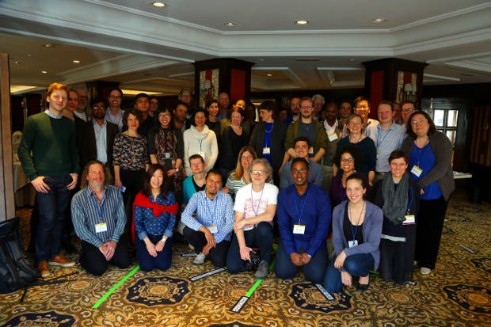

Recently I had the wonderful opportunity of participating in an unusual
workshop thanks to [FORCE11] and the [Leona M. and Harry B. Helmsley Charitable
Trust][helmsley]. This workshop is first in a series of workshops and exercises
organized for the purpose of _defining the scholarly commons_ (you can read the
announcement of the program [here][announcement]). 

I feel like this effort is really about the culmination of the desires of many,
over hundreds of years, to change the way that we collectively create and share
knowledge. While our world has gotten smaller, with many social and technical
advances that have improved life in general, and access to knowledge
specifically, I feel like we are now on the verge of something that will change
our world in ways that we can't now fully anticipate. As you could probably
guess, I am so excited to be a part of this movement! Because I am on the
steering committee for [this working group][commons group], I have had the
opportunity to observe both the foreground as well as the behind-the-scenes
efforts. I want to share some of my impressions from both perspectives.

<!--MORE-->

Before doing so, I wanted to express how fortunate we feel to be involved in
FORCE11! When we started this company, we mainly
focused on solving these problems with technology. It did not take long to
realize that "if you build it, they will come" is really _not_ how it works in
large-scale systemic migrations like this! While the right technology is surely
needed, the social challenges are at least 1000
times more difficult to overcome than the technical ones! But we also
discovered that they are not impossible to overcome either. Actually, in a way,
I think that helping people become united in a common purpose and heading in a
common direction is the only _real_ challenge that there is. Once we're there
we will have a shared vision of what needs to be built, and once it is built we
will all be able to gauge how well it embodies that collective vision (or what
still needs to be improved). FORCE11 is taking
this challenge by the horns, and is trying to doing so in a domain-agnostic
way.

# The premise

So in a spirit of hope for the future, and with the assumption that everyone in
the world would like to do things better and be more involved if they had the
chance, here was the premise of the workshop:

> The scholarly system has vanished. The forms of communication that were valid
> just a moment ago are now part of history. The contracts (international and
> individual) have ceased to exist. All the universities, publications and job
> titles are no longer in effect. The good news is that this is not an end: We
> have gathered this very group here to re-start the whole system, and this is
> a chance to do it better. You can use the same amount of money and technology
> than there was available before, but use it better. Another good news is that
> your intelligence, knowledge and creativity have not vanished. We will need
> those qualities today. We are happy you made it to this emergency meeting.
> Because of this situation, the scholarly world faces the question: Now that
> we have to start from a blank slate, how do we want to organize ourselves?
> How could we create our communication anew?

Yes, it's a bit post-apocalyptic, but isn't it refreshing? Wouldn't it be _so
much easier_ if all existing social contracts went away and we could design it
all from scratch, almost as if we were outside of the current system?
Fortunately or unfortunately, it is not likely that these changes will take
place in real life this way, but it was fun for a couple days to play our hand
at redesigning the way we do things, to take the blinders off and experiment
freely. It think this premise also suggests the immense task that lays ahead as
we seek to make these foundational changes in our society while wading through
the modus operandi of research practices that our culture is so entrenched in 
right now.

# Preparations for a workshop

By the time we found out that we had received the grant, there was not as much
time as we would have liked to prepare for the first workshop, so we had to
move quickly. We wanted to involve a good cross-section of people: old and
young, diverse disciplines, north and south and east and west, so that what we
came up with could be as representative of the collective feelings and thoughts
of the world as possible. The overarching questions we hoped to answer with
this workshop were these: _Are we ready to define a scholarly commons? Are
people willing to work together to come up with new ways of doing things? Is
there some common understanding of how that would work, or desire to move
toward consensus?_

One of the first questions that we considered as a committee in preparation for
this workshop was: do we take more of a top-down approach by steering the
direction of the workshop toward ideas and theories about commons and
commoning, or do we leave it open for people to create whatever they think the
future is and see where the sticks fall? I have to admit that for much of the
time I wanted to choose the former, wanting to teach or indoctrinate concepts
from commons theory during the workshop, and to use theory to design the
commons from the top down. But thanks to the thoughts of a few other people, we
decided on the later, to leave it completely up to the participants to design
the future, however they saw it. We really had no clue to how it would turn
out, and whether or not any consensus at all would exist in the end.

A big lesson that I learned in these early preparations was the importance, and
I would even say the _critical role_, of a positive attitude. What if the
answer in the end was that we were _not_ ready to define a scholarly commons?
We needed to be willing to accept that (though I'm not sure what we would have
done then with the rest of the program), but we also needed to have faith in
the goodness of people, faith that this is the direction that the world needs
to go, and hope that we will have the pieces to get there, and that people will
_want_ to get there. While I think there is some purpose in all the pain,
struggle, and opposition, (we need to have some pain points to have enough
motivation to make positive change), it is certainly easier to complain about
the pain than to take some positive action to make things better. It's hard to
change the world, but not impossible. This is an effort of goodness, a positive
thing aimed to make the world a better place, and we can only do it in a spirit
of cheerfulness, not fearing.

# Outcomes and continuations

By the end of the two-day workshop, we had managed to converge on some ideas
and principles. Here are a few that were especially meaningful to me:

* All contributions are attributed in a way that promotes their value and facilitates credit for all forms of labor.
* The Scholarly Commons are a fair place where everyone can play as long as they play fair and their contributions are [FAIR][fair-paper].
* The commons contains all outputs created over the space of the entire tenure of research (all phases) and what is in the commons remains in there over times (though outputs can be built upon outside its borders).
* Continuous research requires continuous infrastructure and expertise.
* The scholarly commons shall provide equitable opportunities for diverse content, voices & disciplines to be discovered & used; it shall serve diverse needs and not re-inscribe existing power structures.
* In the commons, shared content must have metadata that is: machine processable, meaning that it can be searched, aggregated, translated, manipulated; standards-based; use-agnostic; ideally rich.
* The sustainability of the commons as an ecosystem is the shared responsibility of all participants.
* Modifications to the principles of the commons must rely upon participation of the commons.
* The commons are not static. They evolve in the hearts and minds of the community as everyone learns together and continuously quests their values.
* Commercial entities are welcome, but cannot privatize content.
* Sustaining a healthy commons requires a culture of reciprocity, where those who take from the commons give back to it.
* Mentoring and training is a default part of doing research.
* Stimulating and enabling competition.

While some of these seem like they are reactions to frustrations with the
current practices of scholarship, I think there are some timeless principles
here that could be distilled and refined, and would then be applicable to many
different situations and contexts in knowledge work.

Something that stuck out to me from group discussions was the idea of currency,
or the free exchange of value in an ecosystem. _What is it that provides value
in scholarship?_ Is it publishing papers? Is it money? We decided that it was
none of those things, at least that was not the right way to look at it. The
currency in the commons is the _contributions_, and the value of a particular
contribution is how important that contribution is in some particular context.
Anything can be of value in the right context! The emphasis, therefore, is on
discoverability, participation, and reuse.

<figure id="fig:workshop_participants" property="schema:image" resource="#workshop_participants" typeof="schema:ImageObject" class="img">
  <link property="schema:representativeOfPage" resource="schema:True"/>
  
  <figcaption property="schema:caption">Participants of the workshop <i>Reimagining Scholarly Communications</i>, held in Madrid, Spain, February 2016. I'm hiding (but smiling) in the back right. Thanks to <a property="schema:url" href="https://twitter.com/radicevslobodan">Slobodan Radicev</a> for the photo.</figcaption>
</figure>

So was the [blank-slate approach][the premise] worth it? To me, I think this
was the single best decision that we made. Everyone owned what they came up
with, and even competed with other groups in imagining the greatest future.
There will be time to connect the dots of theory and history later. What we
needed here was an opportunity to freely explore the future that we
collectively hope to create, without any preconceived notions, limitations, or
barriers.

In the end, we answered some of the questions that we had hoped to answer.
There was general consensus that we _do_ want to work together, and that we
_do_ want to find better ways of doing things, and that we _are_ ready to
define a scholarly commons. These nascent outcomes form a high-level sketch of
the boundaries of the Scholarly Commons, but with them came the general feeling
that we were just barely scratching the surface, that a lot more people,
pieces, and ideas needed to be gathered and brought in. We are not done
defining the Scholarly Commons! This is just the beginning. The next questions
to answer include: _How do we define the commons? How can we do this in a way
that truly opens the door as wide as we can, so everyone feels included and
able to play a part in the defining process? And how do we ensure that this
defining process will go on continuously?_

---

[Bianca Kramer]{lang=nl} and [Jeroen Bosman]{lang=nl} put a lot of work into
publishing a report of the workshop. Please [check it out][workshop-report] to
learn more, and please take the opportunity to go through the exercise on your
own, or with your group.

[FORCE11]: <https://force11.org> {.oldstyle}
[helmsley]: <http://helmsleytrust.org>
[commons group]: <https://www.force11.org/group/scholarly-commons-working-group> "Scholarly Commons Working Group @FORCE11"
[announcement]: <https://www.force11.org/article/helmsley-charitable-trust-funds-force11-develop-scholarly-commons-future> "Program announcement @FORCE11"
[workshop-report]: <http://dx.doi.org/10.3897/rio.2.e9340> "Defining the Scholarly Commons - Reimagining Research Communication. Report of Force11 SCWG Workshop, Madrid, Spain, February 25-27, 2016 on RIO"
[fair-paper]: <http://dx.doi.org/10.1038/sdata.2016.18> "The FAIR Guiding Principles for scientific data management and stewardship on Scientific Data"
