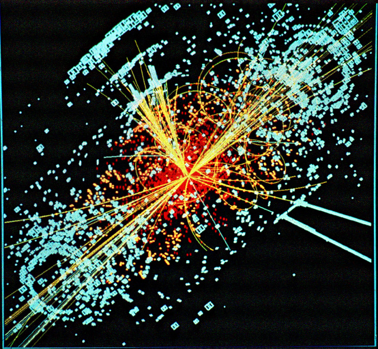

We are thrilled that web annotations, one of the core building blocks that we
are using for Geungle, have made it onto the [W3C standards
track][w3c-annotation]. While this is a great stepping stone in the standards
process, there is still a good ways to go before they becomes a [W3C
Recommendation][w3c-rec], and are adopted by the general Web community.  There
is great hope, however, for [Doug Schepers][shepazu], the W3C contact for the
new working group, mentioned that web annotations broke the record for the
number of W3C votes for any new charter ever since online voting began (in
[2003]{.oldstyle}).[^w3c-email] I have thoroughly enjoyed witnessing how people
have come together from many different places and worked together, trying to
make the web a better place.  While there were opportunities to sow seeds of
discord, no one did (that I am aware of). This is kind of unique in the
standards world (yes, even at the W3C), but I think everyone just realized the
importance of this work, and that collaboration was essential for success. I
have learned a lot watching this process, and have been impressed by everyone
in the [Open Annotation Collaboration][oac], especially Rob Sanderson, [Paolo
Ciccarese]{lang=it}, and Herbert Van de Sompel for their vision and inclusive
approach. Thanks to [Hypothes.is][h] for sponsoring the W3C workshop that
helped to make all of this happen.

Since the [creation of the World Wide Web][oai8], not all has been
[peachy-keen][pk]. The original vision of the Web, according to Tim
Berners-Lee, was one of openness and collaboration, one of democracy and
egalitarianism. While there has been forward progress, there has also been [a
lot of backsliding][internet-lost]. Corporatism, in various forms, is fighting
right now to take over the open, independent Web---to gain control of it. This
is not happening without resistance, however. The [IndieWeb][iwc] is one
example of an initiative to take the Web back to its original vision. As we
transition to doing research on the Web, it is critical that the remedy be not
worse than the disease.[^fishes] While research is now moderated by [the
incumbent gatekeepers][paradigm], there is the potential for research to be
"hedged in" in many more ways if this transition is done badly. The Web, and
especially the Web of research, needs to grow organically, in accordance with
principles of meritocracy, and without corporate hedging. I am hopeful that
there are enough people now clamoring for openness and transparency that this
will happen. 

<!--MORE-->

Web annotations have the potential to be a significant boon to this egalitarian
vision because they provide an excellent foundation for other open,
collaborative standards to build upon. Web annotations invert control compared
to current commenting systems. The author or content creator retains power over
the annotation and the choice of where and how to publish it. The publisher or
website owner doesn't have this power, and must compete for business on [some
basis other than vendor lock-in][vision]. Vendor lock-in can be completely
avoided since web annotations are portable and globally understandable, thanks
to the underlying technologies of [RDF][RDF] and [JSON-LD][JSON-LD]. All of
this gives us, as a research community, enormous potential for moving beyond
[the current publishing paradigm][paradigm].

# Annotations for Research

To understand why web annotations are useful for research, we need to look a
little deeper at what research _is_. The verb _research_ is from the Old French
<dfn id="def-recercher" lang="fr">recercher</dfn>, which means to _seek out_,
or _search closely_.[^term-research] The <dfn id="def-re-">re-</dfn> prefix
means _back to the original place; again, anew, once more_, also with sense of
_undoing_.[^term-re-] No wonder we beat our heads against the wall sometimes!
It often feels like we need to start over again for the umpteenth time.

So _seeking out_, or _searching closely_ implies that there is an object that
is being sought after. In research, this object is called a [source][S]. A
source contains [information][I] that could possibly help in answering a
[question][Q]. This source of information is searched closely, over and over,
until new knowledge, in the form of a [conclusion][C], is obtained.

<figure resource="#simulated-higgs" class="img" typeof="schema:ImageObject prov:Entity">
  <link property="prov:wasDerivedFrom" href="https://cds.cern.ch/record/628469" typeof="prov:Entity" />
  
  <figcaption><b property="dc:title schema:name">Simulated Higgs to two jets and two electrons</b> by <a href="http://cern.ch" property="cc:attributionName" rel="cc:attributionURL dc:creator">CERN</a>. Here a Higgs boson is produced which decays into two jets of hadrons and two electrons. The lines represent the possible paths of particles produced by the proton-proton collision in the detector while the energy these particles deposit is shown in blue. Licensed under a <a property="cc:license" rel="license" href="http://creativecommons.org/licenses/by-sa/4.0/">CC-BY-SA license.</a> </figcaption>
</figure>

Really, the only thing that differentiates the research domains from each other
is what that information is and how that information is obtained. Once
information is obtained the process of finding answers using that information
is surprisingly similar. If you are trying to understand [the weak
force][weak-force], you need [a really large particle accelerator][LHC]. If you
are trying to piece together the past, you need all the artifacts from that
time period that you can get your hands on. 

Web annotations let us build on top of these existing sources of information,
whether they have been sitting for hundreds of years in a archive, or have just
been created by an expensive particle detector. Web annotations are domain
agnostic---it doesn't matter whether the information involves census records or
high-speed proton collisions. Web annotations do not change the data or
documents that they point to. Since web annotations are creative works, the
annotation creator is at liberty to choose how (or if) to license an
annotation, the same as with any other authored content on the web. Yes, this
even makes it possible to liberally license and share annotations of copyright
images in paywalled image repositories.

So to conclude, web annotations are awesome. They're fundamental for
collaborative, open research. They have the potential to revolutionize the way
that research is published. In the near future I will be describing what this
means for genealogy. Bring on the Web!

<figure typeof="schema:ImageObject" property="schema:image" resource="#infographic">
  <link property="schema:representativeOfPage" resource="schema:True" />
  
<iframe property="schema:contentUrl" src="annotation-architecture.svg" class="simple static"></iframe>

  <figcaption property="schema:caption"><b property="schema:name dc:title">Web Annotation Architecture</b>, an infographic from the W3C about web annotations. <a href="annotation-architecture.svg">Display fullscreen</a> for the best viewing experience. Licensed under a <a property="cc:license" href="http://creativecommons.org/publicdomain/zero/1.0/">CC0 license.</a> </figcaption>
</figure>

[^term-research]: _research_, from the [Online Etymology Dictionary](http://www.etymonline.com/index.php?term=research).
[^term-re-]: _re-_, from the [Online Etymology Dictionary](http://www.etymonline.com/index.php?term=re-)
[^fishes]: See [_The Fishes and the Frying-Pan_](http://books.google.com/books?id=4UE-AAAAcAAJ&lpg=PA349&ots=74gka8Ll6P&dq=Fables%20of%20Aesop%20and%20Other%20Eminent%20Mythologists%3A%20Abstemius's%20Fables&pg=PA289#v=onepage&q&f=false), from Abstemius' Fables, in which the Remedy is many times worse than the Disease.
[^w3c-email]: [The announcement](http://lists.w3.org/Archives/Public/public-openannotation/2014Aug/0003.html) for the new working group is in the W3C mailing list archive.

[internet-lost]: http://www.theguardian.com/technology/2014/aug/24/internet-lost-its-way-tim-berners-lee-world-wide-web "How the web lost its way–and its founding principles"
[pk]: http://www.oxforddictionaries.com/definition/american_english/peachy-keen 
[RDF]: http://en.wikipedia.org/wiki/Resource_Description_Framework
[JSON-LD]: http://json-ld.org/
[oai8]: /blog/heading-to-oai8/#p[TsrKoa],h[TsrKoa] "A little about the beginnings of the WWW"
[mission]: /company/#mission
[vision]: /blog/a-social-business/#p[OvoObm],h[OvoObm,1,2]
[S]: /research/process/#dfn:data
[I]: /research/process/#dfn:information
[Q]: /research/process/#dfn:question
[C]: /research/#p[RifNmw],h[RifNmw,3]
[LHC]: http://home.web.cern.ch/topics/large-hadron-collider "Expensive information"
[weak-force]: http://en.wikipedia.org/wiki/Weak_interaction
[paradigm]: /blog/a-social-business/#p[WtcTwn],h[WtcTwn,2]
[w3c-annotation]: http://www.w3.org/annotation/ "W3C Web Annotation Working Group"
[w3c-rec]: http://www.w3.org/standards/faq#std "What is a W3C Recommendation?" {.abbr}
[shepazu]: http://www.w3.org/People/Schepers/
[oac]: http://www.openannotation.org/
[iwc]: http://indiewebcamp.com/
[corporatism]: http://www.economicpolicyjournal.com/2009/11/explaining-difference-between.html "Capitalism vs Corporatism"
[h]: https://hypothes.is/ {.domainname}
