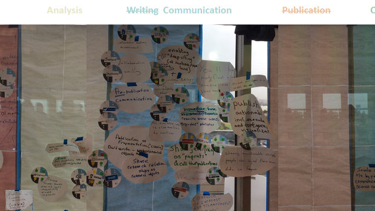
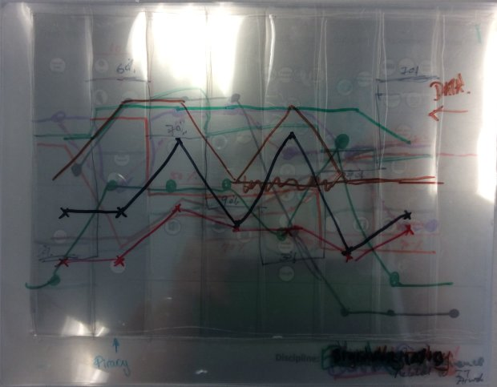
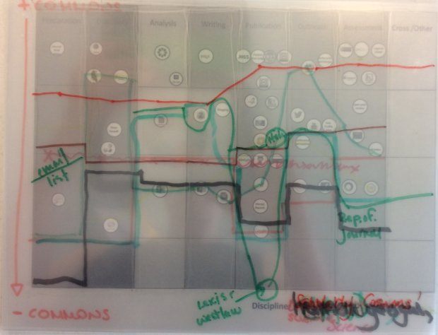
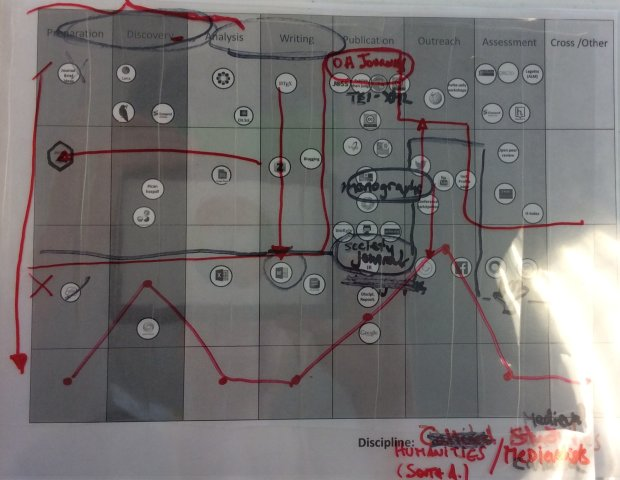

Don't worry---this is not what you think. This post is not about specific
technologies, but about what needs to be enabled by technology to allow for
scholarly commoning. It is a follow-on to a post that I wrote about the
[_culture_ of the Scholarly Commons][culture].

<!--MORE-->

# On gaps and systems

One of the topics that pops up every once in a while in our discussions is the
concept of _compliance_. I think this comes from the desire to know where the
boundaries of the Scholarly Commons are, and following that line of thought,
the question of whether or not something belongs within the commons is based
upon whether that thing _complies_ with certain principles of openness or
reusability.

As much as I love and support open-source software and tooling, I think that
for us this argument has been more of a distraction from what the Scholarly
Commons is all about. The Scholarly Commons is about enabling _interactions_
and the _contributions_ that result from those interactions. Nevertheless, the
main track of the workshop was designed to lead the workshop participants
through an exercise of 'compliance checking' existing tools to see how well
they conformed to the latest rendition of the principles of the Scholarly
Commons.

<figure class="img">
  
  <figcaption>Some thoughts by [Björn Brembs]{lang=nl}, [Jeroen Bosman]{lang=nl}, and [Bianca Kramer]{lang=nl} on practical pathways toward a scholarly commons using existing tools, organizations, and services.</figcaption>
</figure>

In the days leading up to the workshop, I struggled to understand the point of
going through such an exercise. The hope was, as far as I could tell, that we
could find a new system by looking at elements of the old system, and filling
in any gaps that we find. But cultural change and innovation don't happen that
way. Besides that, many of the tools that are used for scholarship right now
are based on cultural practices from which we are trying to get away. We need
technology that will enable the culture of the Scholarly Commons, and this
technology is currently missing. We were not going to discover some preexisting
solution at this workshop that has been waiting for us out there just by
looking at all the components of the current system. We need something more.

To explain what I mean by this, allow me to share a similar fallacy and
resulting struggle in the practice of medicine:

<figure id="systems-vs-components" class="bq grab">

> One essential characteristic of modern life is that we all depend on
> systems---on assemblages of people or technologies or both---and among our
> most profound difficulties is making them work. In medicine, for instance, if
> I want my patients to receive the best care possible, not only must I do a
> good job but a whole collection of diverse components have to somehow mesh
> together effectively. Health care is like a car that way, points out Donald
> Berwick, president of the Institute for Healthcare Improvement in Boston and
> one of our deepest thinkers about systems in medicine. In both cases, having
> great components is not enough.
>
> We're obsessed in medicine with having great components---the best drugs, the
> best devices, the best specialists---but pay little attention to how to make
> them fit together well. Berwick notes how wrongheaded this approach is.
> "Anyone who understands systems will know immediately that optimizing parts
> is not a good route to system excellence," he says. He gives the example of a
> famous thought experiment of trying to build the world's greatest car by
> assembling the world's greatest car parts. We connect the engine of a
> Ferrari, the brakes of a Porsche, the suspension of a BMW, the body of a
> Volvo. "What we get, of course, is nothing close to a great car; we get a
> pile of very expensive junk."

<figcaption>--- Atul Gawande, <cite>The Checklist Manifesto</cite>, [2009]{.oldstyle}, pp. [184--5]{.oldstyle}</figcaption>
</figure>

Research, just like medicine, is not simply the matter of lining up tools into
a usable workflow. We need to approach this problem in a systemic way.

# The exercise

Putting those concerns aside for a moment, the compliance exercise was very
enlightening in some unexpected ways. First, it was good to talk about current
practices. So much of my time I spend thinking _if we could start over from
scratch, what would the world look like?_ and I don't spend as much time
thinking about the difficulties of transition that others are facing as well as
I need to. For example, one participant was threatened with dismissal from her
doctoral program for wanting to publish a paper open access. Compared with Open
Access, what we're trying to do is space age. As much as it sounds nice, and
[as happy as it would be to work in this new world][happy place], the
transition to new ways of working together is not going to happen overnight. It
is not enough to know what our destination is---we also need to know how to get
there from where we are now.

Here are a few of the thoughts that emerged from the exercise:

* Bad tools are used to perform good things (often requiring some workarounds).
* People use what they use because it works.
* It's way more useful to think of what we are trying to _achieve_ with a tool,
  rather than judging a tool's intrinsic quality of compliance.
* Tools can actively hinder open if the outputs are not machine-accessible.
* Practice is more important than tools.

Now merging these results with some of my previous thinking, it is the
_commoning_---the practices, not the tools---that needs to be compliant. Yes,
some tools align with practices that we want to carryover into this new way of
working, but looking back, I think if we had kept the discussion more abstract
and focused on specific _practices_ rather than on tools, we would not have had
the disintegration of the main track as so many of the participants left to
join the Global South discussion. So many of the tools we were studying were
designed for the research culture and infrastructure of the Global North and
just [did not connect with many of the people][april's blog post] that we
brought from around the world. Even so, I did not expect the participants to
react this way, and I think this was an important negative result to obtain.

# The process is the product

As I was sitting there in the workshop, thinking about all the above, the
answer came to me slowly but clearly. Because the research processes were made
explicit and studied this way, it allowed us to reason about, find patterns,
and learn from them. We discovered that it didn't really matter as much for the
exercise whether a tool was open or not, but it _was_ useful to know that a
researcher took some data, put it in such and such tool, and that something
came out at the end (of course open tooling makes things so much easier, but we
need to be free to use the right tool for the job). Well, what if we could look
at the research process in a more _functional_ way, with the tools or other
smaller parts of the process as [black boxes][black box] within a bigger
process? It is the _process_ that needs to be open and replicable. _So why are
we not publishing the research process, even across tools, as the fundamental
scholarly output?_ If the process was the product, many of the problems we are
facing right now in scholarly communications, relating to reproducibility,
participation, and the integration of scholarship into society, would diminish
or be eliminated completely. Researchers would also have something to show for
all their thinking.

If we keep the process implicit, or leave it to post facto analysis alone to
attempt to reveal it, we end up not very far from where we are now: publishing
_about_ the research, instead of publishing _research_, and our ability to
effectively collaborate deeper into the research process will be impeded.

<figure class="bq grab">

> An article about computational science in a scientific publication is *not*
> the scholarship itself, it is merely *advertising* of the scholarship. The
> actual scholarship is the complete software development environment, and the
> complete set of instructions which generated the figures.

<figcaption>--- Jonathan B. Buckheit and David Donoho, <a href="http://statweb.stanford.edu/~donoho/Reports/1995/wavelab.pdf"><cite>Wavelab and Reproducible Research</cite></a>, 1995 (quoted in a <a href="http://www.wf4ever-project.org/wiki/download/attachments/2064544/ISMB2013KeynotecleanGOBLE.pdf">presentation</a> by Carole Goble).</figcaption>
</figure>

But where do we draw the line between implicit and explicit? Is it enough to
know which tools the researcher used and when? The tools are part of it, but
not all. We need to ask ourselves, what is our goal and what is of value in
reaching that goal? If our goal is to create [a new culture][culture] of
scholarship, what would change the culture? In order to create a new culture,
we need more than open notebook science or even a static depiction of a
researcher's process. We need something that draws people _into_ the process
(while, of course, preserving the attribution, integrity, and openness of the
contributions). What about the questions and intentions of the researcher? This
is the level at which I think we really need to be sharing. The researcher's
decisions and and the process of how they came about should form the basis of
research publication and collaboration. From this perspective, the entire
research process could be viewed as a sequence of decisions.

Our process as a committee in defining the Scholarly Commons, aside from the
workshops that we have held, has been mostly limited to seeking feedback when
we were nearing a finished product. Our design process has not been very open,
not because we we haven't wanted it to be open, but because of the lack of
tooling that works this way. We're doing the best we can with what we have, but
we need ways to do this better! I believe that the future really _is_ a [happy
place]!

In order to create a truly open, collaborative, egalitarian culture of
scholarship, we also need the questions, thoughts, and intentions that were in
the researcher's mind in the first place, _as the knowledge was designed_. We
can't continue publishing only closed forms. We need new forms that [invite
participation][research cases]. We need to publish the _research_. We need to
look at research more at a _cellular_ level (or [_tesseral_ level][vision], if
you will :blush:). If we can find ways to communicate more openly throughout
the process, many of the existing forms of scholarly communications will either
change or go away. The Scholarly Commons should be a jumping-off point to new
ways of working together, taking the best ideas of how to do scholarship in a
modern setting, setting aside as many of the undesirable social, cultural, and
technical limitations as possible.

To explain what I mean by this, allow me to give an example of my experience
designing [the logo] for the Scholarly Commons. As I went along, I made a
conscious effort to explain each step, impression, question, and resulting
decision of the design process. This is the spirit and culture of the commons!
Done this way, the process is open, transparent, and invites participation. It
is easy for anyone to ask, 'Did you think about this or that?' and contribute
in context. It is easy for anyone to get involved in the design process,
wherever and whenever the feel they have something to contribute. Obviously,
doing this with a Google Doc is less than ideal, but I hope you can see what I
am trying to show.

# Shared Practice

This to me is the essence of commoning: sharing how, why, and what we do. To do
this, we need a way to explicitly _share_ our practice. I discussed this idea
and the need to share our process openly in the [previous section][the process
is the product]. Taking this idea a step further, we need a way to explicitly
share _patterns_ of practice. Fiona Murphy and Danny Kingsley explored some
possibilities for doing this using [decision trees] during an unworkshop
session. Decision trees direct the focus onto concrete, actionable things we
can do. Decision trees, in this context, describe patterns of practice (that is
to say _behavior_) that can actually _guide_ the practice of research.

Of course, the idea with these decision trees is not to mandate specific
research practices, but to create a way to practice and share our patterns of
practice in a collaborative, peer-to-peer sort of way. This vision is painted
beautifully in the foreword to one of my favorite books on typography. Here I
quote, substituting the practice of research or scholarship for the practice of
typography, since what is described could be applied to many types of
practices:

<figure class="bq grab">

> One question, nevertheless, has been often in my mind. When all
> right-thinking human beings are struggling to remember that other men and
> women are free to be different, and free to become more different still, how
> can one honestly write a rulebook? What reason and authority exist for these
> commandments, suggestions and instructions? Surely \[researchers\], like
> others, ought to be at liberty to follow or to blaze the trails they choose.
>
> \[Scholarship\] thrives as a shared concern -- and there are no paths at all
> where there are no shared desires and directions. A \[researcher\] determined
> to forge new routes must move, like other solitary travelers, through
> uninhabited country and against the grain of the land, crossing common
> thoroughfares in the silence before dawn. The subject of this book is not
> \[scholarly\] solitude, but the old, well-traveled roads at the core of the
> tradition: paths that each of us is free to follow or not, and to enter and
> leave when we choose -- if only we know the paths are there and have a sense
> of where they lead. That freedom is denied us if the tradition is concealed
> or left for dead. Originality is everywhere, but much originality is blocked
> if the way back to earlier discoveries is cut or overgrown.
>
> If you wish to use this book as a guide, by all means leave the road when you
> wish. That is precisely the use of a road: to reach individually chosen
> points of departure. By all means break the rules, and break them
> beautifully, deliberately and well. That is one of the ends for which they
> exist.

<figcaption>--- Robert Bringhurst, <cite>The Elements of Typographic Style</cite>, version [3.2 (2008)]{.oldstyle}</figcaption>
</figure>

Instead of writing these rules or guides in prose and sticking them in a book,
leaving it to those who have read the book to carry the torch, or capturing
them in solitary, inert images for people to scan and manually decode, we need
a way for machines to assemble, connect, and semi-automate these guiding
processes. And as more of the researcher's process becomes open, machines will
be free to find patterns among researchers' paths, giving way to some sort of
collective intelligence in a common search for truth.

As much as we've focused on principles and culture (and they are certainly the
driving force in this effort!), we need an enabling infrastructure for
commoning. We need to make the discovery process easier, and enlarge the doors
and allow others to come and participate in this great endeavor! This is part
of the answer to increasing the porosity of the boundaries between knowledge
clubs and allowing others to play easier, more fluidly. Visitors can be guided
to learn the ropes as quickly as possible. The existing lack of
interoperability between tools is actually an opportunity for something better.

# A relative advantage

When it comes down to it, making the transition to this new culture is really a
user experience problem. Going back to Everett Rogers' <cite>Diffusion of
Innovations</cite>, we need an advantage over the current system. If we can
create a better research experience, then we have created an advantage. We will
then have the potential and power to transform the culture.

But we don't need to stop there! Once we have removed barriers to the
production of knowledge, what is to stop us from using this knowledge freely to
improve the lives of everyone!? Continuing from the [previous
quote](#systems-vs-components) which spoke about the focus on components that
has led to a lack of systemic excellence in the practice of medicine, Gawande
provides some direction for the future:

<figure class="bq grab">

> Nonetheless, in medicine that's exactly what we have done. We have a
> thirty-billion-dollar-a-year National Institutes of Health, which has been a
> remarkable powerhouse of medical discoveries. But we have no National
> Institutes of Health Systems Innovation alongside it studying how best to
> incorporate these discoveries into daily practice...
>
> The same could be said in numerous other fields. We don't study routine
> failures in teaching, in law, in government programs, in the financial
> industry, or elsewhere. We don't look for the patterns of our recurrent
> mistakes or devise and refine potential solutions for them.
>
> But we could, and that is the ultimate point.

<figcaption>--- Atul Gawande, <cite>The Checklist Manifesto</cite>, [2009]{.oldstyle}, p. [185]{.oldstyle}</figcaption>
</figure>

Decision trees can also be used as an analytical tool to study and refine
practices themselves. This is one of the most promising ideas to me, and is
something that will connect research to practice in a way that simply does not
exist right now. If we can approach this in a very general way, this idea has
the potential to make a real difference in how we practice, not just as
researchers but as practitioners in many other fields, and may even blur the
line between researchers and practitioners.

So building on my [earlier definition] of the Scholarly Commons, but from the
perspective of technology:

<dfn id="def:technology-of-the-scholarly-commons">The Scholarly Commons</dfn>
is an opportunity to improve the world by drastically improving our practices
relating to the production and use of knowledge.

So how do we get there? We're working on a [proposal] for that very purpose.

[culture]: </blog/putting-the-pieces-together-culture/> "The Pentandra Blog → Putting the Pieces Together: Culture"
[earlier definition]: </blog/putting-the-pieces-together-culture/#def:the-scholarly-commons> "The Scholarly Commons is the opportunity to come together and create a new culture of commoning on scholarly and scientific knowledge."
[vision]: </#sec:research-experience> "We envision a better research experience"
[the logo]: <https://docs.google.com/document/d/1YIxxMpcOni7alThkdVvvrnc_edKay2Ow4kiRwBDTQrs/edit> "Branding the Scholarly Commons"
[black box]: <https://en.wikipedia.org/wiki/Black_box> "Black box on Wikipedia"
[decision trees]: <decision_trees_proposal.jpg> "Click to see the original decision trees proposal"
[research cases]: </blog/introducing-research-cases/#sec:research-cases>
[happy place]: <https://www.force11.org/blog/future-happy-place> "The Future is a Happy Place, by Maryann Martone"
[april's blog post]: <https://aprilhathcock.wordpress.com/2016/09/27/making-the-local-global-the-colonialism-of-scholarly-communication/>
