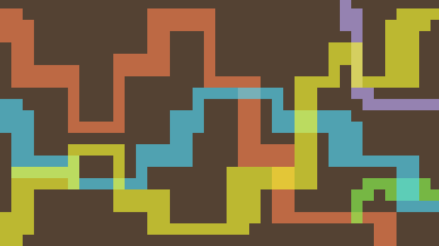

This post started as a follow-on to a post I am writing about the _culture_ of
the Scholarly Commons in response to the [Scholarly Commons San Diego
workshop][san diego workshop] held last September by [FORCE11]{.oldstyle}. But,
as it sometimes turns out in this funny thing we call life, it is time to
release this post, and I am still working on the one about culture. Don't
worry---this post is not about specific technologies, but about what needs to
be enabled by technology to allow for what I'm calling, for purposes of this
discussion, _scholarly commoning_.

As this is my own response to the San Diego workshop and to our discovery
process so far relating to the Scholarly Commons, it represents my own views
only, and not necessarily the views of those in [FORCE11]{.oldstyle}'s
Scholarly Commons Working Group or even its steering committee. Each of us
involved in this project are coming at this from different perspectives, so it
is no surprise that we are not always in complete agreement about what we would
like the Scholarly Commons to be. We are each a product of our own experiences
and backgrounds, and each of our backgrounds is quite dissimilar. Even though
this makes things difficult sometimes, I view this as a good thing in general,
because it has brought more perspectives to the table and has forced us to look
at what we're doing from many different angles.

<!--MORE-->

Ever since we started this thing, a central premise has been that we would
're-imagine scholarly communication starting from scratch as a system
explicitly designed for machine-based access and networked scholarship, and not
simply adapted from the paper-based system.'[^first-workshop] Throughout the
course of us working on this, however, it has become evident that 'from
scratch' and 'networked scholarship' mean different things to different people.
For some on this steering committee (and likely others), these terms convey
more of an idea of an incremental realignment of existing platforms and
services, some of which have been studied in the [[101]{.oldstyle} Scholarly
Innovations project][101 innovations]. But there are also those, myself
included, that have been thinking of these terms on a more foundational level,
of open approaches and emerging technologies that could actually change the
conversation, such as HATEOAS and machine-based ontologies that could help
connect researchers and research across tools and platforms, providing new
interactions for scholarship that would open up the research process and give
us the ability to do things that we have never been able to do before. In
trying to reconcile these two approaches, I have wondered whether it is
possible that the idea of the Scholarly Commons could encompass both.

There is a general consensus among us, I am pretty sure, that the Scholarly
Commons is scholarly communication in a modern setting, one in which we are not
constrained by the limitations of print publishing. But the definition of the
Scholarly Commons goes much deeper than that, and, as they say, the devil is in
the details. The Scholarly Commons represents scholarship reinvented for our
modern era, and whichever the approach to do that, I am hoping we'll take the
best of the past, the aspirations and thirst for understanding that have
motivated mankind for thousands of years, and redesign the whole system from
scratch to fit our current needs and desires, so that, hopefully, in the end,
we will have built, using the best of modern technologies, 'a constellation of
working alternatives driven by a different logic.'[^constellation]

# On gaps and systems

As this essay is, in part, a review of the San Diego workshop,  I want to
structure my thoughts at first around the main track of this workshop, which
was devoted to 'putting the pieces together' by comparing the community vision
of the Scholarly Commons against our current state of chaotic
innovation.[^second-workshop] While there were several unworkshop sessions, the
main track was designed to lead participants through an exercise of 'compliance
checking' existing tools to see how well they conformed to the latest rendition
of the principles of the Scholarly Commons.

One of the topics that pops up every once in a while lately in the discussions
in the Scholarly Commons working group is the concept of _compliance_. I think
this comes from a natural desire to understand what the Scholarly Commons
is---to wrap our brains around the idea, and the hope that if we know where the
boundaries of the Scholarly Commons lie, we might be able to reduce the
Scholarly Commons to some transparent explanatory paragraph or set of
principles. Following that type of thinking then, the question of whether or
not something belongs within the commons is based upon whether that thing
_complies_ with certain agreed-upon principles. But the word _compliance_, to
me, conveys more of a heavy-handed, top-down sort of idea, and promotes
exclusivity over inclusivity. I think that for us over the past year this
argument has been more of a distraction that has held us back from discovering
more what the Scholarly Commons is all about. From my viewpoint, the Scholarly
Commons is more about _enabling interactions_ and the _contributions_ that
result from those interactions. In what we're trying to do, there is this idea
about lowering barriers and reducing friction. The things we're working with
either fit together or they don't. A better word for this type of interactivity
might be <dfn id="def:compatibility">compatibility</dfn>, which, in a
telecommunications context, means 'the capability of two or more items or
components of equipment or material to exist or function in the same system or
environment without mutual interference.'[^compatibility] We use and build upon
resources that are compatible with our manner of working. If there are
resources that don't fit, there is no place to put them. They don't help but
interfere with progress, so we just don't use them. Compatibility puts the
focus on fitness for use rather than on obedience, compliance, or even social
expectation.

So as far as I could tell, the hope for this main track was that we would
discover a new system by looking at and reacting to elements of the old system,
and then filling in any gaps that we find. I struggled with this approach in
the days leading up to the workshop. I had little hope that we would discover
some preexisting solution at this workshop that has just been waiting for us
out there by looking at all the components of the current system. Cultural
change and innovation don't happen that way. Besides that, many of the tools
that are currently used for scholarship are based on cultural practices from
which we are trying to get away. To create a new system, we need to take the
current system apart, looking at the original motivations that created the
pieces that we have, and then take those motivations and design a new form to
fit our current context. But I wondered how well we would come up with
something tenable for the future when we were structuring the discussion so
tightly around the current system. We were not going deep enough. We need
something incredibly basic, something _new_ that does not yet exist (or has
been lost)---_a different logic_ around which a new system could be shaped. To
explain what I'm looking for here, allow me to share a similar fallacy and
resulting struggle in the practice of medicine:

<figure id="systems-vs-components" class="bq grab">

> One essential characteristic of modern life is that we all depend on
> systems---on assemblages of people or technologies or both---and among our
> most profound difficulties is making them work. In medicine, for instance, if
> I want my patients to receive the best care possible, not only must I do a
> good job but a whole collection of diverse components have to somehow mesh
> together effectively. Health care is like a car that way, points out Donald
> Berwick, president of the Institute for Healthcare Improvement in Boston and
> one of our deepest thinkers about systems in medicine. In both cases, having
> great components is not enough.
>
> We're obsessed in medicine with having great components---the best drugs, the
> best devices, the best specialists---but pay little attention to how to make
> them fit together well. Berwick notes how wrongheaded this approach is.
> "Anyone who understands systems will know immediately that optimizing parts
> is not a good route to system excellence," he says. He gives the example of a
> famous thought experiment of trying to build the world's greatest car by
> assembling the world's greatest car parts. We connect the engine of a
> Ferrari, the brakes of a Porsche, the suspension of a BMW, the body of a
> Volvo. "What we get, of course, is nothing close to a great car; we get a
> pile of very expensive junk."

<figcaption>--- Atul Gawande, <cite>The Checklist Manifesto</cite>, [2009]{.oldstyle}, pp. [184--5]{.oldstyle}</figcaption>
</figure>

Research or scholarship, just like medicine, is not simply a matter of lining
up tools into a usable workflow. We need to approach this problem in a systemic
way, considering the many and various aspects of this new system, including
production, governance, culture, economics, and technology. The Scholarly
Commons will look different than our current system, and to enable this
different system, [we need something fundamentally different][they just don't
get it] that will drive this different culture.

# The exercise

Putting those concerns aside for a moment, the compliance exercise was very
enlightening for me in some unexpected ways. I need to add here that, while
this was the main track of the workshop, there were other discussions going on,
and I spent most of the day bobbing between the discussions going on, observing
and trying to understand the participants' various perspectives, so my
understanding of some of the discussions may be incomplete.

<figure class="img" resource="#scholarly_commons_backbone_using_existing_stuff_as_parts" property="schema:sharedContent" typeof="schema:ImageObject">
  <link property="schema:representativeOfPage" resource="schema:True"/>
  
  <figcaption class="schema:caption">Some thoughts that emerged during the main track of the workshop, which was followed through to completion thanks to [Björn Brembs]{lang=nl}, [Jeroen Bosman]{lang=nl}, and [Bianca Kramer]{lang=nl}, on practical pathways toward a scholarly commons using existing tools, organizations, and services.</figcaption>
</figure>

As for the exercise, after the tools went through the 'compliance checking'
activity, they were plotted on a graph and grouped by research phases based on
the current publication paradigm. Participants were invited at that point to
describe the path that they would take (if there was one) through these tools
in the course of work in their particular domain of study. The participants
drew their path onto a transparency that was overlaid on top of the tools.
These transparencies were then grouped by domain...

...and then superimposed on top of each other so that common patterns could be
seen.

Here are some examples:

As you can see, while there is some overlap, the paths, even within domains,
are very idiosyncratic. People are particular about which tools they want to
use, and often there is more than one path to take---more than one tool that
can be used to get a job done. Certain tools might even be used to gain a
competitive advantage.

Here are a few of the group's thoughts that emerged during the compliance
exercise:

* Bad tools are used to perform good things (often requiring some workarounds).
* People use what they use because it works.
* It's way more useful to think of what we are trying to _achieve_ with a tool,
  rather than judging a tool's intrinsic quality of compliance in isolation.
* Tools can actively hinder open if the outputs are not machine-accessible
  using open standards.
* Practice is more important than tools.

As for my first bit of enlightenment, it was good to talk about current
practices. So much of my time I spend thinking _if we could start over from
scratch, what would the world look like?_ and I don't spend as much time
thinking about the difficulties that others are facing of transitioning to this
new world from the current system. For example, one participant was threatened
with dismissal from her doctoral program if she chose to publish a paper open
access. And that's just the resistance placed against the Open Access movement,
which has been going on for many years now. Compared with the Open Access
movement, the Scholarly Commons seems like it is from another millennium, or at
least another century. As much as it sounds nice, and [as happy as it would be
to work in this new world][happy place], the transition to new ways of working
together is not going to happen overnight. It is not enough to know what our
destination is---we also need to know how to get there from where we are now.

Of course we can't expect to figure all of this out in one workshop. But we
must address the right questions. And we need to have the right goal. Merging
the results of this exercise with some of my earlier thoughts in this essay, it
may be that the _commoning_---the practices, not the tools---is what needs to
be compliant. Here it is important to understand that, besides the logical
fallacy that I described in [the first section][on gaps and systems], this
exercise was trying to illuminate what is _common_ among tool use in the
current paradigm, not necessarily what would be required in a _commoning
paradigm_. The exercise was designed to find _common patterns_, not patterns of
commoning. While this was useful in some ways, it leaves more important
questions unanswered, such as _is there a shared resource of a scholarly
commons? If so, what is it? and who is the community that cares about or
manages that shared resource?_ If we don't have answers to these more
fundamental questions, then we really have no way to know whether any of the
answers we come up with are right or even what any of the other questions are.
Common and commoning are not the same thing, and a common practice does not a
commons make. Yes, some existing tools align with practices that we would
likely want to carryover into this new way of working, but looking back, I
think the focus of this exercise was too shallow. If we had kept the discussion
more abstract and focused on specific _practices_ rather than on specific
tools, we may not have had the eventual disintegration of the main workshop
track as so many of the participants left to join [other excellent
discussions][ravi's blog post]. Most of the tools we were studying in this
exercise were designed for the research culture and technical infrastructures
of the Global North and just [did not connect with many of the people][april's
blog post] that we brought from around the world. But perhaps even a focus on
specific practices would have been too shallow as well, and we should have
taken a step back and discussed something else, such as the need for and
approaches to global peer-production. Even so, I did not expect the
participants to react this way, and I think this was an important negative
result to obtain and from which we should learn.

# Scholarly Commoning

Our process as so far in defining the Scholarly Commons, aside from the few
workshops that we have held, has been mostly limited to seeking feedback when
we were nearing a finished product. Our design process has not been very open,
not because we we haven't wanted it that way, but because of the lack of
tooling that preserves the continuity of a broad-reaching, multi-faceted
exploratory research process. I believe that [the future really _is_ a happy
place][happy place] and we need ways to do this better! Throughout this
exploration (and it has been a luxury to be able to explore this topic so
intensely for so long), while I have learned much from the many perspectives
that have been shared, I have found it particularly interesting that we have
not yet discussed together the definition of _scholarship_. I think we've
focused too much on trying to create something appealing to the current
professional community of scholars, scientists, and researchers, and I think
revisiting our definitions of scholarship, science, and research is a necessary
part of defining the Scholarly Commons.

If we go back far enough, say three or four hundred years ago, scholarly
communication didn't happen in the sort of static, dissemination-oriented way
that it does now. People wrote letters to each other, sharing their progress in
understanding openly, including hunches, questions, impressions, tentative
conclusions---the whole gamut. It was a collective effort to gain a greater
understanding of the world, one which was empirical and not based on dogma. It
united people across languages, cultures, nationalities, and backgrounds. It
was only later that, for motivations which I think were at odds to the original
intent and mostly based on the economical limitations of print, these letters
were editorialized, and the scholarly article was born. Eventually researchers
submitted articles to the journals directly, and started using publication to
establish scientific priority. You may think that this was a natural evolution,
but I think we lost something in the transition to more 'modern' scholarly
communication. I am reminded of a quote that I've [shared before][research
cases]:

<figure class="bq grab" lang="en-GB">

> While publication and distribution of the Philosophical Transactions
> certainly contributed to the diffusion of knowledge, it did not provide for
> the flexibility, openness, manoeuvrability and relative rapidity of
> interaction that correspondence did. In short, the Society’s correspondence
> encouraged a more participatory science.

<figcaption>--- [Andrea Rusnock]{lang=en-US}, <a href="http://www.jstor.org/stable/4028081">Correspondence networks and the Royal Society, 1700--1750</a></figcaption>
</figure>

I would argue that what we have lost we need to revive and reintroduce into our
concept and culture of scholarship, and that this idea of '[flexibility,
openness, manoeuvrability, and relative rapidity of interaction]{lang=en-GB}'
is intrinsic in the idea of the Scholarly Commons. We can't really invite
participation and collaboration in this way unless we open up and expose the
research process at this level of granularity. We need to be publishing at the
granularity that would allow us to actually work together throughout any part
of the research process. Otherwise we're still working in silos, albeit
smaller, distributed ones. We need the spirit of scholarship and enlightenment
that existed in [the Republic of Letters][republic of letters], and it comes
quite naturally if we can stop taking ourselves so seriously.

In order to create a truly open, collaborative, egalitarian culture of
scholarship, we also need what was in the researcher's mind in the first place,
_as the knowledge was designed_. We can't continue publishing or disseminating
only closed forms. We need new forms that [invite participation][research
cases]. We need to publish the _research_, exposing it more at the _cellular_
level (or [_tesseral_ level][vision], if you will :blush:). In order to create
this new culture, we need more than open notebook science, research protocols,
reproducibility, or even static depictions of researcher workflows. All of
these things are great, but they don't invite participation by themselves.
We've talked a lot about attribution, but there's something more to the concept
of the researcher that we're not yet talking about that much. We need something
social and dynamic that brings together the pieces of research and draws people
_into the process_ (while, of course, preserving the attribution, integrity,
and openness of the contributions). If we can find effective ways to
communicate more openly throughout the process, many of the existing forms of
scholarly communications will either change or go away. The Scholarly Commons
should be a jumping-off point to new ways of working together, taking the best
ideas of how to do scholarship in a modern setting, setting aside as many of
the undesirable social, cultural, and technical limitations as possible.

# The process is the product

As I was sitting there in the workshop, thinking about all the above, the
answer came to me slowly but clearly. A thought occurred that, well, had
nothing to do with the exercise, except perhaps indirectly: because the
research processes were made explicit and studied this way, it allowed us to
reason about, find patterns, and learn from them. What if we could look at the
research process in more of a _functional_ way? Isn't it the _process_ that
needs to be open and replicable? _So why are we not publishing the research
process, even across tools, as the fundamental scholarly output?_ If knowledge
discovery happens sequentially for a researcher, _why are we not publishing the
journey of the researcher?_ If the process was the product, many of the
problems we are facing right now in scholarly communications relating to
reproducibility, participation, and the integration of scholarship into society
would be greatly diminished or eliminated completely. Researchers would also
have something to show for all their thinking. From this perspective, the
entire research process could be viewed as a sequence of decisions. The
researcher's thoughts and and the process of how they arrived at conclusions
should form the basis of research publication and collaboration.

I'm not advocating here that we capture a complete record of everything that a
researcher is doing. But we need make explicit this common thread---this
sequence of decisions---that drives the research forward, and researchers
should have the flexibility to choose deliberately, at each point of decision,
whether or not to make a thing part of that thread. This thread needs to be an
integral part of the research experience, something that researchers curate as
they go along. If we keep this part implicit, or leave it to ex post facto
analysis alone to attempt to reveal it, we end up not very far from where we
are now: publishing _about_ the research, instead of publishing _research_, and
our ability to effectively collaborate deeper into the research process will be
impeded.

<figure class="bq grab">

> An article about computational science in a scientific publication is *not*
> the scholarship itself, it is merely *advertising* of the scholarship. The
> actual scholarship is the complete software development environment, and the
> complete set of instructions which generated the figures.

<figcaption>--- Jonathan B. Buckheit and David Donoho, <a href="http://statweb.stanford.edu/~donoho/Reports/1995/wavelab.pdf"><cite>Wavelab and Reproducible Research</cite></a>, 1995 (quoted in a <a href="https://www.slideshare.net/carolegoble/ismb2013-keynotecleangoble">presentation</a> by Carole Goble).</figcaption>
</figure>

But where do we draw the line between implicit and explicit? Is it enough to
know which tools the researcher used and when? The tools are part of it, but
not all. We need to ask ourselves, _what is our goal?_ and then _what is of
value in reaching that goal?_ If our goal is to create a new culture of
scholarship, _what would change the culture?_ What about the questions and
intentions of the researcher? Sharing openly at this level may be just enough
to change the culture, as it would invite people into the process and place the
emphasis on potential participation rather than on prior prestige.

To give an example of what I mean, allow me to share my experience designing
[the logo] for the Scholarly Commons. As I went along, I made a conscious
effort to explain each step, impression, question, and resulting decision of
the design process. This is the spirit and culture of the commons! Done this
way, the process is open, transparent, and invites participation. It is easy
for anyone to ask, 'Did you think about this or that?' and contribute in
context. It is easy for anyone to get involved in the design process, wherever
and whenever the feel they have something to contribute. Obviously, doing this
with a Google Doc is less than ideal, but I hope you can see what I am trying
to show.

# Shared Practice

To me the essence of scholarly commoning is sharing how, why, and what we do.
To do this, we need a way to explicitly _share_ our practice. I discussed the
need to share our practice openly as [the fundamental scholarly product][the
process is the product], as well as [what that product should invite][scholarly
commoning]. Taking this idea a step further, we need a way to explicitly share
_patterns_ of practice. Fiona Murphy and Danny Kingsley explored some
possibilities for doing this using [decision trees] during an unworkshop
session. Unlike the logical flow of questions that portray a researcher's prior
journey of discovery, decision trees, in this context, describe patterns of
practice (or _behavior_) that can guide the practice of research _going
forward_. Decision trees direct the focus onto concrete, actionable things we
can do.

Of course, the idea with these research guides is not to mandate specific
research practices, but to create a way to practice and share our patterns of
practice in a collaborative, peer-to-peer sort of way. This vision is painted
beautifully in the foreword to one of my favorite books on typography. Here I
quote, substituting the practice of research or scholarship for the practice of
typography, since what is described could be applied to many types of practices
and we're talking here about the practice of research:

<figure class="bq grab">

> One question, nevertheless, has been often in my mind. When all
> right-thinking human beings are struggling to remember that other men and
> women are free to be different, and free to become more different still, how
> can one honestly write a rulebook? What reason and authority exist for these
> commandments, suggestions and instructions? Surely \[researchers\], like
> others, ought to be at liberty to follow or to blaze the trails they choose.
>
> \[Scholarship\] thrives as a shared concern -- and there are no paths at all
> where there are no shared desires and directions. A \[researcher\] determined
> to forge new routes must move, like other solitary travelers, through
> uninhabited country and against the grain of the land, crossing common
> thoroughfares in the silence before dawn. The subject of this book is not
> \[scholarly\] solitude, but the old, well-traveled roads at the core of the
> tradition: paths that each of us is free to follow or not, and to enter and
> leave when we choose -- if only we know the paths are there and have a sense
> of where they lead. That freedom is denied us if the tradition is concealed
> or left for dead. Originality is everywhere, but much originality is blocked
> if the way back to earlier discoveries is cut or overgrown.
>
> If you wish to use this book as a guide, by all means leave the road when you
> wish. That is precisely the use of a road: to reach individually chosen
> points of departure. By all means break the rules, and break them
> beautifully, deliberately and well. That is one of the ends for which they
> exist.

<figcaption>--- Robert Bringhurst, <cite>The Elements of Typographic Style</cite>, version [3.2 (2008)]{.oldstyle}</figcaption>
</figure>

Instead of writing these rules or guides in prose and sticking them in a book,
leaving it to those who have read the book to carry the torch, or capturing
them in solitary, inert images for people to scan and manually decode, we need
a way for machines to assemble, connect, and semi-automate these guiding
processes. And as more of the researcher's process becomes open, machines will
be free to find patterns among researchers' paths, giving way to some sort of
collective intelligence in a common search for truth.

Decision trees can also be used as an analytical tool to study and refine
practices themselves. This is one of the most promising ideas to me, and is
something that will connect research to practice in a way that simply does not
exist right now. But we don't need to stop there! Once we have removed barriers
to the production of knowledge, what is to stop us from using this knowledge
freely to improve the lives of everyone!? If we can approach this in a very
general way, this idea has the potential to make a real difference in how we
practice, not just as researchers but as practitioners in many other fields,
and may even blur the line between researchers and practitioners. Continuing
from his [previous quote](#systems-vs-components) about the focus on components
that has led to a lack of systemic excellence in the practice of medicine,
Gawande provides some direction for the future:

<figure class="bq grab">

> Nonetheless, in medicine that's exactly what we have done. We have a
> thirty-billion-dollar-a-year National Institutes of Health, which has been a
> remarkable powerhouse of medical discoveries. But we have no National
> Institutes of Health Systems Innovation alongside it studying how best to
> incorporate these discoveries into daily practice...
>
> The same could be said in numerous other fields. We don't study routine
> failures in teaching, in law, in government programs, in the financial
> industry, or elsewhere. We don't look for the patterns of our recurrent
> mistakes or devise and refine potential solutions for them.
>
> But we could, and that is the ultimate point.

<figcaption>--- Atul Gawande, <cite>The Checklist Manifesto</cite>, p. [185]{.oldstyle}</figcaption>
</figure>

Sharing our patterns of practice is part of the answer to [increasing the
porosity of the boundaries between knowledge clubs][porosity] and allowing
others to play easier, more fluidly. Visitors can be guided to learn the ropes
as quickly as possible. The ability to find patterns and assemble these guides,
providing a mechanism to influence and constantly improve practice, is one of
the benefits of the Scholarly Commons over [proprietary approaches], and is
something which those types of approaches will never be able to offer in quite
the same way.

# A relative advantage

To summarize, in my view we need technology to help us with two things that are
actually very complementary: we need a way to expose and preserve our own
individual journeys of discovery, and guides to help us through the process. As
much as we've focused on principles and culture (and they are certainly the
driving force in this effort!), we need an enabling infrastructure for
commoning. We need to make the scholarly and scientific process easier, and
then enlarge the doors and allow others to come and participate in this great
endeavor!

When it comes down to it, making the transition to this new culture is, in
large part, a user experience problem. The existing lack of interoperability
between tools is actually an opportunity for something better. Going back to
Everett Rogers' <cite>Diffusion of Innovations</cite>, we need an advantage
over the current system. If we can create a better research experience, one
that is open and invites anyone that desires to come and play and bring what
they have to offer, then we have created an advantage. We will then have the
potential and power to transform the culture.

We also need the ability to try out this new system without worry of losing
what we already have. Rogers refers to this as trialability. The Scholarly
Commons is something that enhances---it does not detract or take away from the
current system, but is an alternative that can exist _alongside_ existing
systems! If you are publishing your process openly, there is nothing to stop
you (or someone else, for that matter) from writing up a summary for a journal,
whether open or proprietary. Either way, the underlying research is still open
for anyone to learn from or build upon. The Scholarly Commons is not anti
anything, but invites all to come and participate, which will enable it,
potentially, to scale bigger in scope and influence than existing systems are
capable. Because it will be a fully functioning alternative _driven by a
different logic_, the Scholarly Commons will eventually have the ability to
displace existing systems.

[proprietary approaches]: <https://scholarlykitchen.sspnet.org/2017/02/09/cobbling-together-workflow-businesses/>
[earlier definition]: </blog/putting-the-pieces-together-culture/#def:the-scholarly-commons> "The Scholarly Commons is the opportunity to come together and create a new culture of commoning on scholarly and scientific knowledge."
[vision]: </#sec:research-experience> "We envision a better research experience"
[the logo]: <https://docs.google.com/document/d/1YIxxMpcOni7alThkdVvvrnc_edKay2Ow4kiRwBDTQrs/edit> "Branding the Scholarly Commons"
[black box]: <https://en.wikipedia.org/wiki/Black_box> "Black box on Wikipedia"
[decision trees]: <decision_trees_proposal.jpg> "Click to see the original decision trees proposal"
[research cases]: </blog/introducing-research-cases/#research-cases> "The Pentandra Blog → Introducing Research Cases"
[republic of letters]: </blog/introducing-research-cases/#motives-of-correspondence> "The Pentandra Blog → Introducing Research Cases (Motives of correspondence)"
[happy place]: <https://www.force11.org/blog/future-happy-place> "The Future is a Happy Place, by Maryann Martone"
[april's blog post]: <https://aprilhathcock.wordpress.com/2016/09/27/making-the-local-global-the-colonialism-of-scholarly-communication/>
[proposal]: <<%# link_to_id('/static/solutions/scholarly-commoning/index.md') %>>
[ravi's blog post]: <http://blog.inasp.info/miles-scholarly-commons-global-academic-norm-2/> "Miles to go for Scholarly Commons to become a global academic norm, by Ravi Murugesan"
[san diego workshop]: <https://www.force11.org/group/scholarly-commons-working-group/san-diego-workshop-sept-2016>
[porosity]: <http://cameronneylon.net/blog/the-end-of-the-journal-what-has-changed-what-stayed-the-same/> "The end of the journal? What has changed, what stayed the same?, by Cameron Neylon"
[they just don't get it]: <http://cameronneylon.net/blog/they-just-dont-get-it/> "They. Just. Don't. Get. It..., by Cameron Neylon"
[101 innovations]: <http://101innovations.wordpress.com> "101 Innovations in Scholarly Communication, by Jeroen Bosman and Bianca Kramer"

[^constellation]: Bollier, David. <a href="https://hyp.is/upj6uiSeEee-Q6M26eFALg/thenextsystem.org/commoning-as-a-transformative-social-paradigm/"><cite>Commoning as a Transformative Social Paradigm</cite></a>, Nov. [2015]{.oldstyle}, p. [9]{.oldstyle}.

[^compatibility]: From Wiktionary.

[^first-workshop]: In fact, the description of the original idea behind the first workshop reads:

    

    > The first workshop would take up a [1K]{.sic} challenge idea by
    > Dr. Sarah Callahan from FORCE[2015]{.oldstyle}: What would research
    > communication look like after a clean start? A common theme that emerges
    > from FORCE meetings in that many of our ideas for reforming scholarly
    > communications spring from [350]{.oldstyle} years of tradition around
    > scientific dissemination. As shown by the discussion on credit systems at
    > FORCE[2015]{.oldstyle}, we don’t question the basic assumptions behind
    > our current systems which are often electronic implementations of old
    > practices that [pre-date]{.sic} machine-based access to information.
    >
    > This workshop will re-imagine scholarly communication starting from
    > scratch as a system explicitly designed for machine-based access and
    > networked scholarship, and not simply adapted from the paper-based
    > system. For example, what would scientific discourse look like if we
    > didn't have a [350]{.oldstyle} year old tradition of describing data
    > rather than publishing it? What if the Ingelfinger rule stating that all
    > articles must present new research had never been adopted? If the impact
    > factor built around coarse citation systems hadn't taken hold? If science
    > had always involved the work of large teams?

    

[^second-workshop]: The description of the original idea behind the second workshop reads:

    

    > The second workshop will be devoted to Putting the pieces together by
    > comparing the community vision against our current state of "chaotic
    > innovation". How close are we to realizing this vision? What pieces do we
    > have? Where are we lacking infrastructure, expertise, tools, principles,
    > or incentives? Where does current scholarship need radical retooling?
    > What opportunities exist for the community to fill these gaps, and how
    > can we create community buy-in around proposed solutions?

    

