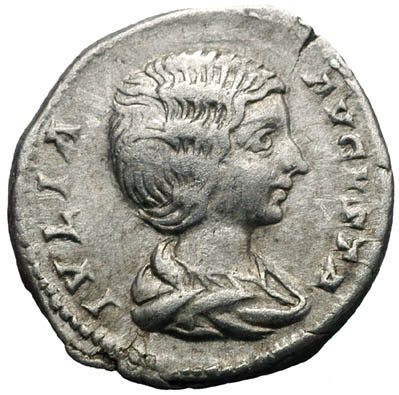

<figure property="schema:image" id="fig:julia-domna" resource="#julia_domna" class="aside img" typeof="schema:ImageObject">
  <link property="schema:representativeOfPage" resource="schema:True" />
  <meta property="schema:width" content="399 px" datatype="schema:Distance" />
  <meta property="schema:height" content="395 px" datatype="schema:Distance" />
  
  <figcaption>
    This image, entitled <a href="https://commons.wikimedia.org/wiki/File:Julia-domna.jpg" rel="prov:wasDerivedFrom" property="schema:name dc:title">Coin of Julia Domna</a>,
    by
    <a href="http://en.wikipedia.org/wiki/User:Rasiel" property="cc:attributionName" rel="cc:attributionURL dc:creator">Rasiel Suarez</a>
    is licensed under a
    <a rel="license" href="http://creativecommons.org/licenses/by-sa/3.0/"><abbr>CC-BY-SA</abbr> license</a>.
    
  </figcaption>
</figure>

I don't know much about hairdos, especially those that were in vogue 1500 years ago. But it turns out that the experts may
not have known everything there is to know about them either. A couple weeks
ago, on the front page of the Wall Street Journal was [a
story](http://online.wsj.com/article/SB10001424127887324900204578286272195339456.html)[^1]
about a very unusual hairdresser named Janet Stephens.

<!--MORE-->

Ms. Stephens is a hairdresser by trade, but has done something not very many
hairdressers before her have done. She has published research[^ja] in an
academic journal---the [Journal of Roman
Archaeology](http://www.journalofromanarch.com/). Apparently after work she
goes home and tries to recreate the hairdos of the ancient Romans. But as she
studied the history books and conducted experiments, she couldn't get the
hairdos to hold together. Nevertheless, she persisted and finally had a
breakthrough. Quoting from the newspaper article: "Studying translations of
Roman literature, Ms. Stephens says, she realized the Latin term 'acus' was
probably being misunderstood in the context of hairdressing. Acus has several
meanings including a 'single-prong hairpin' or 'needle and thread,' she says.
Translators generally went with 'hairpin.'"

All of her research and experimentation seemed to point to the fact that the
ancients used needle and thread to stitch together their hair designs.

The most remarkable thing to me, however, is that she took the time to publish
her findings. "It's amazing how much chutzpah you have when you have no idea
what you're doing," she said. "I don't write scholarly material. I'm a
hairdresser." The journal's editor, John Humphrey surmised, "I could tell even
from the first version that it was a very serious piece of experimental
archaeology which no scholar who was not a hairdresser---in other words, no
scholar---would have been able to write."

This highlights, in my opinion, one of the brightest possibilities for the
future of research and research collaboration: we should not leave all of the
discovery of knowledge to the academically elite. One of my favorite authors,
Meg Wheatley, writes about the new thought on leadership and organization,
which can also be applied to research:

<figure class="bq grab">
  <blockquote>
    

      In the traditional model, we leave the interpretation of data to senior
      or expert people. A few people, charged with interpreting the data,
      observe only a few potentialities contained within that data. How often
      do we even think about all the data that goes unnoticed because we rely
      on these solitary observations?

    

    

      ... It would seem that the more participants we engage in this
      participative universe, the more we can access its potentials and the
      wiser we can become.  We banish the ghosts of this ghostly universe by
      engaging in a different pattern of behavior---one in which more and more
      of us are included in the process of observing what is going on, and
      contributing our unique interpretations to the organization.

    

  </blockquote>
  <figcaption>--- Margaret J. Wheatley, from <cite>Leadership and the New Science</cite>, pp. 66--67</figcaption>
</figure>

While practitioners discover new things every day, few take the time (or would
even want to learn _how_) to publish their findings in a scholarly journal.
But I think many could and *would* participate in the research process, if
there were easier ways to do so.

As a side thought, for many in the academic and research communities, the
publication of journal articles is tied tightly to job continuity and
promotion. Yet, scholarly writing, in many cases, is too byzantine and
impenetrable for human consumption. It is almost as if the writers were more
concerned about keeping the research to themselves rather than freely
disseminating it to the world.[^1st-journals]

There should be no excuse for researchers to continue working in isolation.
The current research publication process worked well when the only way to
publish involved printed paper. We live in a different world now and the
publication process needs to be redesigned for this new world.

Either way, what is so cool to me is that someone down in the trenches---not in
the ivory tower---figured it out. Ms. Stephens had a different perspective and
could discern the existing holes in logic that the "experts" couldn't see. She
is an unusual mix of hairdresser *and* archaeologist and is a good example of
what I would call a [_bridge builder_](/research/#p[OwgWnb],h[OwgWnb,3]). We
need more researchers like that.
{: .conclusion }

# Notes

[^1]: Abigail Pesta, "On Pins and Needles: Stylist Turns Ancient Hairdo Debate
    on Its Head," <i>The Wall Street Journal</i>, February 7, 2013, A1 and A12.

[^ja]: Ms. Stephens' journal article, _Ancient Roman hairdressing: on
    (hair)pins and needles_, is
    [freely available for download](http://www.journalofromanarch.com/samples.html)
    on the journal's website.

[^1st-journals]:

    The original scientific journals, the <cite>Philosophical Transactions of
    the Royal Society</cite> and the <cite lang="fr">Journal des
    sçavans</cite>, were created primarily to provide a means of establishing
    [scientific priority](http://en.wikipedia.org/wiki/Scientific_priority),
    and not necessarily to disseminate research to the public. Many
    researchers, including Sir Isaac Newton and Gottfried Wilhelm von Leibniz
    actually enciphered their findings using anagrams so that the uninformed
    could not read them! For more information see [Academic
    Publishing](http://en.wikipedia.org/wiki/Academic_publishing#History) on
    Wikipedia.
